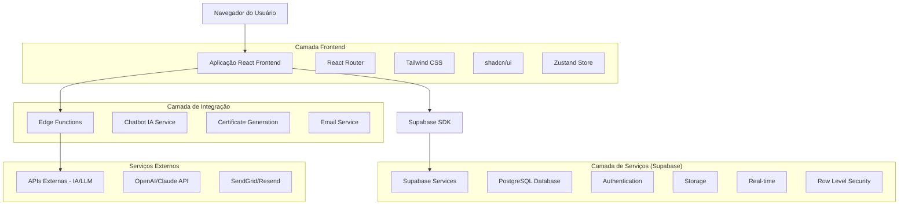
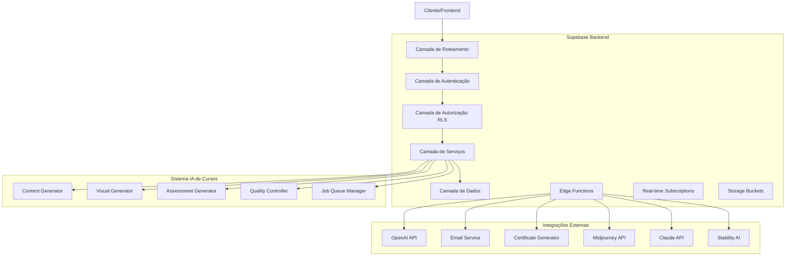
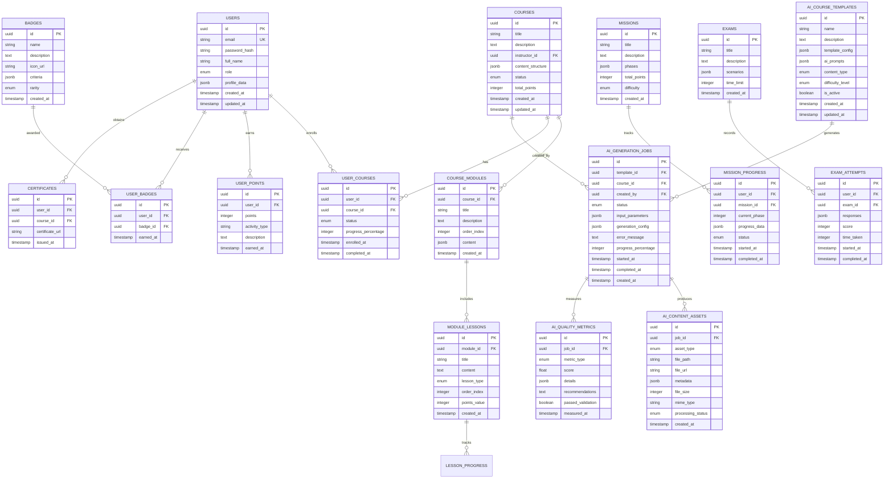

# Documento de Arquitetura Técnica - Esquads Academy Platform

## 1. Design da Arquitetura



## 2. Descrição das Tecnologias

- **Frontend**: React@18 + TypeScript + Tailwind CSS@3 + Vite + shadcn/ui
- **Backend**: Supabase (PostgreSQL + Auth + Storage + Edge Functions + Real-time)
- **Estado Global**: Zustand para gerenciamento de estado
- **Roteamento**: React Router v6
- **Validação**: Zod para validação de schemas
- **Formulários**: React Hook Form
- **Gráficos**: Recharts para analytics e dashboards
- **Ícones**: Lucide React
- **Animações**: Framer Motion
- **Testes**: Vitest + React Testing Library

## 3. Definições de Rotas

| Rota | Propósito |
|------|-----------|
| `/` | Página inicial com login/registro |
| `/login` | Página de autenticação de usuários |
| `/register` | Página de registro de novos usuários |
| `/admin/dashboard` | Dashboard administrativo com analytics em tempo real |
| `/admin/courses` | Gestão de cursos e conteúdo educacional |
| `/admin/users` | Administração de usuários e permissões |
| `/admin/gamification` | Centro de configuração de gamificação |
| `/admin/reports` | Sistema de relatórios e exportação de dados |
| `/admin/certificates` | Geração e gestão de certificados |
| `/admin/exams` | Simulador de exames de cibersegurança |
| `/admin/ai-course-generator` | Sistema de geração automatizada de cursos via IA |
| `/admin/ai-content-templates` | Gestão de templates e configurações de IA |
| `/admin/ai-quality-control` | Controle de qualidade e validação de conteúdo IA |
| `/student/dashboard` | Dashboard personalizado do estudante |
| `/student/courses` | Ambiente de aprendizado e progressão modular |
| `/student/missions` | Sistema de missões com chatbot IA |
| `/student/social` | Área social para interação entre pares |
| `/student/profile` | Perfil pessoal e configurações do estudante |
| `/student/achievements` | Visualização de conquistas e badges |
| `/student/leaderboard` | Rankings e competições |

### Validação de Rotas por Role

- Regras de redirecionamento pós-login:
  - `admin` → `/admin/dashboard`
  - `student` → `/student/dashboard`
- A verificação ocorre logo após autenticação bem-sucedida, usando a role normalizada no perfil.
- Persistência de sessão deve garantir acesso consistente durante a navegação.

## 4. Definições de API

### 4.1 APIs Principais

**Autenticação de Usuários**
```
POST /auth/v1/token
```

Request:
| Nome do Parâmetro | Tipo do Parâmetro | Obrigatório | Descrição |
|-------------------|-------------------|-------------|-----------|
| email | string | true | Email do usuário |
| password | string | true | Senha do usuário |

Response:
| Nome do Parâmetro | Tipo do Parâmetro | Descrição |
|-------------------|-------------------|-----------|
| access_token | string | Token JWT para autenticação |
| refresh_token | string | Token para renovação |
| user | object | Dados do usuário autenticado |

**Gestão de Cursos**
```
POST /rest/v1/courses
```

Request:
| Nome do Parâmetro | Tipo do Parâmetro | Obrigatório | Descrição |
|-------------------|-------------------|-------------|-----------|
| title | string | true | Título do curso |
| description | string | true | Descrição detalhada |
| modules | array | true | Array de módulos do curso |
| created_by | uuid | true | ID do administrador responsável |

Response:
| Nome do Parâmetro | Tipo do Parâmetro | Descrição |
|-------------------|-------------------|-----------|
| id | uuid | ID único do curso criado |
| created_at | timestamp | Data de criação |
| status | string | Status do curso |

**Sistema de Gamificação**
```
POST /rest/v1/user_points
```

Request:
| Nome do Parâmetro | Tipo do Parâmetro | Obrigatório | Descrição |
|-------------------|-------------------|-------------|-----------|
| user_id | uuid | true | ID do usuário |
| points | integer | true | Quantidade de pontos a adicionar |
| activity_type | string | true | Tipo de atividade que gerou os pontos |

**Edge Functions para IA**
```
POST /functions/v1/chatbot-assistance
```

Request:
| Nome do Parâmetro | Tipo do Parâmetro | Obrigatório | Descrição |
|-------------------|-------------------|-------------|-----------|
| message | string | true | Mensagem do usuário |
| context | object | true | Contexto da missão/curso atual |
| user_id | uuid | true | ID do usuário para personalização |

**Sistema de Geração de Cursos IA**
```
POST /functions/v1/ai-course-generator
```

Request:
| Nome do Parâmetro | Tipo do Parâmetro | Obrigatório | Descrição |
|-------------------|-------------------|-------------|-----------|
| topic | string | true | Tópico principal do curso |
| difficulty_level | string | true | Nível de dificuldade (beginner, intermediate, advanced) |
| target_audience | string | true | Público-alvo do curso |
| duration_hours | integer | true | Duração estimada em horas |
| learning_objectives | array | true | Objetivos de aprendizado |
| content_type | string | true | Tipo de conteúdo (text, mixed, interactive) |

Response:
| Nome do Parâmetro | Tipo do Parâmetro | Descrição |
|-------------------|-------------------|-----------|
| job_id | uuid | ID do job de geração |
| status | string | Status do processamento |
| estimated_completion | timestamp | Tempo estimado de conclusão |

**Geração de Conteúdo Didático**
```
POST /functions/v1/ai-content-generator
```

Request:
| Nome do Parâmetro | Tipo do Parâmetro | Obrigatório | Descrição |
|-------------------|-------------------|-------------|-----------|
| module_title | string | true | Título do módulo |
| learning_objectives | array | true | Objetivos específicos do módulo |
| content_structure | object | true | Estrutura desejada do conteúdo |
| pedagogical_approach | string | true | Abordagem pedagógica |

**Geração de Elementos Visuais**
```
POST /functions/v1/ai-visual-generator
```

Request:
| Nome do Parâmetro | Tipo do Parâmetro | Obrigatório | Descrição |
|-------------------|-------------------|-------------|-----------|
| content_context | string | true | Contexto do conteúdo |
| visual_type | string | true | Tipo de visual (cover, diagram, illustration) |
| style_preferences | object | false | Preferências de estilo visual |

**Sistema de Avaliação Automatizada**
```
POST /functions/v1/ai-assessment-generator
```

Request:
| Nome do Parâmetro | Tipo do Parâmetro | Obrigatório | Descrição |
|-------------------|-------------------|-------------|-----------|
| module_content | string | true | Conteúdo do módulo para avaliação |
| question_types | array | true | Tipos de questões desejadas |
| difficulty_distribution | object | true | Distribuição de dificuldade |
| question_count | integer | true | Número de questões |

**Controle de Qualidade IA**
```
POST /functions/v1/ai-quality-control
```

Request:
| Nome do Parâmetro | Tipo do Parâmetro | Obrigatório | Descrição |
|-------------------|-------------------|-------------|-----------|
| content_id | uuid | true | ID do conteúdo a ser validado |
| validation_criteria | object | true | Critérios de validação |
| auto_fix | boolean | false | Aplicar correções automáticas |

Exemplo de Request:
```json
{
  "email": "usuario@exemplo.com",
  "password": "senhaSegura123"
}
```

## 5. Diagrama da Arquitetura do Servidor



## 6. Modelo de Dados

### 6.1 Definição do Modelo de Dados



### 6.2 Linguagem de Definição de Dados

**Tabela de Usuários (users)**
```sql
-- Criar tabela de usuários
CREATE TABLE users (
    id UUID PRIMARY KEY DEFAULT gen_random_uuid(),
    email VARCHAR(255) UNIQUE NOT NULL,
    password_hash VARCHAR(255),
    full_name VARCHAR(100) NOT NULL,
    role VARCHAR(20) DEFAULT 'student' CHECK (role IN ('admin', 'student')),
    profile_data JSONB DEFAULT '{}',
    avatar_url TEXT,
    total_points INTEGER DEFAULT 0,
    current_level INTEGER DEFAULT 1,
    created_at TIMESTAMP WITH TIME ZONE DEFAULT NOW(),
    updated_at TIMESTAMP WITH TIME ZONE DEFAULT NOW()
);

-- Políticas RLS para usuários
ALTER TABLE users ENABLE ROW LEVEL SECURITY;

CREATE POLICY "Usuários podem ver próprio perfil" ON users
    FOR SELECT USING (auth.uid() = id);

CREATE POLICY "Usuários podem atualizar próprio perfil" ON users
    FOR UPDATE USING (auth.uid() = id);

CREATE POLICY "Admins podem ver todos usuários" ON users
    FOR ALL USING (
        EXISTS (
            SELECT 1 FROM users 
            WHERE id = auth.uid() AND role = 'admin'
        )
    );
```

**Tabela de Cursos (courses)**
```sql
-- Criar tabela de cursos
CREATE TABLE courses (
    id UUID PRIMARY KEY DEFAULT gen_random_uuid(),
    title VARCHAR(200) NOT NULL,
    description TEXT,
    instructor_id UUID REFERENCES users(id) ON DELETE SET NULL,
    content_structure JSONB DEFAULT '{}',
    status VARCHAR(20) DEFAULT 'draft' CHECK (status IN ('draft', 'published', 'archived')),
    total_points INTEGER DEFAULT 0,
    estimated_duration INTEGER, -- em minutos
    difficulty_level VARCHAR(20) DEFAULT 'beginner',
    thumbnail_url TEXT,
    created_at TIMESTAMP WITH TIME ZONE DEFAULT NOW(),
    updated_at TIMESTAMP WITH TIME ZONE DEFAULT NOW()
);

-- Políticas RLS para cursos
ALTER TABLE courses ENABLE ROW LEVEL SECURITY;

CREATE POLICY "Cursos publicados são visíveis para todos" ON courses
    FOR SELECT USING (status = 'published');

CREATE POLICY "Admins podem gerenciar todos cursos" ON courses
    FOR ALL USING (
        EXISTS (
            SELECT 1 FROM users 
            WHERE id = auth.uid() AND role = 'admin'
        )
    );
```

**Tabela de Módulos do Curso (course_modules)**
```sql
-- Criar tabela de módulos
CREATE TABLE course_modules (
    id UUID PRIMARY KEY DEFAULT gen_random_uuid(),
    course_id UUID REFERENCES courses(id) ON DELETE CASCADE,
    title VARCHAR(200) NOT NULL,
    description TEXT,
    order_index INTEGER NOT NULL,
    content JSONB DEFAULT '{}',
    is_published BOOLEAN DEFAULT false,
    created_at TIMESTAMP WITH TIME ZONE DEFAULT NOW()
);

-- Políticas RLS para módulos
ALTER TABLE course_modules ENABLE ROW LEVEL SECURITY;

CREATE POLICY "Módulos visíveis baseado no curso" ON course_modules
    FOR SELECT USING (
        EXISTS (
            SELECT 1 FROM courses 
            WHERE id = course_id AND status = 'published'
        )
    );
```

**Tabela de Pontos do Usuário (user_points)**
```sql
-- Criar tabela de pontos
CREATE TABLE user_points (
    id UUID PRIMARY KEY DEFAULT gen_random_uuid(),
    user_id UUID REFERENCES users(id) ON DELETE CASCADE,
    points INTEGER NOT NULL,
    activity_type VARCHAR(50) NOT NULL,
    description TEXT,
    reference_id UUID, -- ID da atividade que gerou os pontos
    earned_at TIMESTAMP WITH TIME ZONE DEFAULT NOW()
);

-- Políticas RLS para pontos
ALTER TABLE user_points ENABLE ROW LEVEL SECURITY;

CREATE POLICY "Usuários veem próprios pontos" ON user_points
    FOR SELECT USING (user_id = auth.uid());

GRANT SELECT ON user_points TO authenticated;
GRANT INSERT ON user_points TO authenticated;
```

**Tabela de Badges (badges)**
```sql
-- Criar tabela de badges
CREATE TABLE badges (
    id UUID PRIMARY KEY DEFAULT gen_random_uuid(),
    name VARCHAR(100) NOT NULL,
    description TEXT,
    icon_url TEXT,
    criteria JSONB NOT NULL,
    rarity VARCHAR(20) DEFAULT 'common' CHECK (rarity IN ('common', 'rare', 'epic', 'legendary')),
    points_required INTEGER DEFAULT 0,
    created_at TIMESTAMP WITH TIME ZONE DEFAULT NOW()
);

-- Tabela de badges dos usuários
CREATE TABLE user_badges (
    id UUID PRIMARY KEY DEFAULT gen_random_uuid(),
    user_id UUID REFERENCES users(id) ON DELETE CASCADE,
    badge_id UUID REFERENCES badges(id) ON DELETE CASCADE,
    earned_at TIMESTAMP WITH TIME ZONE DEFAULT NOW(),
    UNIQUE(user_id, badge_id)
);

-- Políticas RLS
ALTER TABLE badges ENABLE ROW LEVEL SECURITY;
ALTER TABLE user_badges ENABLE ROW LEVEL SECURITY;

CREATE POLICY "Badges são visíveis para todos" ON badges
    FOR SELECT TO authenticated USING (true);

CREATE POLICY "Usuários veem próprios badges" ON user_badges
    FOR SELECT USING (user_id = auth.uid());
```

**Índices para Performance**
```sql
-- Índices para otimização de consultas
CREATE INDEX idx_users_email ON users(email);
CREATE INDEX idx_users_role ON users(role);
CREATE INDEX idx_courses_instructor ON courses(instructor_id);
CREATE INDEX idx_courses_status ON courses(status);
CREATE INDEX idx_user_points_user_id ON user_points(user_id);
CREATE INDEX idx_user_points_earned_at ON user_points(earned_at DESC);
CREATE INDEX idx_user_badges_user_id ON user_badges(user_id);
CREATE INDEX idx_course_modules_course_id ON course_modules(course_id);
CREATE INDEX idx_course_modules_order ON course_modules(course_id, order_index);
```

**Dados Iniciais**
```sql
-- Inserir badges padrão
INSERT INTO badges (name, description, icon_url, criteria, rarity, points_required) VALUES
('Primeiro Passo', 'Complete sua primeira lição', '/badges/first-step.svg', '{"type": "lesson_completed", "count": 1}', 'common', 10),
('Estudante Dedicado', 'Complete 10 lições', '/badges/dedicated.svg', '{"type": "lesson_completed", "count": 10}', 'rare', 100),
('Mestre da Cibersegurança', 'Complete todos os cursos de cibersegurança', '/badges/cyber-master.svg', '{"type": "course_category_completed", "category": "cybersecurity"}', 'legendary', 1000);

-- Inserir usuário administrador padrão
INSERT INTO users (email, full_name, role) VALUES
('admin@esquads.com', 'Administrador Sistema', 'admin');
```

**Tabelas do Sistema IA de Cursos**

**Tabela de Templates IA (ai_course_templates)**
```sql
-- Criar tabela de templates de IA
CREATE TABLE ai_course_templates (
    id UUID PRIMARY KEY DEFAULT gen_random_uuid(),
    name VARCHAR(200) NOT NULL,
    description TEXT,
    template_config JSONB NOT NULL DEFAULT '{}',
    ai_prompts JSONB NOT NULL DEFAULT '{}',
    content_type VARCHAR(50) DEFAULT 'mixed' CHECK (content_type IN ('text', 'mixed', 'interactive')),
    difficulty_level VARCHAR(20) DEFAULT 'intermediate' CHECK (difficulty_level IN ('beginner', 'intermediate', 'advanced')),
    is_active BOOLEAN DEFAULT true,
    created_at TIMESTAMP WITH TIME ZONE DEFAULT NOW(),
    updated_at TIMESTAMP WITH TIME ZONE DEFAULT NOW()
);

-- Políticas RLS para templates IA
ALTER TABLE ai_course_templates ENABLE ROW LEVEL SECURITY;

CREATE POLICY "Admins podem gerenciar templates IA" ON ai_course_templates
    FOR ALL USING (
        EXISTS (
            SELECT 1 FROM users 
            WHERE id = auth.uid() AND role = 'admin'
        )
    );

CREATE POLICY "Admins podem visualizar templates IA" ON ai_course_templates
    FOR SELECT USING (
        EXISTS (
            SELECT 1 FROM users 
            WHERE id = auth.uid() AND role = 'admin'
        )
    );
```

**Tabela de Jobs de Geração IA (ai_generation_jobs)**
```sql
-- Criar tabela de jobs de geração
CREATE TABLE ai_generation_jobs (
    id UUID PRIMARY KEY DEFAULT gen_random_uuid(),
    template_id UUID REFERENCES ai_course_templates(id) ON DELETE SET NULL,
    course_id UUID REFERENCES courses(id) ON DELETE CASCADE,
    created_by UUID REFERENCES users(id) ON DELETE SET NULL,
    status VARCHAR(20) DEFAULT 'pending' CHECK (status IN ('pending', 'processing', 'completed', 'failed', 'cancelled')),
    input_parameters JSONB NOT NULL DEFAULT '{}',
    generation_config JSONB DEFAULT '{}',
    error_message TEXT,
    progress_percentage INTEGER DEFAULT 0 CHECK (progress_percentage >= 0 AND progress_percentage <= 100),
    started_at TIMESTAMP WITH TIME ZONE,
    completed_at TIMESTAMP WITH TIME ZONE,
    created_at TIMESTAMP WITH TIME ZONE DEFAULT NOW()
);

-- Políticas RLS para jobs de geração
ALTER TABLE ai_generation_jobs ENABLE ROW LEVEL SECURITY;

CREATE POLICY "Usuários veem próprios jobs" ON ai_generation_jobs
    FOR SELECT USING (created_by = auth.uid());

CREATE POLICY "Admins veem todos jobs" ON ai_generation_jobs
    FOR ALL USING (
        EXISTS (
            SELECT 1 FROM users 
            WHERE id = auth.uid() AND role = 'admin'
        )
    );
```

**Tabela de Assets de Conteúdo IA (ai_content_assets)**
```sql
-- Criar tabela de assets de conteúdo
CREATE TABLE ai_content_assets (
    id UUID PRIMARY KEY DEFAULT gen_random_uuid(),
    job_id UUID REFERENCES ai_generation_jobs(id) ON DELETE CASCADE,
    asset_type VARCHAR(50) NOT NULL CHECK (asset_type IN ('cover_image', 'diagram', 'illustration', 'text_content', 'quiz', 'assessment')),
    file_path TEXT,
    file_url TEXT,
    metadata JSONB DEFAULT '{}',
    file_size INTEGER,
    mime_type VARCHAR(100),
    processing_status VARCHAR(20) DEFAULT 'pending' CHECK (processing_status IN ('pending', 'processing', 'completed', 'failed')),
    created_at TIMESTAMP WITH TIME ZONE DEFAULT NOW()
);

-- Políticas RLS para assets
ALTER TABLE ai_content_assets ENABLE ROW LEVEL SECURITY;

CREATE POLICY "Assets visíveis baseado no job" ON ai_content_assets
    FOR SELECT USING (
        EXISTS (
            SELECT 1 FROM ai_generation_jobs 
            WHERE id = job_id AND (
                created_by = auth.uid() OR 
                EXISTS (SELECT 1 FROM users WHERE id = auth.uid() AND role = 'admin')
            )
        )
    );
```

**Tabela de Métricas de Qualidade IA (ai_quality_metrics)**
```sql
-- Criar tabela de métricas de qualidade
CREATE TABLE ai_quality_metrics (
    id UUID PRIMARY KEY DEFAULT gen_random_uuid(),
    job_id UUID REFERENCES ai_generation_jobs(id) ON DELETE CASCADE,
    metric_type VARCHAR(50) NOT NULL CHECK (metric_type IN ('content_coherence', 'pedagogical_quality', 'difficulty_consistency', 'grammar_check', 'factual_accuracy')),
    score FLOAT CHECK (score >= 0 AND score <= 1),
    details JSONB DEFAULT '{}',
    recommendations TEXT,
    passed_validation BOOLEAN DEFAULT false,
    measured_at TIMESTAMP WITH TIME ZONE DEFAULT NOW()
);

-- Políticas RLS para métricas
ALTER TABLE ai_quality_metrics ENABLE ROW LEVEL SECURITY;

CREATE POLICY "Métricas visíveis baseado no job" ON ai_quality_metrics
    FOR SELECT USING (
        EXISTS (
            SELECT 1 FROM ai_generation_jobs 
            WHERE id = job_id AND (
                created_by = auth.uid() OR 
                EXISTS (SELECT 1 FROM users WHERE id = auth.uid() AND role = 'admin')
            )
        )
    );
```

**Índices para Sistema IA**
```sql
-- Índices para otimização do sistema IA
CREATE INDEX idx_ai_generation_jobs_status ON ai_generation_jobs(status);
CREATE INDEX idx_ai_generation_jobs_created_by ON ai_generation_jobs(created_by);
CREATE INDEX idx_ai_generation_jobs_course_id ON ai_generation_jobs(course_id);
CREATE INDEX idx_ai_content_assets_job_id ON ai_content_assets(job_id);
CREATE INDEX idx_ai_content_assets_type ON ai_content_assets(asset_type);
CREATE INDEX idx_ai_quality_metrics_job_id ON ai_quality_metrics(job_id);
CREATE INDEX idx_ai_quality_metrics_type ON ai_quality_metrics(metric_type);
CREATE INDEX idx_ai_templates_active ON ai_course_templates(is_active);
```

**Dados Iniciais para Sistema IA**
```sql
-- Inserir templates padrão de IA
INSERT INTO ai_course_templates (name, description, template_config, ai_prompts, content_type, difficulty_level) VALUES
(
    'Template Cibersegurança Básica',
    'Template para cursos introdutórios de cibersegurança',
    '{"modules_count": 5, "lessons_per_module": 4, "assessment_frequency": "per_module"}',
    '{"content_prompt": "Crie conteúdo educacional sobre cibersegurança para iniciantes", "assessment_prompt": "Gere questões de múltipla escolha sobre conceitos básicos de segurança"}',
    'mixed',
    'beginner'
),
(
    'Template Programação Avançada',
    'Template para cursos avançados de programação',
    '{"modules_count": 8, "lessons_per_module": 6, "assessment_frequency": "per_lesson", "practical_exercises": true}',
    '{"content_prompt": "Desenvolva material avançado de programação com exemplos práticos", "assessment_prompt": "Crie exercícios de codificação e questões conceituais avançadas"}',
    'interactive',
    'advanced'
);
```
```
