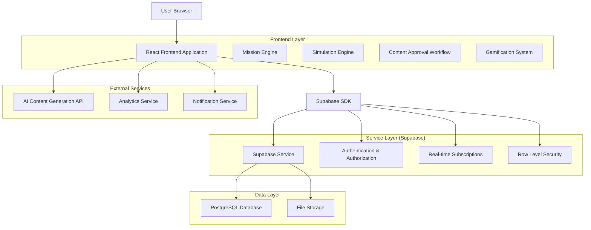
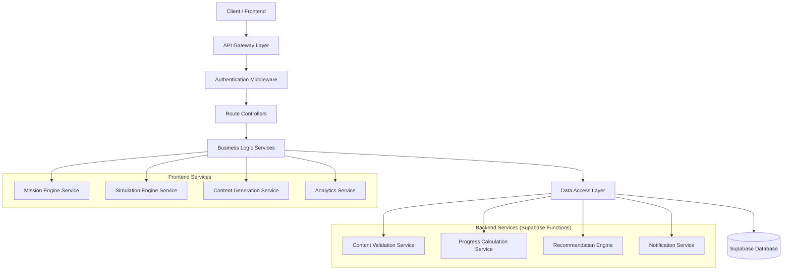
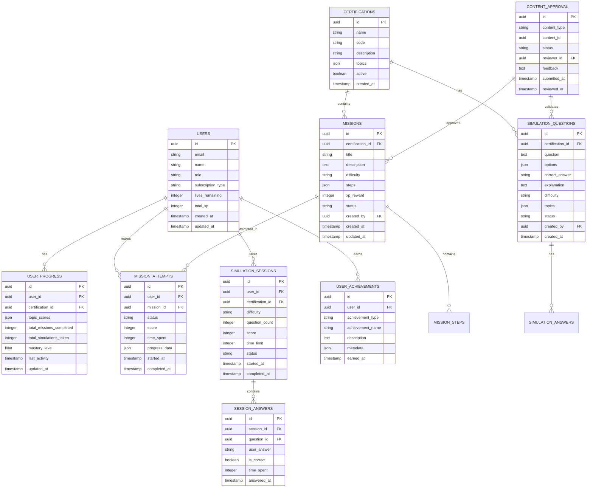

# Documento de Arquitetura Técnica - Esquads Unificada

## 1. Design da Arquitetura



## 2. Descrição das Tecnologias

**Frontend:**

* React\@18 + TypeScript para componentes tipados e reutilizáveis

* Tailwind CSS\@3 + shadcn/ui para interface consistente 8-bit/terminal

* Vite para build otimizado e desenvolvimento rápido

* React Query para cache e sincronização de dados

* Zustand para gerenciamento de estado global

* React Hook Form para formulários performáticos

**Backend:**

* Supabase (PostgreSQL + Auth + Storage + Real-time)

* Row Level Security (RLS) para segurança granular

* Supabase Functions para lógica de negócio complexa

* Real-time subscriptions para atualizações instantâneas

**Integrações Externas:**

* OpenAI API para geração de conteúdo de missões e questões

* Analytics personalizado para métricas de aprendizado

* Sistema de notificações para engajamento

## 3. Definições de Rotas

| Rota                          | Propósito                                                  |
| ----------------------------- | ---------------------------------------------------------- |
| `/dashboard`                  | Dashboard unificado principal com visão geral de progresso |
| `/missions`                   | Hub de missões gamificadas com categorias e rastreamento   |
| `/missions/:category`         | Missões específicas por certificação (aws, azure, comptia) |
| `/missions/:id/play`          | Interface de execução de missão individual                 |
| `/simulations`                | Centro de simulações de certificação                       |
| `/simulations/:certification` | Simulações específicas por certificação                    |
| `/simulations/:id/exam`       | Interface de execução de exame simulado                    |
| `/profile`                    | Perfil do usuário com estatísticas e progresso             |
| `/profile/analytics`          | Análise detalhada de lacunas e recomendações               |
| `/admin`                      | Painel administrativo principal                            |
| `/admin/content`              | Geração e gestão de conteúdo                               |
| `/admin/approval`             | Workflow de aprovação de conteúdo                          |
| `/admin/users`                | Monitoramento e gestão de usuários                         |
| `/admin/analytics`            | Métricas e relatórios administrativos                      |

## 4. Definições de API

### 4.1 APIs Principais

**Autenticação e Usuários**

```
POST /auth/login
POST /auth/register
POST /auth/logout
GET /auth/profile
PUT /auth/profile
```

**Missões**

```
GET /api/missions
GET /api/missions/:category
POST /api/missions/:id/start
PUT /api/missions/:id/progress
POST /api/missions/:id/complete
GET /api/missions/:id/hints
```

**Simulações**

```
GET /api/simulations
GET /api/simulations/:certification
POST /api/simulations/:id/start
PUT /api/simulations/:id/answer
POST /api/simulations/:id/submit
GET /api/simulations/:id/results
```

**Conteúdo Administrativo**

```
POST /api/admin/content/generate
GET /api/admin/content/pending
PUT /api/admin/content/:id/approve
PUT /api/admin/content/:id/reject
GET /api/admin/analytics/users
GET /api/admin/analytics/content
```

### Exemplo de Request/Response:

**Iniciar Simulação**

```
POST /api/simulations/:id/start
```

Request:

| Param Name      | Param Type | isRequired | Description                                             |
| --------------- | ---------- | ---------- | ------------------------------------------------------- |
| certification   | string     | true       | Tipo de certificação (aws, azure, comptia)              |
| difficulty      | string     | true       | Nível de dificuldade (beginner, intermediate, advanced) |
| question\_count | number     | true       | Número de questões (10-100)                             |
| topics          | array      | false      | Tópicos específicos para focar                          |

Response:

| Param Name  | Param Type | Description                                     |
| ----------- | ---------- | ----------------------------------------------- |
| session\_id | string     | ID único da sessão de simulação                 |
| questions   | array      | Array de questões geradas                       |
| time\_limit | number     | Tempo limite em minutos                         |
| status      | string     | Status da simulação (active, paused, completed) |

Exemplo:

```json
{
  "certification": "aws",
  "difficulty": "intermediate",
  "question_count": 50,
  "topics": ["iam", "vpc", "encryption"]
}
```

## 5. Arquitetura do Servidor



## 6. Modelo de Dados

### 6.1 Definição do Modelo de Dados



### 6.2 Linguagem de Definição de Dados

**Tabela de Usuários (users)**

```sql
-- Criar tabela de usuários
CREATE TABLE users (
    id UUID PRIMARY KEY DEFAULT gen_random_uuid(),
    email VARCHAR(255) UNIQUE NOT NULL,
    name VARCHAR(100) NOT NULL,
    role VARCHAR(20) DEFAULT 'student' CHECK (role IN ('student', 'mission_architect', 'admin')),
    subscription_type VARCHAR(20) DEFAULT 'free' CHECK (subscription_type IN ('free', 'premium')),
    lives_remaining INTEGER DEFAULT 5,
    total_xp INTEGER DEFAULT 0,
    created_at TIMESTAMP WITH TIME ZONE DEFAULT NOW(),
    updated_at TIMESTAMP WITH TIME ZONE DEFAULT NOW()
);

-- Políticas RLS
ALTER TABLE users ENABLE ROW LEVEL SECURITY;
GRANT SELECT ON users TO anon;
GRANT ALL PRIVILEGES ON users TO authenticated;

CREATE POLICY "users_own_data" ON users
    FOR ALL USING (auth.uid() = id);
```

**Tabela de Certificações (certifications)**

```sql
-- Criar tabela de certificações
CREATE TABLE certifications (
    id UUID PRIMARY KEY DEFAULT gen_random_uuid(),
    name VARCHAR(100) NOT NULL,
    code VARCHAR(20) UNIQUE NOT NULL,
    description TEXT,
    topics JSONB DEFAULT '[]',
    active BOOLEAN DEFAULT true,
    created_at TIMESTAMP WITH TIME ZONE DEFAULT NOW()
);

-- Políticas RLS
ALTER TABLE certifications ENABLE ROW LEVEL SECURITY;
GRANT SELECT ON certifications TO anon;
GRANT ALL PRIVILEGES ON certifications TO authenticated;

CREATE POLICY "certifications_public_read" ON certifications
    FOR SELECT USING (active = true);

-- Dados iniciais
INSERT INTO certifications (name, code, description, topics) VALUES
('AWS Security Certification', 'AWS-SEC', 'Amazon Web Services Security Specialty', 
 '["iam", "vpc", "encryption", "monitoring", "compliance"]'),
('Azure Security Engineer', 'AZ-500', 'Microsoft Azure Security Engineer Associate', 
 '["identity", "platform_protection", "security_operations", "data_applications"]'),
('CompTIA Security+', 'SEC-PLUS', 'CompTIA Security+ Certification', 
 '["threats", "architecture", "implementation", "operations", "governance"]');
```

**Tabela de Missões (missions)**

```sql
-- Criar tabela de missões
CREATE TABLE missions (
    id UUID PRIMARY KEY DEFAULT gen_random_uuid(),
    certification_id UUID REFERENCES certifications(id),
    title VARCHAR(200) NOT NULL,
    description TEXT,
    difficulty VARCHAR(20) CHECK (difficulty IN ('beginner', 'intermediate', 'advanced')),
    steps JSONB DEFAULT '[]',
    xp_reward INTEGER DEFAULT 100,
    status VARCHAR(20) DEFAULT 'pending' CHECK (status IN ('pending', 'approved', 'rejected')),
    created_by UUID REFERENCES users(id),
    created_at TIMESTAMP WITH TIME ZONE DEFAULT NOW(),
    updated_at TIMESTAMP WITH TIME ZONE DEFAULT NOW()
);

-- Índices
CREATE INDEX idx_missions_certification ON missions(certification_id);
CREATE INDEX idx_missions_difficulty ON missions(difficulty);
CREATE INDEX idx_missions_status ON missions(status);

-- Políticas RLS
ALTER TABLE missions ENABLE ROW LEVEL SECURITY;
GRANT SELECT ON missions TO anon;
GRANT ALL PRIVILEGES ON missions TO authenticated;

CREATE POLICY "missions_approved_public" ON missions
    FOR SELECT USING (status = 'approved');
```

**Tabela de Tentativas de Missão (mission\_attempts)**

```sql
-- Criar tabela de tentativas de missão
CREATE TABLE mission_attempts (
    id UUID PRIMARY KEY DEFAULT gen_random_uuid(),
    user_id UUID REFERENCES users(id),
    mission_id UUID REFERENCES missions(id),
    status VARCHAR(20) DEFAULT 'in_progress' CHECK (status IN ('in_progress', 'completed', 'failed')),
    score INTEGER DEFAULT 0,
    time_spent INTEGER DEFAULT 0, -- em segundos
    progress_data JSONB DEFAULT '{}',
    started_at TIMESTAMP WITH TIME ZONE DEFAULT NOW(),
    completed_at TIMESTAMP WITH TIME ZONE
);

-- Índices
CREATE INDEX idx_mission_attempts_user ON mission_attempts(user_id);
CREATE INDEX idx_mission_attempts_mission ON mission_attempts(mission_id);
CREATE INDEX idx_mission_attempts_status ON mission_attempts(status);

-- Políticas RLS
ALTER TABLE mission_attempts ENABLE ROW LEVEL SECURITY;
GRANT ALL PRIVILEGES ON mission_attempts TO authenticated;

CREATE POLICY "mission_attempts_own_data" ON mission_attempts
    FOR ALL USING (auth.uid() = user_id);
```

**Tabela de Questões de Simulação (simulation\_questions)**

```sql
-- Criar tabela de questões de simulação
CREATE TABLE simulation_questions (
    id UUID PRIMARY KEY DEFAULT gen_random_uuid(),
    certification_id UUID REFERENCES certifications(id),
    question TEXT NOT NULL,
    options JSONB NOT NULL, -- array de opções
    correct_answer VARCHAR(10) NOT NULL,
    explanation TEXT NOT NULL,
    difficulty VARCHAR(20) CHECK (difficulty IN ('beginner', 'intermediate', 'advanced')),
    topics JSONB DEFAULT '[]',
    status VARCHAR(20) DEFAULT 'pending' CHECK (status IN ('pending', 'approved', 'rejected')),
    created_by UUID REFERENCES users(id),
    created_at TIMESTAMP WITH TIME ZONE DEFAULT NOW()
);

-- Índices
CREATE INDEX idx_simulation_questions_certification ON simulation_questions(certification_id);
CREATE INDEX idx_simulation_questions_difficulty ON simulation_questions(difficulty);
CREATE INDEX idx_simulation_questions_status ON simulation_questions(status);

-- Políticas RLS
ALTER TABLE simulation_questions ENABLE ROW LEVEL SECURITY;
GRANT SELECT ON simulation_questions TO anon;
GRANT ALL PRIVILEGES ON simulation_questions TO authenticated;

CREATE POLICY "simulation_questions_approved_public" ON simulation_questions
    FOR SELECT USING (status = 'approved');
```

**Tabela de Progresso do Usuário (user\_progress)**

```sql
-- Criar tabela de progresso do usuário
CREATE TABLE user_progress (
    id UUID PRIMARY KEY DEFAULT gen_random_uuid(),
    user_id UUID REFERENCES users(id),
    certification_id UUID REFERENCES certifications(id),
    topic_scores JSONB DEFAULT '{}',
    total_missions_completed INTEGER DEFAULT 0,
    total_simulations_taken INTEGER DEFAULT 0,
    mastery_level FLOAT DEFAULT 0.0,
    last_activity TIMESTAMP WITH TIME ZONE DEFAULT NOW(),
    updated_at TIMESTAMP WITH TIME ZONE DEFAULT NOW(),
    UNIQUE(user_id, certification_id)
);

-- Índices
CREATE INDEX idx_user_progress_user ON user_progress(user_id);
CREATE INDEX idx_user_progress_certification ON user_progress(certification_id);
CREATE INDEX idx_user_progress_mastery ON user_progress(mastery_level DESC);

-- Políticas RLS
ALTER TABLE user_progress ENABLE ROW LEVEL SECURITY;
GRANT ALL PRIVILEGES ON user_progress TO authenticated;

CREATE POLICY "user_progress_own_data" ON user_progress
    FOR ALL USING (auth.uid() = user_id);
```

