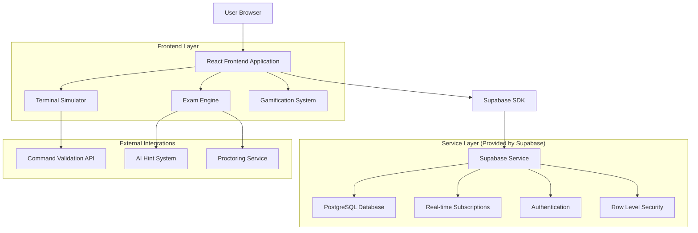
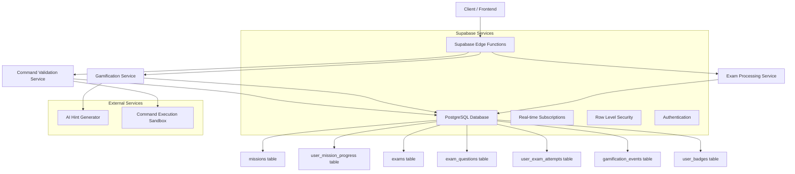
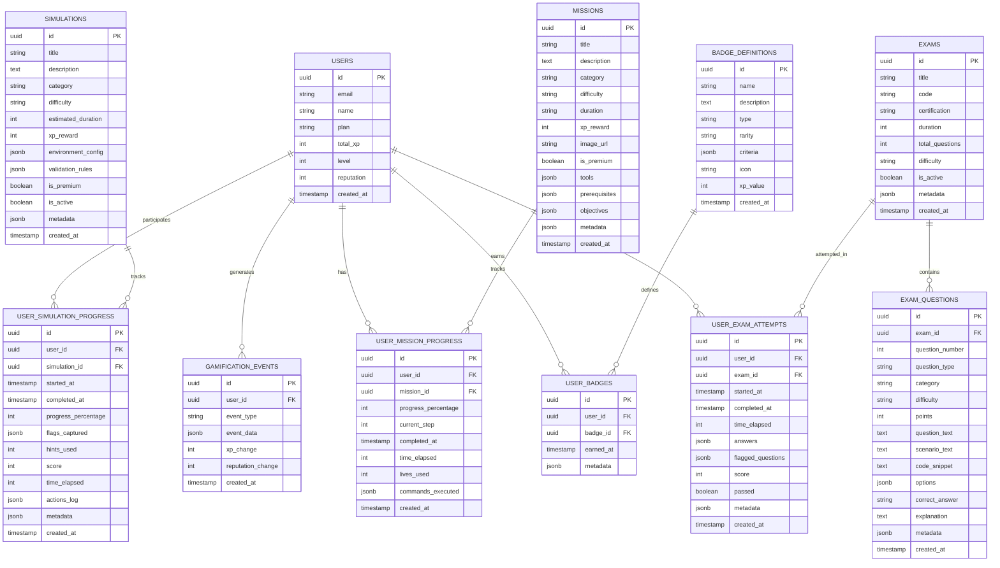

# Arquitetura Técnica - Missões e Simulados

## 1. Architecture design



## 2. Technology Description

- Frontend: React@18 + TypeScript + tailwindcss@3 + vite + shadcn/ui
- Backend: Supabase (PostgreSQL + Real-time + Auth + Storage)
- Terminal: Custom React component with command validation
- Exam Engine: React-based with timer and proctoring features
- Gamification: Event-driven system with XP/badges/leaderboards
- State Management: React Context + Custom hooks
- Routing: React Router DOM v6

## 3. Route definitions

| Route | Purpose |
|-------|---------|
| /student/missions | Lista de missões disponíveis com filtros e categorias |
| /student/missions/play/:missionId | Interface de execução de missão com terminal interativo |
| /student/missions/results/:missionId | Resultados detalhados da missão com XP e badges |
| /student/exams | Seleção de exames e certificações disponíveis |
| /student/exams/take/:examId | Interface de execução de exame com timer e proctoring |
| /student/exams/results/:attemptId | Resultados do exame com score e análise de performance |
| /student/simulations | Lista de simulações CTF e labs práticos |
| /student/simulations/play/:simulationId | Ambiente de simulação com validação de flags |
| /admin/missions | Gestão de missões (CRUD) com editor de objetivos |
| /admin/exams | Gestão de exames e questões com banco de questões |
| /admin/simulations | Gestão de simulações com configuração de ambiente |

## 4. API definitions

### 4.1 Core API

**Missões - Validação de Comandos**
```
POST /api/missions/validate-command
```

Request:
| Param Name| Param Type  | isRequired  | Description |
|-----------|-------------|-------------|-------------|
| missionId | string      | true        | ID da missão |
| command   | string      | true        | Comando executado pelo usuário |
| step      | number      | true        | Step atual da missão |

Response:
| Param Name| Param Type  | Description |
|-----------|-------------|-------------|
| isValid   | boolean     | Se o comando é válido para o step |
| message   | string      | Mensagem de feedback |
| xpReward  | number      | XP ganho (se válido) |
| nextStep  | number      | Próximo step da missão |

Example:
```json
{
  "missionId": "uuid-mission-1",
  "command": "iptables -L",
  "step": 1
}
```

**Exames - Submissão de Respostas**
```
POST /api/exams/submit-answer
```

Request:
| Param Name| Param Type  | isRequired  | Description |
|-----------|-------------|-------------|-------------|
| attemptId | string      | true        | ID da tentativa de exame |
| questionId| string      | true        | ID da questão |
| answer    | string      | true        | Resposta selecionada |

Response:
| Param Name| Param Type  | Description |
|-----------|-------------|-------------|
| success   | boolean     | Status da submissão |
| message   | string      | Mensagem de confirmação |

**Gamificação - Registro de Eventos**
```
POST /api/gamification/record-event
```

Request:
| Param Name| Param Type  | isRequired  | Description |
|-----------|-------------|-------------|-------------|
| eventType | string      | true        | Tipo do evento (mission_completed, etc.) |
| metadata  | object      | true        | Dados específicos do evento |

Response:
| Param Name| Param Type  | Description |
|-----------|-------------|-------------|
| xpGained  | number      | XP ganho no evento |
| badgesEarned | array    | Badges conquistadas |
| levelUp   | boolean     | Se subiu de nível |

## 5. Server architecture diagram



## 6. Data model

### 6.1 Data model definition



### 6.2 Data Definition Language

**Tabela de Missões**
```sql
-- Criar tabela de missões
CREATE TABLE missions (
    id UUID PRIMARY KEY DEFAULT gen_random_uuid(),
    title VARCHAR(255) NOT NULL,
    description TEXT,
    category VARCHAR(100) NOT NULL CHECK (category IN ('Firewall', 'Cloud Security', 'Forensics', 'Network Security', 'Penetration Testing', 'Incident Response')),
    difficulty VARCHAR(50) NOT NULL CHECK (difficulty IN ('Iniciante', 'Intermediário', 'Avançado')),
    duration VARCHAR(50),
    xp_reward INTEGER DEFAULT 0,
    image_url TEXT,
    is_premium BOOLEAN DEFAULT false,
    tools JSONB DEFAULT '[]',
    prerequisites JSONB DEFAULT '[]',
    objectives JSONB DEFAULT '[]',
    metadata JSONB DEFAULT '{}',
    created_at TIMESTAMP WITH TIME ZONE DEFAULT NOW(),
    updated_at TIMESTAMP WITH TIME ZONE DEFAULT NOW()
);

-- Índices para performance
CREATE INDEX idx_missions_category ON missions(category);
CREATE INDEX idx_missions_difficulty ON missions(difficulty);
CREATE INDEX idx_missions_premium ON missions(is_premium);

-- Dados iniciais de missões
INSERT INTO missions (title, description, category, difficulty, duration, xp_reward, tools, objectives) VALUES
('Configuração Básica de Firewall', 'Aprenda a configurar regras básicas de firewall usando iptables', 'Firewall', 'Iniciante', '15 min', 100, 
 '["iptables", "netstat", "ss"]',
 '[
   {"title": "Listar regras atuais", "description": "Use iptables -L para ver as regras", "xpReward": 25, "hint": "Digite iptables -L"},
   {"title": "Bloquear porta 22", "description": "Bloqueie conexões SSH", "xpReward": 50, "hint": "Use iptables -A INPUT -p tcp --dport 22 -j DROP"},
   {"title": "Permitir HTTP", "description": "Permita tráfego na porta 80", "xpReward": 25, "hint": "Use iptables -A INPUT -p tcp --dport 80 -j ACCEPT"}
 ]'),
 
('Análise de Logs AWS', 'Investigue atividades suspeitas em logs do CloudTrail', 'Cloud Security', 'Intermediário', '30 min', 200,
 '["aws", "jq", "grep"]',
 '[
   {"title": "Conectar ao AWS CLI", "description": "Configure as credenciais AWS", "xpReward": 30, "hint": "Use aws configure"},
   {"title": "Baixar logs CloudTrail", "description": "Obtenha logs dos últimos 7 dias", "xpReward": 50, "hint": "Use aws logs describe-log-groups"},
   {"title": "Filtrar eventos suspeitos", "description": "Encontre tentativas de login falhadas", "xpReward": 70, "hint": "Use jq para filtrar eventName"},
   {"title": "Gerar relatório", "description": "Crie um resumo dos achados", "xpReward": 50, "hint": "Documente os IPs suspeitos"}
 ]'),

('Análise de Memória com Volatility', 'Use Volatility para analisar dump de memória', 'Forensics', 'Avançado', '45 min', 300,
 '["volatility", "strings", "hexdump"]',
 '[
   {"title": "Identificar perfil", "description": "Determine o perfil do sistema operacional", "xpReward": 50, "hint": "Use volatility imageinfo"},
   {"title": "Listar processos", "description": "Extraia lista de processos em execução", "xpReward": 75, "hint": "Use volatility pslist"},
   {"title": "Analisar conexões de rede", "description": "Identifique conexões ativas", "xpReward": 75, "hint": "Use volatility netscan"},
   {"title": "Extrair artefatos", "description": "Encontre evidências de malware", "xpReward": 100, "hint": "Use volatility malfind"}
 ]');
```

**Tabela de Progresso de Missões**
```sql
-- Criar tabela de progresso de missões
CREATE TABLE user_mission_progress (
    id UUID PRIMARY KEY DEFAULT gen_random_uuid(),
    user_id UUID REFERENCES auth.users(id) ON DELETE CASCADE,
    mission_id UUID REFERENCES missions(id) ON DELETE CASCADE,
    progress_percentage INTEGER DEFAULT 0 CHECK (progress_percentage >= 0 AND progress_percentage <= 100),
    current_step INTEGER DEFAULT 1,
    completed_at TIMESTAMP WITH TIME ZONE,
    time_elapsed INTEGER DEFAULT 0, -- em segundos
    lives_used INTEGER DEFAULT 0,
    commands_executed JSONB DEFAULT '[]',
    created_at TIMESTAMP WITH TIME ZONE DEFAULT NOW(),
    updated_at TIMESTAMP WITH TIME ZONE DEFAULT NOW(),
    UNIQUE(user_id, mission_id)
);

-- Índices
CREATE INDEX idx_user_mission_progress_user_id ON user_mission_progress(user_id);
CREATE INDEX idx_user_mission_progress_mission_id ON user_mission_progress(mission_id);
CREATE INDEX idx_user_mission_progress_completed ON user_mission_progress(completed_at) WHERE completed_at IS NOT NULL;
```

**Tabelas de Exames**
```sql
-- Criar tabela de exames
CREATE TABLE exams (
    id UUID PRIMARY KEY DEFAULT gen_random_uuid(),
    title VARCHAR(255) NOT NULL,
    code VARCHAR(100) UNIQUE NOT NULL,
    certification VARCHAR(100) NOT NULL,
    duration INTEGER NOT NULL, -- em minutos
    total_questions INTEGER NOT NULL,
    difficulty VARCHAR(50) NOT NULL CHECK (difficulty IN ('Iniciante', 'Intermediário', 'Avançado')),
    is_active BOOLEAN DEFAULT true,
    metadata JSONB DEFAULT '{}',
    created_at TIMESTAMP WITH TIME ZONE DEFAULT NOW(),
    updated_at TIMESTAMP WITH TIME ZONE DEFAULT NOW()
);

-- Criar tabela de questões
CREATE TABLE exam_questions (
    id UUID PRIMARY KEY DEFAULT gen_random_uuid(),
    exam_id UUID REFERENCES exams(id) ON DELETE CASCADE,
    question_number INTEGER NOT NULL,
    question_type VARCHAR(50) NOT NULL CHECK (question_type IN ('scenario', 'code', 'multiple')),
    category VARCHAR(100),
    difficulty VARCHAR(50),
    points INTEGER DEFAULT 1,
    question_text TEXT NOT NULL,
    scenario_text TEXT,
    code_snippet TEXT,
    options JSONB NOT NULL,
    correct_answer VARCHAR(255) NOT NULL,
    explanation TEXT,
    metadata JSONB DEFAULT '{}',
    created_at TIMESTAMP WITH TIME ZONE DEFAULT NOW(),
    UNIQUE(exam_id, question_number)
);

-- Criar tabela de tentativas de exame
CREATE TABLE user_exam_attempts (
    id UUID PRIMARY KEY DEFAULT gen_random_uuid(),
    user_id UUID REFERENCES auth.users(id) ON DELETE CASCADE,
    exam_id UUID REFERENCES exams(id) ON DELETE CASCADE,
    started_at TIMESTAMP WITH TIME ZONE DEFAULT NOW(),
    completed_at TIMESTAMP WITH TIME ZONE,
    time_elapsed INTEGER, -- em segundos
    answers JSONB DEFAULT '{}',
    flagged_questions JSONB DEFAULT '[]',
    score INTEGER,
    passed BOOLEAN,
    metadata JSONB DEFAULT '{}',
    created_at TIMESTAMP WITH TIME ZONE DEFAULT NOW()
);

-- Índices para exames
CREATE INDEX idx_exams_certification ON exams(certification);
CREATE INDEX idx_exam_questions_exam_id ON exam_questions(exam_id);
CREATE INDEX idx_user_exam_attempts_user_id ON user_exam_attempts(user_id);
CREATE INDEX idx_user_exam_attempts_exam_id ON user_exam_attempts(exam_id);

-- Dados iniciais de exames
INSERT INTO exams (title, code, certification, duration, total_questions, difficulty) VALUES
('CISSP Practice Exam', 'CISSP-001', 'CISSP', 180, 50, 'Avançado'),
('Security+ Foundation', 'SEC-PLUS-001', 'CompTIA Security+', 90, 30, 'Intermediário'),
('CEH Ethical Hacking', 'CEH-001', 'CEH', 120, 40, 'Avançado');

-- Questões de exemplo para Security+
INSERT INTO exam_questions (exam_id, question_number, question_type, category, difficulty, points, question_text, options, correct_answer, explanation) VALUES
((SELECT id FROM exams WHERE code = 'SEC-PLUS-001'), 1, 'multiple', 'Network Security', 'Intermediário', 1,
 'Qual protocolo é usado para estabelecer uma conexão segura entre um cliente e servidor web?',
 '[
   {"id": "a", "text": "HTTP", "description": "Protocolo de transferência de hipertexto"},
   {"id": "b", "text": "HTTPS", "description": "HTTP seguro com SSL/TLS"},
   {"id": "c", "text": "FTP", "description": "Protocolo de transferência de arquivos"},
   {"id": "d", "text": "SMTP", "description": "Protocolo de transferência de email"}
 ]',
 'b',
 'HTTPS (HTTP Secure) usa SSL/TLS para criptografar a comunicação entre cliente e servidor, garantindo confidencialidade e integridade dos dados.'),

((SELECT id FROM exams WHERE code = 'SEC-PLUS-001'), 2, 'scenario', 'Incident Response', 'Intermediário', 2,
 'Você é um analista de segurança e detectou tráfego suspeito saindo da rede corporativa para um IP desconhecido na porta 443. O tráfego está ocorrendo fora do horário comercial e vem de uma estação de trabalho do departamento financeiro.',
 '[
   {"id": "a", "text": "Ignorar o alerta", "description": "Considerar como falso positivo"},
   {"id": "b", "text": "Isolar a estação imediatamente", "description": "Desconectar da rede"},
   {"id": "c", "text": "Monitorar por mais tempo", "description": "Coletar mais evidências"},
   {"id": "d", "text": "Reiniciar a estação", "description": "Resolver com reboot"}
 ]',
 'b',
 'Em casos de suspeita de comprometimento, especialmente em sistemas críticos como do departamento financeiro, o isolamento imediato é a melhor prática para conter possível propagação de malware.');
```

**Tabelas de Simulações**
```sql
-- Criar tabela de simulações
CREATE TABLE simulations (
    id UUID PRIMARY KEY DEFAULT gen_random_uuid(),
    title VARCHAR(255) NOT NULL,
    description TEXT,
    category VARCHAR(100) NOT NULL,
    difficulty VARCHAR(50) NOT NULL CHECK (difficulty IN ('Iniciante', 'Intermediário', 'Avançado')),
    estimated_duration INTEGER, -- em minutos
    xp_reward INTEGER DEFAULT 0,
    environment_config JSONB DEFAULT '{}',
    validation_rules JSONB DEFAULT '{}',
    is_premium BOOLEAN DEFAULT false,
    is_active BOOLEAN DEFAULT true,
    metadata JSONB DEFAULT '{}',
    created_at TIMESTAMP WITH TIME ZONE DEFAULT NOW(),
    updated_at TIMESTAMP WITH TIME ZONE DEFAULT NOW()
);

-- Criar tabela de progresso em simulações
CREATE TABLE user_simulation_progress (
    id UUID PRIMARY KEY DEFAULT gen_random_uuid(),
    user_id UUID REFERENCES auth.users(id) ON DELETE CASCADE,
    simulation_id UUID REFERENCES simulations(id) ON DELETE CASCADE,
    started_at TIMESTAMP WITH TIME ZONE DEFAULT NOW(),
    completed_at TIMESTAMP WITH TIME ZONE,
    progress_percentage INTEGER DEFAULT 0,
    flags_captured JSONB DEFAULT '[]',
    hints_used INTEGER DEFAULT 0,
    score INTEGER DEFAULT 0,
    time_elapsed INTEGER DEFAULT 0,
    actions_log JSONB DEFAULT '[]',
    metadata JSONB DEFAULT '{}',
    created_at TIMESTAMP WITH TIME ZONE DEFAULT NOW(),
    UNIQUE(user_id, simulation_id)
);

-- Dados iniciais de simulações
INSERT INTO simulations (title, description, category, difficulty, estimated_duration, xp_reward, environment_config, validation_rules) VALUES
('Web Application Penetration Test', 'Encontre vulnerabilidades em uma aplicação web simulada', 'Penetration Testing', 'Intermediário', 60, 250,
 '{"target_url": "http://vulnerable-app.local", "tools": ["burp", "nmap", "sqlmap"], "flags": 5}',
 '{"flags": [
   {"name": "SQL Injection", "value": "flag{sql_injection_found}", "points": 50},
   {"name": "XSS", "value": "flag{xss_vulnerability}", "points": 40},
   {"name": "Directory Traversal", "value": "flag{path_traversal}", "points": 60},
   {"name": "Admin Access", "value": "flag{admin_panel_access}", "points": 70},
   {"name": "Database Dump", "value": "flag{database_extracted}", "points": 80}
 ]}'),

('Network Forensics Challenge', 'Analise captura de tráfego de rede para encontrar evidências', 'Forensics', 'Avançado', 90, 400,
 '{"pcap_file": "network_capture.pcap", "tools": ["wireshark", "tcpdump", "tshark"], "flags": 4}',
 '{"flags": [
   {"name": "Malicious IP", "value": "flag{malicious_ip_identified}", "points": 80},
   {"name": "Exfiltrated Data", "value": "flag{data_exfiltration_found}", "points": 100},
   {"name": "C2 Communication", "value": "flag{c2_communication}", "points": 120},
   {"name": "Attack Timeline", "value": "flag{timeline_reconstructed}", "points": 100}
 ]}');
```

**Políticas RLS (Row Level Security)**
```sql
-- Habilitar RLS em todas as tabelas
ALTER TABLE missions ENABLE ROW LEVEL SECURITY;
ALTER TABLE user_mission_progress ENABLE ROW LEVEL SECURITY;
ALTER TABLE exams ENABLE ROW LEVEL SECURITY;
ALTER TABLE exam_questions ENABLE ROW LEVEL SECURITY;
ALTER TABLE user_exam_attempts ENABLE ROW LEVEL SECURITY;
ALTER TABLE simulations ENABLE ROW LEVEL SECURITY;
ALTER TABLE user_simulation_progress ENABLE ROW LEVEL SECURITY;

-- Políticas para missions
CREATE POLICY "missions_select_all" ON missions FOR SELECT USING (true);
CREATE POLICY "missions_admin_full" ON missions FOR ALL USING (
    EXISTS (SELECT 1 FROM user_profiles WHERE user_id = auth.uid() AND role IN ('admin', 'instructor'))
);

-- Políticas para user_mission_progress
CREATE POLICY "user_mission_progress_own_data" ON user_mission_progress FOR ALL USING (auth.uid() = user_id);
CREATE POLICY "user_mission_progress_admin_read" ON user_mission_progress FOR SELECT USING (
    EXISTS (SELECT 1 FROM user_profiles WHERE user_id = auth.uid() AND role IN ('admin', 'instructor'))
);

-- Políticas para exams
CREATE POLICY "exams_select_active" ON exams FOR SELECT USING (is_active = true);
CREATE POLICY "exams_admin_full" ON exams FOR ALL USING (
    EXISTS (SELECT 1 FROM user_profiles WHERE user_id = auth.uid() AND role IN ('admin', 'instructor'))
);

-- Políticas para exam_questions
CREATE POLICY "exam_questions_select_with_exam" ON exam_questions FOR SELECT USING (
    EXISTS (SELECT 1 FROM exams WHERE exams.id = exam_questions.exam_id AND exams.is_active = true)
);

-- Políticas para user_exam_attempts
CREATE POLICY "user_exam_attempts_own_data" ON user_exam_attempts FOR ALL USING (auth.uid() = user_id);

-- Políticas para simulations
CREATE POLICY "simulations_select_active" ON simulations FOR SELECT USING (is_active = true);
CREATE POLICY "simulations_admin_full" ON simulations FOR ALL USING (
    EXISTS (SELECT 1 FROM user_profiles WHERE user_id = auth.uid() AND role IN ('admin', 'instructor'))
);

-- Políticas para user_simulation_progress
CREATE POLICY "user_simulation_progress_own_data" ON user_simulation_progress FOR ALL USING (auth.uid() = user_id);

-- Conceder permissões básicas
GRANT SELECT ON missions TO anon, authenticated;
GRANT ALL PRIVILEGES ON user_mission_progress TO authenticated;
GRANT SELECT ON exams TO anon, authenticated;
GRANT SELECT ON exam_questions TO anon, authenticated;
GRANT ALL PRIVILEGES ON user_exam_attempts TO authenticated;
GRANT SELECT ON simulations TO anon, authenticated;
GRANT ALL PRIVILEGES ON user_simulation_progress TO authenticated;
```

**Funções Auxiliares**
```sql
-- Função para calcular score de exame
CREATE OR REPLACE FUNCTION calculate_exam_score(attempt_id UUID)
RETURNS INTEGER AS $$
DECLARE
    total_points INTEGER := 0;
    earned_points INTEGER := 0;
    question_record RECORD;
    user_answer TEXT;
BEGIN
    -- Buscar respostas do usuário
    FOR question_record IN 
        SELECT eq.id, eq.points, eq.correct_answer, uea.answers
        FROM exam_questions eq
        JOIN user_exam_attempts uea ON uea.exam_id = eq.exam_id
        WHERE uea.id = attempt_id
    LOOP
        total_points := total_points + question_record.points;
        
        -- Verificar se a resposta está correta
        user_answer := question_record.answers->question_record.id::text;
        IF user_answer = question_record.correct_answer THEN
            earned_points := earned_points + question_record.points;
        END IF;
    END LOOP;
    
    -- Calcular porcentagem
    IF total_points > 0 THEN
        RETURN (earned_points * 100) / total_points;
    ELSE
        RETURN 0;
    END IF;
END;
$$ LANGUAGE plpgsql SECURITY DEFINER;

-- Função para validar comando de missão
CREATE OR REPLACE FUNCTION validate_mission_command(
    p_user_id UUID,
    p_mission_id UUID,
    p_command TEXT,
    p_step INTEGER
) RETURNS JSONB AS $$
DECLARE
    mission_objectives JSONB;
    current_objective JSONB;
    validation_result BOOLEAN := false;
    response_message TEXT;
    xp_reward INTEGER := 0;
BEGIN
    -- Buscar objetivos da missão
    SELECT objectives INTO mission_objectives
    FROM missions WHERE id = p_mission_id;
    
    -- Buscar objetivo atual
    current_objective := mission_objectives->p_step-1;
    
    -- Validação básica por categoria
    IF p_command ILIKE '%iptables%' AND current_objective->>'title' ILIKE '%firewall%' THEN
        validation_result := true;
        response_message := 'Comando executado com sucesso!';
        xp_reward := (current_objective->>'xpReward')::INTEGER;
    ELSIF p_command ILIKE '%aws%' AND current_objective->>'title' ILIKE '%aws%' THEN
        validation_result := true;
        response_message := 'Comando AWS executado corretamente!';
        xp_reward := (current_objective->>'xpReward')::INTEGER;
    ELSIF p_command ILIKE '%volatility%' AND current_objective->>'title' ILIKE '%memória%' THEN
        validation_result := true;
        response_message := 'Análise de memória iniciada!';
        xp_reward := (current_objective->>'xpReward')::INTEGER;
    ELSE
        response_message := 'Comando não reconhecido para este objetivo. Tente novamente.';
    END IF;
    
    -- Registrar comando executado
    UPDATE user_mission_progress 
    SET commands_executed = commands_executed || jsonb_build_object(
        'command', p_command,
        'step', p_step,
        'timestamp', NOW(),
        'valid', validation_result
    ),
    current_step = CASE WHEN validation_result THEN p_step + 1 ELSE current_step END,
    updated_at = NOW()
    WHERE user_id = p_user_id AND mission_id = p_mission_id;
    
    RETURN jsonb_build_object(
        'is_valid', validation_result,
        'message', response_message,
        'xp_reward', xp_reward,
        'next_step', CASE WHEN validation_result THEN p_step + 1 ELSE p_step END
    );
END;
$$ LANGUAGE plpgsql SECURITY DEFINER;
```