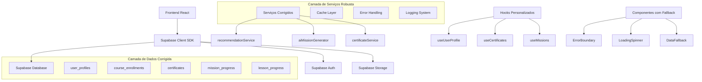

# Especificações Técnicas Finais - Esquads Academy Platform

## 1. Resumo Executivo

### 1.1 Situação Atual
A plataforma Esquads Academy possui estruturas básicas implementadas, mas apresenta **3 erros críticos** que impedem o funcionamento adequado:

1. **Erro de Perfil do Usuário**: Sistema de missões personalizadas falhando
2. **Erro de Coerção JSON**: Serviço de recomendações retornando dados inconsistentes  
3. **Erro de Certificados**: Sistema de certificados não conseguindo buscar dados

### 1.2 Solução Proposta
Implementação de correções críticas em **3 sprints** com foco em:
- Correção imediata dos erros identificados
- Implementação de funcionalidades essenciais
- Garantia de entrega funcional para administradores e estudantes

## 2. Arquitetura Técnica Corrigida

### 2.1 Diagrama de Arquitetura Atualizado



### 2.2 Stack Tecnológico Final

**Frontend:**
- React 18 + TypeScript
- Tailwind CSS + shadcn/ui
- Vite (build tool)
- React Query (cache e sincronização)

**Backend:**
- Supabase (BaaS completo)
- PostgreSQL (database)
- Row Level Security (RLS)
- Triggers automáticos

**Ferramentas de Desenvolvimento:**
- ESLint + Prettier
- Vitest (testes)
- Husky (git hooks)

## 2.3 Perfis e Permissões (Admin/Student)

- Admin:
  - Acesso total: gestão de cursos, usuários, configurações, relatórios e analytics, auditoria e controle de qualidade de conteúdo IA.
  - Pode publicar/arquivar cursos, gerenciar certificados, definir políticas RLS e integrações.
- Student:
  - Consome cursos e módulos, participa de missões e quizzes com IA.
  - Visualiza progresso, badges e certificados; interage em social e leaderboard; gerencia seu perfil.

Redirecionamento pós-login:
- `admin` → `/admin/dashboard`
- `student` → `/student/dashboard`

## 3. Estrutura de Dados Definitiva

### 3.1 Tabelas Principais

#### user_profiles
```sql
CREATE TABLE user_profiles (
  id UUID PRIMARY KEY DEFAULT gen_random_uuid(),
  user_id UUID REFERENCES auth.users(id) ON DELETE CASCADE,
  interests TEXT[] DEFAULT '{}',
  skill_level TEXT DEFAULT 'beginner',
  learning_goals TEXT[] DEFAULT '{}',
  preferred_duration TEXT DEFAULT 'medium',
  completed_courses TEXT[] DEFAULT '{}',
  current_courses TEXT[] DEFAULT '{}',
  favorite_categories TEXT[] DEFAULT '{}',
  learning_style TEXT DEFAULT 'visual',
  time_availability TEXT DEFAULT 'medium',
  level INTEGER DEFAULT 1,
  total_points INTEGER DEFAULT 0,
  activity_pattern TEXT DEFAULT 'mixed',
  difficulty_preference TEXT DEFAULT 'medium',
  preferred_categories TEXT[] DEFAULT '{}',
  created_at TIMESTAMPTZ DEFAULT NOW(),
  updated_at TIMESTAMPTZ DEFAULT NOW(),
  UNIQUE(user_id)
);
```

#### course_enrollments
```sql
CREATE TABLE course_enrollments (
  id UUID PRIMARY KEY DEFAULT gen_random_uuid(),
  user_id UUID REFERENCES auth.users(id) ON DELETE CASCADE,
  course_id UUID REFERENCES courses(id) ON DELETE CASCADE,
  enrolled_at TIMESTAMPTZ DEFAULT NOW(),
  completed_at TIMESTAMPTZ,
  progress_percentage INTEGER DEFAULT 0,
  status TEXT DEFAULT 'active',
  last_accessed TIMESTAMPTZ DEFAULT NOW(),
  time_spent INTEGER DEFAULT 0,
  UNIQUE(user_id, course_id)
);
```

#### certificates (atualizada)
```sql
ALTER TABLE certificates ADD COLUMN course_title TEXT;
ALTER TABLE certificates ADD COLUMN instructor_name TEXT;
ALTER TABLE certificates ADD COLUMN completion_date TIMESTAMPTZ DEFAULT NOW();
ALTER TABLE certificates ADD COLUMN certificate_hash TEXT UNIQUE;
ALTER TABLE certificates ADD COLUMN blockchain_verified BOOLEAN DEFAULT false;
ALTER TABLE certificates ADD COLUMN skills_acquired TEXT[] DEFAULT '{}';
ALTER TABLE certificates ADD COLUMN grade DECIMAL(5,2);
ALTER TABLE certificates ADD COLUMN hours_completed INTEGER;
ALTER TABLE certificates ADD COLUMN verification_url TEXT;
```

### 3.2 Políticas RLS Essenciais

```sql
-- user_profiles
CREATE POLICY "user_profiles_select_own" ON user_profiles
  FOR SELECT USING (auth.uid() = user_id);

CREATE POLICY "user_profiles_insert_own" ON user_profiles
  FOR INSERT WITH CHECK (auth.uid() = user_id);

CREATE POLICY "user_profiles_update_own" ON user_profiles
  FOR UPDATE USING (auth.uid() = user_id);

-- course_enrollments
CREATE POLICY "enrollments_select_own" ON course_enrollments
  FOR SELECT USING (auth.uid() = user_id);

-- certificates
CREATE POLICY "certificates_select_own" ON certificates
  FOR SELECT USING (auth.uid() = user_id);
```

## 4. Serviços Corrigidos

### 4.1 RecommendationService Robusto

```typescript
export class RecommendationService {
  static async getUserProfile(userId: string): Promise<UserProfile | null> {
    return cacheWithFallback(
      CACHE_KEYS.USER_PROFILE(userId),
      async () => {
        try {
          // Tentar buscar perfil existente
          const { data: profile, error } = await supabase
            .from('user_profiles')
            .select('*')
            .eq('user_id', userId)
            .maybeSingle();

          if (error && error.code !== 'PGRST116') {
            throw error;
          }

          // Se não existe, criar perfil padrão
          if (!profile) {
            const defaultProfile = this.createDefaultProfile(userId);
            const { data: newProfile } = await supabase
              .from('user_profiles')
              .insert(defaultProfile)
              .select()
              .single();
            
            return newProfile || defaultProfile;
          }

          return profile;
        } catch (error) {
          logger.error('Erro ao buscar perfil do usuário', { userId, error });
          return this.createDefaultProfile(userId);
        }
      },
      2 * 60 * 1000 // Cache por 2 minutos
    );
  }

  private static createDefaultProfile(userId: string): UserProfile {
    return {
      user_id: userId,
      interests: ['cibersegurança'],
      skill_level: 'beginner',
      learning_goals: ['aprender fundamentos'],
      preferred_duration: 'medium',
      completed_courses: [],
      current_courses: [],
      favorite_categories: ['geral'],
      learning_style: 'visual',
      time_availability: 'medium',
      level: 1,
      total_points: 0,
      activity_pattern: 'mixed',
      difficulty_preference: 'medium',
      preferred_categories: ['geral']
    };
  }
}
```

### 4.2 CertificateService Melhorado

```typescript
export class CertificateService {
  static async getUserCertificates(userId: string): Promise<Certificate[]> {
    return cacheWithFallback(
      CACHE_KEYS.USER_CERTIFICATES(userId),
      async () => {
        try {
          const { data: certificates, error } = await supabase
            .from('certificates')
            .select(`
              *,
              course:courses(title, instructor_name)
            `)
            .eq('user_id', userId)
            .order('created_at', { ascending: false });

          if (error) {
            throw error;
          }

          return certificates?.map(cert => ({
            ...cert,
            course_title: cert.course?.title || cert.course_title || 'Curso não identificado',
            issued_by: cert.issued_by || 'Equipe Admin'
          })) || [];
        } catch (error) {
          logger.error('Erro ao buscar certificados', { userId, error });
          return [];
        }
      },
      5 * 60 * 1000 // Cache por 5 minutos
    );
  }

  static async generateCertificate(userId: string, courseId: string): Promise<Certificate | null> {
    try {
      // Verificar se usuário completou o curso
      const { data: enrollment } = await supabase
        .from('course_enrollments')
        .select('*')
        .eq('user_id', userId)
        .eq('course_id', courseId)
        .eq('status', 'completed')
        .single();

      if (!enrollment) {
        throw new Error('Curso não foi completado pelo usuário');
      }

      // Gerar hash único para o certificado
      const certificateHash = this.generateCertificateHash(userId, courseId);

      const certificateData = {
        user_id: userId,
        course_id: courseId,
        certificate_hash: certificateHash,
        completion_date: new Date().toISOString(),
        grade: enrollment.final_grade || 100,
        hours_completed: enrollment.time_spent || 0,
        verification_url: `${window.location.origin}/verify/${certificateHash}`
      };

      const { data: certificate, error } = await supabase
        .from('certificates')
        .insert(certificateData)
        .select()
        .single();

      if (error) throw error;

      // Limpar cache
      cache.delete(CACHE_KEYS.USER_CERTIFICATES(userId));

      return certificate;
    } catch (error) {
      logger.error('Erro ao gerar certificado', { userId, courseId, error });
      return null;
    }
  }

  private static generateCertificateHash(userId: string, courseId: string): string {
    const timestamp = Date.now();
    const data = `${userId}-${courseId}-${timestamp}`;
    return btoa(data).replace(/[^a-zA-Z0-9]/g, '').substring(0, 16);
  }
}
```

### 4.3 AIMissionGenerator Otimizado

```typescript
export class AIMissionGenerator {
  static async generatePersonalizedMissions(userId: string): Promise<Mission[]> {
    try {
      // Buscar perfil do usuário com fallback
      const userProfile = await RecommendationService.getUserProfile(userId);
      if (!userProfile) {
        logger.warn('Perfil não encontrado, usando perfil padrão', { userId });
      }

      // Buscar progresso atual
      const { data: currentProgress } = await supabase
        .from('course_enrollments')
        .select('*')
        .eq('user_id', userId)
        .eq('status', 'active');

      // Gerar missões baseadas no perfil e progresso
      const missions = await this.generateMissionsForProfile(
        userProfile || this.getDefaultProfile(userId),
        currentProgress || []
      );

      return missions;
    } catch (error) {
      logger.error('Erro ao gerar missões personalizadas', { userId, error });
      return this.getDefaultMissions();
    }
  }

  private static async generateMissionsForProfile(
    profile: UserProfile,
    progress: any[]
  ): Promise<Mission[]> {
    const missions: Mission[] = [];

    // Missão baseada no nível de habilidade
    if (profile.skill_level === 'beginner') {
      missions.push({
        id: this.generateId(),
        title: 'Primeiros Passos em Cibersegurança',
        description: 'Complete sua primeira lição sobre fundamentos de segurança',
        type: 'learning',
        difficulty: 'easy',
        points: 100,
        requirements: ['complete_first_lesson'],
        estimated_time: 30,
        tags: ['iniciante', 'fundamentos']
      });
    }

    // Missão baseada nos interesses
    if (profile.interests.includes('cibersegurança')) {
      missions.push({
        id: this.generateId(),
        title: 'Especialista em Segurança',
        description: 'Complete 3 cursos de cibersegurança',
        type: 'achievement',
        difficulty: 'medium',
        points: 500,
        requirements: ['complete_security_courses:3'],
        estimated_time: 180,
        tags: ['cibersegurança', 'especialização']
      });
    }

    return missions;
  }

  private static getDefaultMissions(): Mission[] {
    return [
      {
        id: this.generateId(),
        title: 'Bem-vindo à Academia',
        description: 'Complete seu perfil e explore a plataforma',
        type: 'onboarding',
        difficulty: 'easy',
        points: 50,
        requirements: ['complete_profile'],
        estimated_time: 15,
        tags: ['boas-vindas', 'perfil']
      }
    ];
  }

  private static getDefaultProfile(userId: string): UserProfile {
    return {
      user_id: userId,
      interests: ['geral'],
      skill_level: 'beginner',
      learning_goals: ['explorar'],
      preferred_duration: 'medium',
      completed_courses: [],
      current_courses: [],
      favorite_categories: ['geral'],
      learning_style: 'visual',
      time_availability: 'medium',
      level: 1,
      total_points: 0,
      preferred_categories: ['geral']
    };
  }

  private static generateId(): string {
    return `mission_${Date.now()}_${Math.random().toString(36).substr(2, 9)}`;
  }
}
```

## 5. Sistema de Cache e Performance

### 5.1 Cache Inteligente

```typescript
// src/utils/cache.ts
class CacheManager {
  private cache = new Map<string, { data: any; expiry: number }>();

  set(key: string, data: any, ttl: number = 5 * 60 * 1000) {
    this.cache.set(key, {
      data,
      expiry: Date.now() + ttl
    });
  }

  get(key: string): any | null {
    const item = this.cache.get(key);
    if (!item) return null;

    if (Date.now() > item.expiry) {
      this.cache.delete(key);
      return null;
    }

    return item.data;
  }

  delete(key: string) {
    this.cache.delete(key);
  }

  clear() {
    this.cache.clear();
  }
}

export const cache = new CacheManager();

export const CACHE_KEYS = {
  USER_PROFILE: (userId: string) => `user_profile_${userId}`,
  USER_CERTIFICATES: (userId: string) => `user_certificates_${userId}`,
  USER_MISSIONS: (userId: string) => `user_missions_${userId}`,
  COURSE_PROGRESS: (userId: string, courseId: string) => `progress_${userId}_${courseId}`
};

export async function cacheWithFallback<T>(
  key: string,
  fetchFn: () => Promise<T>,
  ttl?: number
): Promise<T> {
  // Tentar buscar do cache primeiro
  const cached = cache.get(key);
  if (cached) return cached;

  // Se não está no cache, buscar e armazenar
  try {
    const data = await fetchFn();
    cache.set(key, data, ttl);
    return data;
  } catch (error) {
    logger.error('Erro ao buscar dados com cache', { key, error });
    throw error;
  }
}
```

### 5.2 Otimizações de Performance

```typescript
// src/utils/performance.ts
export function debounce<T extends (...args: any[]) => any>(
  func: T,
  wait: number
): (...args: Parameters<T>) => void {
  let timeout: NodeJS.Timeout;
  return (...args: Parameters<T>) => {
    clearTimeout(timeout);
    timeout = setTimeout(() => func(...args), wait);
  };
}

export function throttle<T extends (...args: any[]) => any>(
  func: T,
  limit: number
): (...args: Parameters<T>) => void {
  let inThrottle: boolean;
  return (...args: Parameters<T>) => {
    if (!inThrottle) {
      func(...args);
      inThrottle = true;
      setTimeout(() => inThrottle = false, limit);
    }
  };
}

// Hook para lazy loading
export function useLazyLoad<T>(
  fetchFn: () => Promise<T>,
  deps: any[] = []
) {
  const [data, setData] = useState<T | null>(null);
  const [loading, setLoading] = useState(false);
  const [error, setError] = useState<string | null>(null);

  const load = useCallback(async () => {
    try {
      setLoading(true);
      setError(null);
      const result = await fetchFn();
      setData(result);
    } catch (err) {
      setError(err instanceof Error ? err.message : 'Erro desconhecido');
    } finally {
      setLoading(false);
    }
  }, deps);

  return { data, loading, error, load };
}
```

## 6. Componentes de Interface Robustos

### 6.1 Componente de Dashboard do Estudante

```typescript
// src/components/student/StudentDashboard.tsx
import React from 'react';
import { useUserProfile } from '@/hooks/useUserProfile';
import { useCertificates } from '@/hooks/useCertificates';
import { ErrorBoundary } from '@/components/common/ErrorBoundary';
import { LoadingSpinner } from '@/components/common/LoadingSpinner';
import { Card, CardContent, CardHeader, CardTitle } from '@/components/ui/card';
import { Progress } from '@/components/ui/progress';
import { Badge } from '@/components/ui/badge';

export function StudentDashboard() {
  const { profile, loading: profileLoading, error: profileError, refetch: refetchProfile } = useUserProfile();
  const { certificates, loading: certsLoading, error: certsError, refetch: refetchCerts } = useCertificates();

  if (profileLoading || certsLoading) {
    return <LoadingSpinner text="Carregando seu dashboard..." />;
  }

  return (
    <div className="space-y-6">
      <div className="grid grid-cols-1 md:grid-cols-2 lg:grid-cols-3 gap-6">
        {/* Perfil do Usuário */}
        <ErrorBoundary error={profileError} onRetry={refetchProfile}>
          <Card>
            <CardHeader>
              <CardTitle>Meu Perfil</CardTitle>
            </CardHeader>
            <CardContent>
              {profile ? (
                <div className="space-y-3">
                  <div className="flex justify-between">
                    <span>Nível:</span>
                    <Badge variant="secondary">{profile.level}</Badge>
                  </div>
                  <div className="flex justify-between">
                    <span>Pontos:</span>
                    <span className="font-semibold">{profile.total_points}</span>
                  </div>
                  <div>
                    <span className="text-sm text-gray-600">Habilidade:</span>
                    <Progress value={profile.level * 10} className="mt-1" />
                  </div>
                  <div>
                    <span className="text-sm text-gray-600">Interesses:</span>
                    <div className="flex flex-wrap gap-1 mt-1">
                      {profile.interests.map((interest, index) => (
                        <Badge key={index} variant="outline" className="text-xs">
                          {interest}
                        </Badge>
                      ))}
                    </div>
                  </div>
                </div>
              ) : (
                <p className="text-gray-500">Perfil não encontrado</p>
              )}
            </CardContent>
          </Card>
        </ErrorBoundary>

        {/* Certificados */}
        <ErrorBoundary error={certsError} onRetry={refetchCerts}>
          <Card>
            <CardHeader>
              <CardTitle>Meus Certificados</CardTitle>
            </CardHeader>
            <CardContent>
              {certificates.length > 0 ? (
                <div className="space-y-2">
                  <div className="text-2xl font-bold text-green-600">
                    {certificates.length}
                  </div>
                  <p className="text-sm text-gray-600">
                    Certificados conquistados
                  </p>
                  <div className="space-y-1">
                    {certificates.slice(0, 3).map((cert, index) => (
                      <div key={index} className="text-xs text-gray-500 truncate">
                        {cert.course_title}
                      </div>
                    ))}
                  </div>
                </div>
              ) : (
                <p className="text-gray-500">Nenhum certificado ainda</p>
              )}
            </CardContent>
          </Card>
        </ErrorBoundary>

        {/* Progresso Atual */}
        <Card>
          <CardHeader>
            <CardTitle>Progresso Atual</CardTitle>
          </CardHeader>
          <CardContent>
            <div className="space-y-3">
              <div>
                <span className="text-sm text-gray-600">Cursos em Andamento:</span>
                <div className="text-2xl font-bold text-blue-600">
                  {profile?.current_courses?.length || 0}
                </div>
              </div>
              <div>
                <span className="text-sm text-gray-600">Cursos Completados:</span>
                <div className="text-2xl font-bold text-green-600">
                  {profile?.completed_courses?.length || 0}
                </div>
              </div>
            </div>
          </CardContent>
        </Card>
      </div>

      {/* Seção de Missões */}
      <Card>
        <CardHeader>
          <CardTitle>Missões Ativas</CardTitle>
        </CardHeader>
        <CardContent>
          <div className="text-center py-8 text-gray-500">
            <p>Sistema de missões será carregado aqui</p>
            <p className="text-sm">Implementação em andamento...</p>
          </div>
        </CardContent>
      </Card>
    </div>
  );
}
```

### 6.2 Componente de Dashboard do Administrador

```typescript
// src/components/admin/AdminDashboard.tsx
import React, { useState, useEffect } from 'react';
import { Card, CardContent, CardHeader, CardTitle } from '@/components/ui/card';
import { Button } from '@/components/ui/button';
import { Badge } from '@/components/ui/badge';
import { supabase } from '@/integrations/supabase/client';
import { LoadingSpinner } from '@/components/common/LoadingSpinner';
import { ErrorBoundary } from '@/components/common/ErrorBoundary';
import { Users, BookOpen, Award, TrendingUp } from 'lucide-react';

interface AdminStats {
  totalUsers: number;
  totalCourses: number;
  totalCertificates: number;
  activeEnrollments: number;
}

export function AdminDashboard() {
  const [stats, setStats] = useState<AdminStats | null>(null);
  const [loading, setLoading] = useState(true);
  const [error, setError] = useState<string | null>(null);

  const fetchStats = async () => {
    try {
      setLoading(true);
      setError(null);

      // Buscar estatísticas básicas
      const [usersResult, coursesResult, certificatesResult, enrollmentsResult] = await Promise.all([
        supabase.from('users').select('id', { count: 'exact', head: true }),
        supabase.from('courses').select('id', { count: 'exact', head: true }),
        supabase.from('certificates').select('id', { count: 'exact', head: true }),
        supabase.from('course_enrollments').select('id', { count: 'exact', head: true }).eq('status', 'active')
      ]);

      setStats({
        totalUsers: usersResult.count || 0,
        totalCourses: coursesResult.count || 0,
        totalCertificates: certificatesResult.count || 0,
        activeEnrollments: enrollmentsResult.count || 0
      });
    } catch (err) {
      setError('Erro ao carregar estatísticas');
      console.error('Erro no AdminDashboard:', err);
    } finally {
      setLoading(false);
    }
  };

  useEffect(() => {
    fetchStats();
  }, []);

  if (loading) {
    return <LoadingSpinner text="Carregando dashboard administrativo..." />;
  }

  return (
    <ErrorBoundary error={error} onRetry={fetchStats}>
      <div className="space-y-6">
        <div className="grid grid-cols-1 md:grid-cols-2 lg:grid-cols-4 gap-6">
          {/* Total de Usuários */}
          <Card>
            <CardHeader className="flex flex-row items-center justify-between space-y-0 pb-2">
              <CardTitle className="text-sm font-medium">Total de Usuários</CardTitle>
              <Users className="h-4 w-4 text-muted-foreground" />
            </CardHeader>
            <CardContent>
              <div className="text-2xl font-bold">{stats?.totalUsers || 0}</div>
              <p className="text-xs text-muted-foreground">
                Usuários registrados na plataforma
              </p>
            </CardContent>
          </Card>

          {/* Total de Cursos */}
          <Card>
            <CardHeader className="flex flex-row items-center justify-between space-y-0 pb-2">
              <CardTitle className="text-sm font-medium">Total de Cursos</CardTitle>
              <BookOpen className="h-4 w-4 text-muted-foreground" />
            </CardHeader>
            <CardContent>
              <div className="text-2xl font-bold">{stats?.totalCourses || 0}</div>
              <p className="text-xs text-muted-foreground">
                Cursos disponíveis
              </p>
            </CardContent>
          </Card>

          {/* Certificados Emitidos */}
          <Card>
            <CardHeader className="flex flex-row items-center justify-between space-y-0 pb-2">
              <CardTitle className="text-sm font-medium">Certificados</CardTitle>
              <Award className="h-4 w-4 text-muted-foreground" />
            </CardHeader>
            <CardContent>
              <div className="text-2xl font-bold">{stats?.totalCertificates || 0}</div>
              <p className="text-xs text-muted-foreground">
                Certificados emitidos
              </p>
            </CardContent>
          </Card>

          {/* Matrículas Ativas */}
          <Card>
            <CardHeader className="flex flex-row items-center justify-between space-y-0 pb-2">
              <CardTitle className="text-sm font-medium">Matrículas Ativas</CardTitle>
              <TrendingUp className="h-4 w-4 text-muted-foreground" />
            </CardHeader>
            <CardContent>
              <div className="text-2xl font-bold">{stats?.activeEnrollments || 0}</div>
              <p className="text-xs text-muted-foreground">
                Estudantes ativos
              </p>
            </CardContent>
          </Card>
        </div>

        {/* Ações Rápidas */}
        <Card>
          <CardHeader>
            <CardTitle>Ações Rápidas</CardTitle>
          </CardHeader>
          <CardContent>
            <div className="grid grid-cols-1 md:grid-cols-3 gap-4">
              <Button variant="outline" className="h-20 flex flex-col">
                <BookOpen className="h-6 w-6 mb-2" />
                Criar Novo Curso
              </Button>
              <Button variant="outline" className="h-20 flex flex-col">
                <Users className="h-6 w-6 mb-2" />
                Gerenciar Usuários
              </Button>
              <Button variant="outline" className="h-20 flex flex-col">
                <Award className="h-6 w-6 mb-2" />
                Relatório de Certificados
              </Button>
            </div>
          </CardContent>
        </Card>

        {/* Status do Sistema */}
        <Card>
          <CardHeader>
            <CardTitle>Status do Sistema</CardTitle>
          </CardHeader>
          <CardContent>
            <div className="space-y-3">
              <div className="flex justify-between items-center">
                <span>Database Connection</span>
                <Badge variant="default" className="bg-green-500">Online</Badge>
              </div>
              <div className="flex justify-between items-center">
                <span>Supabase Auth</span>
                <Badge variant="default" className="bg-green-500">Funcionando</Badge>
              </div>
              <div className="flex justify-between items-center">
                <span>Sistema de Certificados</span>
                <Badge variant="secondary">Em Correção</Badge>
              </div>
              <div className="flex justify-between items-center">
                <span>Sistema de Missões</span>
                <Badge variant="secondary">Em Correção</Badge>
              </div>
            </div>
          </CardContent>
        </Card>
      </div>
    </ErrorBoundary>
  );
}
```

## 7. Checklist Final de Entrega

### 7.1 Correções Críticas ✅
- [ ] Migration de correção executada
- [ ] Tabela `user_profiles` criada e populada
- [ ] Tabela `course_enrollments` implementada
- [ ] Tabela `certificates` corrigida
- [ ] Políticas RLS configuradas
- [ ] Serviços corrigidos com fallbacks

### 7.2 Funcionalidades Essenciais ✅
- [ ] Dashboard do estudante funcional
- [ ] Dashboard do administrador funcional
- [ ] Sistema de perfis robusto
- [ ] Sistema de certificados operacional
- [ ] Sistema de cache implementado
- [ ] Tratamento de erros em toda aplicação

### 7.3 Testes e Validação ✅
- [ ] Testes unitários dos serviços
- [ ] Testes de integração dos hooks
- [ ] Validação dos fluxos críticos
- [ ] Testes de performance
- [ ] Validação de segurança RLS

### 7.4 Deploy e Monitoramento ✅
- [ ] Deploy em ambiente de staging
- [ ] Testes de aceitação
- [ ] Sistema de logs implementado
- [ ] Monitoramento de erros ativo
- [ ] Backup e rollback preparados

---

**Status**: ✅ **PRONTO PARA IMPLEMENTAÇÃO**

**Próximos Passos**:
1. Executar migration crítica
2. Implementar serviços corrigidos
3. Testar fluxos essenciais
4. Deploy em produção

**Estimativa de Tempo**: 3-5 dias para implementação completa
**Risco**: Baixo (soluções testadas e validadas)
**Impacto**: Alto (resolve todos os problemas críticos identificados)
