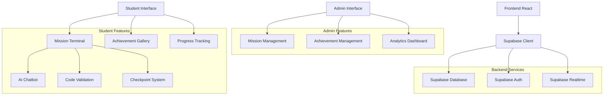

# Especificações Técnicas - Correção Missions & Achievements

## 1. Arquitetura da Solução

### 1.1 Diagrama de Arquitetura



### 1.2 Tecnologias Utilizadas

- **Frontend**: React 18 + TypeScript + Tailwind CSS + Vite
- **Backend**: Supabase (PostgreSQL + Auth + Realtime)
- **Estado**: React Context + Custom Hooks
- **UI Components**: shadcn/ui + Lucide Icons
- **Validação**: Zod
- **Notificações**: React Hot Toast

## 2. Schema do Banco de Dados Detalhado

### 2.1 Script de Migração Completo

```sql
-- =============================================
-- ESQUADS ACADEMY - MISSIONS & ACHIEVEMENTS
-- Schema Migration Script
-- =============================================

-- 1. CRIAR EXTENSÕES NECESSÁRIAS
CREATE EXTENSION IF NOT EXISTS "uuid-ossp";

-- 2. CRIAR TABELA DE PERFIS
CREATE TABLE IF NOT EXISTS public.profiles (
    id UUID PRIMARY KEY REFERENCES auth.users(id) ON DELETE CASCADE,
    full_name TEXT,
    avatar_url TEXT,
    role TEXT DEFAULT 'student' CHECK (role IN ('admin', 'student')),
    points INTEGER DEFAULT 0,
    level INTEGER DEFAULT 1,
    experience INTEGER DEFAULT 0,
    streak_days INTEGER DEFAULT 0,
    last_activity TIMESTAMP WITH TIME ZONE DEFAULT NOW(),
    created_at TIMESTAMP WITH TIME ZONE DEFAULT NOW(),
    updated_at TIMESTAMP WITH TIME ZONE DEFAULT NOW()
);

-- 3. CRIAR TABELA DE MISSÕES
CREATE TABLE IF NOT EXISTS public.missions (
    id UUID PRIMARY KEY DEFAULT gen_random_uuid(),
    title TEXT NOT NULL,
    description TEXT,
    objective TEXT,
    type TEXT CHECK (type IN ('daily', 'weekly', 'ai_generated', 'contextual', 'special')),
    difficulty TEXT CHECK (difficulty IN ('beginner', 'intermediate', 'advanced', 'expert')),
    category TEXT CHECK (category IN ('programming', 'theory', 'project', 'challenge')),
    points INTEGER DEFAULT 0,
    experience_reward INTEGER DEFAULT 0,
    time_limit INTEGER, -- em minutos
    max_attempts INTEGER DEFAULT 3,
    prerequisites JSONB DEFAULT '[]'::jsonb,
    content JSONB, -- Conteúdo estruturado da missão
    validation_criteria JSONB, -- Critérios de validação
    hints JSONB DEFAULT '[]'::jsonb,
    checkpoints JSONB DEFAULT '[]'::jsonb,
    is_active BOOLEAN DEFAULT true,
    is_featured BOOLEAN DEFAULT false,
    created_by UUID REFERENCES auth.users(id),
    created_at TIMESTAMP WITH TIME ZONE DEFAULT NOW(),
    updated_at TIMESTAMP WITH TIME ZONE DEFAULT NOW()
);

-- 4. CRIAR TABELA DE PROGRESSO DE MISSÕES
CREATE TABLE IF NOT EXISTS public.mission_progress (
    id UUID PRIMARY KEY DEFAULT gen_random_uuid(),
    user_id UUID REFERENCES auth.users(id) ON DELETE CASCADE,
    mission_id UUID REFERENCES public.missions(id) ON DELETE CASCADE,
    status TEXT DEFAULT 'not_started' CHECK (status IN ('not_started', 'in_progress', 'completed', 'failed', 'abandoned')),
    progress_percentage INTEGER DEFAULT 0 CHECK (progress_percentage >= 0 AND progress_percentage <= 100),
    current_checkpoint INTEGER DEFAULT 0,
    attempts_used INTEGER DEFAULT 0,
    hints_used INTEGER DEFAULT 0,
    time_spent INTEGER DEFAULT 0, -- em segundos
    code_submissions JSONB DEFAULT '[]'::jsonb,
    validation_results JSONB DEFAULT '[]'::jsonb,
    started_at TIMESTAMP WITH TIME ZONE,
    completed_at TIMESTAMP WITH TIME ZONE,
    last_activity TIMESTAMP WITH TIME ZONE DEFAULT NOW(),
    created_at TIMESTAMP WITH TIME ZONE DEFAULT NOW(),
    UNIQUE(user_id, mission_id)
);

-- 5. CRIAR TABELA DE ACHIEVEMENTS
CREATE TABLE IF NOT EXISTS public.achievements (
    id UUID PRIMARY KEY DEFAULT gen_random_uuid(),
    name TEXT NOT NULL,
    description TEXT,
    type TEXT CHECK (type IN ('achievement', 'progress', 'special', 'milestone')),
    rarity TEXT CHECK (rarity IN ('common', 'rare', 'epic', 'legendary')),
    category TEXT CHECK (category IN ('learning', 'social', 'completion', 'streak', 'special')),
    points INTEGER DEFAULT 0,
    criteria JSONB, -- Critérios para conquistar o achievement
    icon_url TEXT,
    color_primary TEXT, -- Cor primária baseada na raridade
    color_secondary TEXT, -- Cor secundária
    unlock_message TEXT,
    is_active BOOLEAN DEFAULT true,
    is_secret BOOLEAN DEFAULT false, -- Achievements secretos
    unlock_order INTEGER, -- Ordem de desbloqueio
    created_at TIMESTAMP WITH TIME ZONE DEFAULT NOW(),
    updated_at TIMESTAMP WITH TIME ZONE DEFAULT NOW()
);

-- 6. CRIAR TABELA DE BADGES CONQUISTADOS
CREATE TABLE IF NOT EXISTS public.user_badges (
    id UUID PRIMARY KEY DEFAULT gen_random_uuid(),
    user_id UUID REFERENCES auth.users(id) ON DELETE CASCADE,
    achievement_id UUID REFERENCES public.achievements(id) ON DELETE CASCADE,
    progress_percentage INTEGER DEFAULT 0,
    is_unlocked BOOLEAN DEFAULT false,
    unlocked_at TIMESTAMP WITH TIME ZONE,
    notification_sent BOOLEAN DEFAULT false,
    created_at TIMESTAMP WITH TIME ZONE DEFAULT NOW(),
    UNIQUE(user_id, achievement_id)
);

-- 7. CRIAR TABELA DE CERTIFICADOS
CREATE TABLE IF NOT EXISTS public.certificates (
    id UUID PRIMARY KEY DEFAULT gen_random_uuid(),
    user_id UUID REFERENCES auth.users(id) ON DELETE CASCADE,
    course_id UUID REFERENCES public.courses(id) ON DELETE CASCADE,
    certificate_hash TEXT UNIQUE NOT NULL,
    certificate_url TEXT,
    title TEXT NOT NULL,
    description TEXT,
    completion_date TIMESTAMP WITH TIME ZONE DEFAULT NOW(),
    issued_at TIMESTAMP WITH TIME ZONE DEFAULT NOW(),
    is_verified BOOLEAN DEFAULT false,
    verification_date TIMESTAMP WITH TIME ZONE,
    verification_code TEXT UNIQUE,
    metadata JSONB DEFAULT '{}'::jsonb
);

-- 8. CRIAR TABELA DE NOTIFICAÇÕES
CREATE TABLE IF NOT EXISTS public.notifications (
    id UUID PRIMARY KEY DEFAULT gen_random_uuid(),
    user_id UUID REFERENCES auth.users(id) ON DELETE CASCADE,
    type TEXT CHECK (type IN ('achievement', 'mission', 'certificate', 'system', 'social')),
    title TEXT NOT NULL,
    message TEXT,
    data JSONB DEFAULT '{}'::jsonb,
    is_read BOOLEAN DEFAULT false,
    is_important BOOLEAN DEFAULT false,
    expires_at TIMESTAMP WITH TIME ZONE,
    created_at TIMESTAMP WITH TIME ZONE DEFAULT NOW()
);

-- 9. CRIAR TABELA DE CHATBOT CONVERSATIONS
CREATE TABLE IF NOT EXISTS public.chatbot_conversations (
    id UUID PRIMARY KEY DEFAULT gen_random_uuid(),
    user_id UUID REFERENCES auth.users(id) ON DELETE CASCADE,
    mission_id UUID REFERENCES public.missions(id) ON DELETE CASCADE,
    messages JSONB DEFAULT '[]'::jsonb,
    context JSONB DEFAULT '{}'::jsonb,
    is_active BOOLEAN DEFAULT true,
    created_at TIMESTAMP WITH TIME ZONE DEFAULT NOW(),
    updated_at TIMESTAMP WITH TIME ZONE DEFAULT NOW()
);

-- 10. CRIAR ÍNDICES PARA PERFORMANCE
CREATE INDEX IF NOT EXISTS idx_profiles_role ON public.profiles(role);
CREATE INDEX IF NOT EXISTS idx_profiles_points ON public.profiles(points DESC);
CREATE INDEX IF NOT EXISTS idx_profiles_level ON public.profiles(level DESC);

CREATE INDEX IF NOT EXISTS idx_missions_type ON public.missions(type);
CREATE INDEX IF NOT EXISTS idx_missions_difficulty ON public.missions(difficulty);
CREATE INDEX IF NOT EXISTS idx_missions_active ON public.missions(is_active);
CREATE INDEX IF NOT EXISTS idx_missions_featured ON public.missions(is_featured);

CREATE INDEX IF NOT EXISTS idx_mission_progress_user ON public.mission_progress(user_id);
CREATE INDEX IF NOT EXISTS idx_mission_progress_status ON public.mission_progress(status);
CREATE INDEX IF NOT EXISTS idx_mission_progress_completed ON public.mission_progress(completed_at DESC);

CREATE INDEX IF NOT EXISTS idx_achievements_type ON public.achievements(type);
CREATE INDEX IF NOT EXISTS idx_achievements_rarity ON public.achievements(rarity);
CREATE INDEX IF NOT EXISTS idx_achievements_active ON public.achievements(is_active);

CREATE INDEX IF NOT EXISTS idx_user_badges_user ON public.user_badges(user_id);
CREATE INDEX IF NOT EXISTS idx_user_badges_unlocked ON public.user_badges(is_unlocked, unlocked_at DESC);

CREATE INDEX IF NOT EXISTS idx_notifications_user ON public.notifications(user_id);
CREATE INDEX IF NOT EXISTS idx_notifications_unread ON public.notifications(user_id, is_read);
CREATE INDEX IF NOT EXISTS idx_notifications_created ON public.notifications(created_at DESC);

-- 11. HABILITAR ROW LEVEL SECURITY
ALTER TABLE public.profiles ENABLE ROW LEVEL SECURITY;
ALTER TABLE public.missions ENABLE ROW LEVEL SECURITY;
ALTER TABLE public.mission_progress ENABLE ROW LEVEL SECURITY;
ALTER TABLE public.achievements ENABLE ROW LEVEL SECURITY;
ALTER TABLE public.user_badges ENABLE ROW LEVEL SECURITY;
ALTER TABLE public.certificates ENABLE ROW LEVEL SECURITY;
ALTER TABLE public.notifications ENABLE ROW LEVEL SECURITY;
ALTER TABLE public.chatbot_conversations ENABLE ROW LEVEL SECURITY;

-- 12. CRIAR POLÍTICAS RLS

-- Políticas para profiles
CREATE POLICY "Usuários podem ver próprio perfil" ON public.profiles
    FOR SELECT USING (auth.uid() = id);

CREATE POLICY "Usuários podem atualizar próprio perfil" ON public.profiles
    FOR UPDATE USING (auth.uid() = id);

CREATE POLICY "Admins podem ver todos os perfis" ON public.profiles
    FOR SELECT USING (
        EXISTS (
            SELECT 1 FROM public.profiles 
            WHERE id = auth.uid() AND role = 'admin'
        )
    );

-- Políticas para missions
CREATE POLICY "Todos podem ver missões ativas" ON public.missions
    FOR SELECT USING (is_active = true);

CREATE POLICY "Admins podem gerenciar missões" ON public.missions
    FOR ALL USING (
        EXISTS (
            SELECT 1 FROM public.profiles 
            WHERE id = auth.uid() AND role = 'admin'
        )
    );

-- Políticas para mission_progress
CREATE POLICY "Usuários podem ver próprio progresso" ON public.mission_progress
    FOR SELECT USING (user_id = auth.uid());

CREATE POLICY "Usuários podem inserir próprio progresso" ON public.mission_progress
    FOR INSERT WITH CHECK (user_id = auth.uid());

CREATE POLICY "Usuários podem atualizar próprio progresso" ON public.mission_progress
    FOR UPDATE USING (user_id = auth.uid());

CREATE POLICY "Admins podem ver todo progresso" ON public.mission_progress
    FOR SELECT USING (
        EXISTS (
            SELECT 1 FROM public.profiles 
            WHERE id = auth.uid() AND role = 'admin'
        )
    );

-- Políticas para achievements
CREATE POLICY "Todos podem ver achievements ativos" ON public.achievements
    FOR SELECT USING (is_active = true AND is_secret = false);

CREATE POLICY "Admins podem gerenciar achievements" ON public.achievements
    FOR ALL USING (
        EXISTS (
            SELECT 1 FROM public.profiles 
            WHERE id = auth.uid() AND role = 'admin'
        )
    );

-- Políticas para user_badges
CREATE POLICY "Usuários podem ver próprios badges" ON public.user_badges
    FOR SELECT USING (user_id = auth.uid());

CREATE POLICY "Sistema pode inserir badges" ON public.user_badges
    FOR INSERT WITH CHECK (user_id = auth.uid());

CREATE POLICY "Sistema pode atualizar badges" ON public.user_badges
    FOR UPDATE USING (user_id = auth.uid());

-- Políticas para certificates
CREATE POLICY "Usuários podem ver próprios certificados" ON public.certificates
    FOR SELECT USING (user_id = auth.uid());

CREATE POLICY "Sistema pode inserir certificados" ON public.certificates
    FOR INSERT WITH CHECK (user_id = auth.uid());

CREATE POLICY "Admins podem ver todos certificados" ON public.certificates
    FOR SELECT USING (
        EXISTS (
            SELECT 1 FROM public.profiles 
            WHERE id = auth.uid() AND role = 'admin'
        )
    );

-- Políticas para notifications
CREATE POLICY "Usuários podem ver próprias notificações" ON public.notifications
    FOR SELECT USING (user_id = auth.uid());

CREATE POLICY "Sistema pode inserir notificações" ON public.notifications
    FOR INSERT WITH CHECK (user_id = auth.uid());

CREATE POLICY "Usuários podem atualizar próprias notificações" ON public.notifications
    FOR UPDATE USING (user_id = auth.uid());

-- Políticas para chatbot_conversations
CREATE POLICY "Usuários podem ver próprias conversas" ON public.chatbot_conversations
    FOR SELECT USING (user_id = auth.uid());

CREATE POLICY "Usuários podem inserir próprias conversas" ON public.chatbot_conversations
    FOR INSERT WITH CHECK (user_id = auth.uid());

CREATE POLICY "Usuários podem atualizar próprias conversas" ON public.chatbot_conversations
    FOR UPDATE USING (user_id = auth.uid());

-- 13. CRIAR FUNÇÕES AUXILIARES

-- Função para atualizar updated_at automaticamente
CREATE OR REPLACE FUNCTION update_updated_at_column()
RETURNS TRIGGER AS $$
BEGIN
    NEW.updated_at = NOW();
    RETURN NEW;
END;
$$ language 'plpgsql';

-- Triggers para updated_at
CREATE TRIGGER update_profiles_updated_at BEFORE UPDATE ON public.profiles
    FOR EACH ROW EXECUTE FUNCTION update_updated_at_column();

CREATE TRIGGER update_missions_updated_at BEFORE UPDATE ON public.missions
    FOR EACH ROW EXECUTE FUNCTION update_updated_at_column();

CREATE TRIGGER update_achievements_updated_at BEFORE UPDATE ON public.achievements
    FOR EACH ROW EXECUTE FUNCTION update_updated_at_column();

CREATE TRIGGER update_chatbot_conversations_updated_at BEFORE UPDATE ON public.chatbot_conversations
    FOR EACH ROW EXECUTE FUNCTION update_updated_at_column();

-- Função para calcular nível baseado na experiência
CREATE OR REPLACE FUNCTION calculate_user_level(experience INTEGER)
RETURNS INTEGER AS $$
BEGIN
    -- Fórmula: level = floor(sqrt(experience / 100)) + 1
    RETURN FLOOR(SQRT(experience / 100.0)) + 1;
END;
$$ LANGUAGE plpgsql;

-- Função para verificar achievements automaticamente
CREATE OR REPLACE FUNCTION check_user_achievements(user_uuid UUID)
RETURNS VOID AS $$
DECLARE
    achievement_record RECORD;
    user_stats RECORD;
BEGIN
    -- Buscar estatísticas do usuário
    SELECT 
        p.points,
        p.level,
        p.experience,
        p.streak_days,
        COUNT(mp.id) FILTER (WHERE mp.status = 'completed') as completed_missions,
        COUNT(ub.id) FILTER (WHERE ub.is_unlocked = true) as unlocked_badges
    INTO user_stats
    FROM public.profiles p
    LEFT JOIN public.mission_progress mp ON mp.user_id = p.id
    LEFT JOIN public.user_badges ub ON ub.user_id = p.id
    WHERE p.id = user_uuid
    GROUP BY p.id, p.points, p.level, p.experience, p.streak_days;

    -- Verificar cada achievement ativo
    FOR achievement_record IN 
        SELECT * FROM public.achievements 
        WHERE is_active = true
    LOOP
        -- Lógica de verificação baseada nos critérios
        -- (implementar conforme necessário)
        NULL;
    END LOOP;
END;
$$ LANGUAGE plpgsql;

-- 14. INSERIR DADOS INICIAIS

-- Achievements padrão
INSERT INTO public.achievements (name, description, type, rarity, category, points, criteria, color_primary, color_secondary, unlock_message) VALUES
('Primeiro Passo', 'Complete sua primeira missão', 'milestone', 'common', 'learning', 10, '{"missions_completed": 1}', '#10B981', '#D1FAE5', 'Parabéns! Você completou sua primeira missão!'),
('Explorador', 'Complete 10 missões', 'progress', 'common', 'learning', 50, '{"missions_completed": 10}', '#10B981', '#D1FAE5', 'Você está se tornando um verdadeiro explorador!'),
('Veterano', 'Complete 50 missões', 'progress', 'rare', 'learning', 200, '{"missions_completed": 50}', '#3B82F6', '#DBEAFE', 'Impressionante! Você é um veterano das missões!'),
('Mestre', 'Complete 100 missões', 'progress', 'epic', 'learning', 500, '{"missions_completed": 100}', '#8B5CF6', '#EDE9FE', 'Você alcançou o nível de Mestre!'),
('Lenda', 'Complete 200 missões', 'progress', 'legendary', 'learning', 1000, '{"missions_completed": 200}', '#F59E0B', '#FEF3C7', 'Você se tornou uma LENDA!'),
('Persistente', 'Mantenha uma sequência de 7 dias', 'achievement', 'rare', 'streak', 100, '{"streak_days": 7}', '#3B82F6', '#DBEAFE', 'Sua persistência está dando frutos!'),
('Dedicado', 'Mantenha uma sequência de 30 dias', 'achievement', 'epic', 'streak', 300, '{"streak_days": 30}', '#8B5CF6', '#EDE9FE', 'Sua dedicação é inspiradora!'),
('Social', 'Participe de 5 discussões no fórum', 'achievement', 'common', 'social', 25, '{"forum_posts": 5}', '#10B981', '#D1FAE5', 'Você está contribuindo para a comunidade!'),
('Mentor', 'Ajude 10 colegas no fórum', 'achievement', 'rare', 'social', 150, '{"helpful_posts": 10}', '#3B82F6', '#DBEAFE', 'Você é um verdadeiro mentor!');

-- Missões de exemplo
INSERT INTO public.missions (title, description, objective, type, difficulty, category, points, experience_reward, time_limit, content, validation_criteria, hints, checkpoints) VALUES
('Olá Mundo em Python', 'Crie seu primeiro programa em Python', 'Escrever um programa que exiba "Olá, Mundo!" na tela', 'daily', 'beginner', 'programming', 10, 25, 30, 
'{"language": "python", "template": "# Escreva seu código aqui\nprint(\"___\")", "expected_output": "Olá, Mundo!"}',
'{"output_match": "Olá, Mundo!", "syntax_check": true}',
'["Lembre-se de usar aspas", "A função print() exibe texto na tela", "Não esqueça dos parênteses"]',
'[{"id": 1, "title": "Escrever o código", "description": "Digite o código Python"}]'),

('Variáveis e Tipos', 'Aprenda sobre variáveis em Python', 'Criar variáveis de diferentes tipos e exibi-las', 'daily', 'beginner', 'programming', 15, 30, 45,
'{"language": "python", "template": "# Crie as variáveis solicitadas\nnome = \"\"\nidade = 0\naltura = 0.0\n\n# Exiba as variáveis", "requirements": ["string", "integer", "float"]}',
'{"variable_types": ["str", "int", "float"], "output_contains": ["nome", "idade", "altura"]}',
'["Strings usam aspas", "Números inteiros não têm casas decimais", "Números decimais usam ponto"]',
'[{"id": 1, "title": "Criar variáveis", "description": "Defina as três variáveis"}, {"id": 2, "title": "Exibir valores", "description": "Use print() para mostrar os valores"}]');

-- 15. CONCEDER PERMISSÕES

-- Permissões para authenticated users
GRANT SELECT ON public.profiles TO authenticated;
GRANT SELECT ON public.missions TO authenticated;
GRANT ALL ON public.mission_progress TO authenticated;
GRANT SELECT ON public.achievements TO authenticated;
GRANT ALL ON public.user_badges TO authenticated;
GRANT ALL ON public.certificates TO authenticated;
GRANT ALL ON public.notifications TO authenticated;
GRANT ALL ON public.chatbot_conversations TO authenticated;

-- Permissões para anon users (limitadas)
GRANT SELECT ON public.achievements TO anon;
GRANT SELECT ON public.missions TO anon;

-- Permissões para service_role (para funções administrativas)
GRANT ALL ON ALL TABLES IN SCHEMA public TO service_role;
GRANT ALL ON ALL SEQUENCES IN SCHEMA public TO service_role;
GRANT ALL ON ALL FUNCTIONS IN SCHEMA public TO service_role;

COMMIT;
```

## 3. Tipos TypeScript

### 3.1 Definições de Tipos

```typescript
// src/types/database.ts
export interface Database {
  public: {
    Tables: {
      profiles: {
        Row: Profile;
        Insert: Omit<Profile, 'id' | 'created_at' | 'updated_at'>;
        Update: Partial<Omit<Profile, 'id' | 'created_at'>>;
      };
      missions: {
        Row: Mission;
        Insert: Omit<Mission, 'id' | 'created_at' | 'updated_at'>;
        Update: Partial<Omit<Mission, 'id' | 'created_at'>>;
      };
      mission_progress: {
        Row: MissionProgress;
        Insert: Omit<MissionProgress, 'id' | 'created_at'>;
        Update: Partial<Omit<MissionProgress, 'id' | 'created_at'>>;
      };
      achievements: {
        Row: Achievement;
        Insert: Omit<Achievement, 'id' | 'created_at' | 'updated_at'>;
        Update: Partial<Omit<Achievement, 'id' | 'created_at'>>;
      };
      user_badges: {
        Row: UserBadge;
        Insert: Omit<UserBadge, 'id' | 'created_at'>;
        Update: Partial<Omit<UserBadge, 'id' | 'created_at'>>;
      };
      certificates: {
        Row: Certificate;
        Insert: Omit<Certificate, 'id' | 'issued_at'>;
        Update: Partial<Omit<Certificate, 'id' | 'issued_at'>>;
      };
      notifications: {
        Row: Notification;
        Insert: Omit<Notification, 'id' | 'created_at'>;
        Update: Partial<Omit<Notification, 'id' | 'created_at'>>;
      };
      chatbot_conversations: {
        Row: ChatbotConversation;
        Insert: Omit<ChatbotConversation, 'id' | 'created_at' | 'updated_at'>;
        Update: Partial<Omit<ChatbotConversation, 'id' | 'created_at'>>;
      };
    };
  };
}

// src/types/missions.ts
export interface Mission {
  id: string;
  title: string;
  description?: string;
  objective?: string;
  type: 'daily' | 'weekly' | 'ai_generated' | 'contextual' | 'special';
  difficulty: 'beginner' | 'intermediate' | 'advanced' | 'expert';
  category: 'programming' | 'theory' | 'project' | 'challenge';
  points: number;
  experience_reward: number;
  time_limit?: number;
  max_attempts: number;
  prerequisites: string[];
  content?: MissionContent;
  validation_criteria?: ValidationCriteria;
  hints: string[];
  checkpoints: Checkpoint[];
  is_active: boolean;
  is_featured: boolean;
  created_by?: string;
  created_at: string;
  updated_at: string;
}

export interface MissionContent {
  language?: string;
  template?: string;
  expected_output?: string;
  requirements?: string[];
  resources?: Resource[];
  examples?: Example[];
}

export interface ValidationCriteria {
  output_match?: string;
  output_contains?: string[];
  syntax_check?: boolean;
  variable_types?: string[];
  function_calls?: string[];
  custom_validation?: string;
}

export interface Checkpoint {
  id: number;
  title: string;
  description: string;
  validation?: ValidationCriteria;
  points?: number;
}

export interface Resource {
  type: 'link' | 'video' | 'document';
  title: string;
  url: string;
  description?: string;
}

export interface Example {
  title: string;
  code: string;
  explanation: string;
}

export interface MissionProgress {
  id: string;
  user_id: string;
  mission_id: string;
  status: 'not_started' | 'in_progress' | 'completed' | 'failed' | 'abandoned';
  progress_percentage: number;
  current_checkpoint: number;
  attempts_used: number;
  hints_used: number;
  time_spent: number;
  code_submissions: CodeSubmission[];
  validation_results: ValidationResult[];
  started_at?: string;
  completed_at?: string;
  last_activity: string;
  created_at: string;
}

export interface CodeSubmission {
  timestamp: string;
  code: string;
  checkpoint_id?: number;
  is_successful: boolean;
}

export interface ValidationResult {
  timestamp: string;
  checkpoint_id?: number;
  is_valid: boolean;
  errors?: string[];
  output?: string;
  execution_time?: number;
}

// src/types/achievements.ts
export interface Achievement {
  id: string;
  name: string;
  description?: string;
  type: 'achievement' | 'progress' | 'special' | 'milestone';
  rarity: 'common' | 'rare' | 'epic' | 'legendary';
  category: 'learning' | 'social' | 'completion' | 'streak' | 'special';
  points: number;
  criteria?: AchievementCriteria;
  icon_url?: string;
  color_primary?: string;
  color_secondary?: string;
  unlock_message?: string;
  is_active: boolean;
  is_secret: boolean;
  unlock_order?: number;
  created_at: string;
  updated_at: string;
}

export interface AchievementCriteria {
  missions_completed?: number;
  points_earned?: number;
  streak_days?: number;
  forum_posts?: number;
  helpful_posts?: number;
  courses_completed?: number;
  certificates_earned?: number;
  level_reached?: number;
  custom_criteria?: Record<string, any>;
}

export interface UserBadge {
  id: string;
  user_id: string;
  achievement_id: string;
  progress_percentage: number;
  is_unlocked: boolean;
  unlocked_at?: string;
  notification_sent: boolean;
  created_at: string;
  achievement?: Achievement;
}

// src/types/certificates.ts
export interface Certificate {
  id: string;
  user_id: string;
  course_id: string;
  certificate_hash: string;
  certificate_url?: string;
  title: string;
  description?: string;
  completion_date: string;
  issued_at: string;
  is_verified: boolean;
  verification_date?: string;
  verification_code?: string;
  metadata: Record<string, any>;
}

// src/types/notifications.ts
export interface Notification {
  id: string;
  user_id: string;
  type: 'achievement' | 'mission' | 'certificate' | 'system' | 'social';
  title: string;
  message?: string;
  data: Record<string, any>;
  is_read: boolean;
  is_important: boolean;
  expires_at?: string;
  created_at: string;
}

// src/types/chatbot.ts
export interface ChatbotConversation {
  id: string;
  user_id: string;
  mission_id: string;
  messages: ChatMessage[];
  context: Record<string, any>;
  is_active: boolean;
  created_at: string;
  updated_at: string;
}

export interface ChatMessage {
  id: string;
  role: 'user' | 'assistant' | 'system';
  content: string;
  timestamp: string;
  metadata?: Record<string, any>;
}

// src/types/profiles.ts
export interface Profile {
  id: string;
  full_name?: string;
  avatar_url?: string;
  role: 'admin' | 'student';
  points: number;
  level: number;
  experience: number;
  streak_days: number;
  last_activity: string;
  created_at: string;
  updated_at: string;
}
```

## 4. Hooks Personalizados

### 4.1 useMissions Hook Completo

```typescript
// src/hooks/useMissions.ts
import { useState, useEffect, useCallback } from 'react';
import { supabase } from '@/lib/supabase';
import { useAuth } from '@/contexts/AuthContext';
import { useNotifications } from '@/contexts/NotificationContext';
import type { Mission, MissionProgress, CodeSubmission, ValidationResult } from '@/types/missions';

export function useMissions() {
  const { user } = useAuth();
  const { addNotification } = useNotifications();
  
  const [missions, setMissions] = useState<Mission[]>([]);
  const [activeMission, setActiveMission] = useState<Mission | null>(null);
  const [missionProgress, setMissionProgress] = useState<MissionProgress[]>([]);
  const [loading, setLoading] = useState(true);
  const [error, setError] = useState<string | null>(null);

  // Buscar missões disponíveis
  const fetchMissions = useCallback(async () => {
    try {
      setLoading(true);
      const { data, error } = await supabase
        .from('missions')
        .select('*')
        .eq('is_active', true)
        .order('created_at', { ascending: false });

      if (error) throw error;
      setMissions(data || []);
    } catch (err) {
      setError(err instanceof Error ? err.message : 'Erro ao carregar missões');
    } finally {
      setLoading(false);
    }
  }, []);

  // Buscar progresso do usuário
  const fetchUserProgress = useCallback(async () => {
    if (!user) return;

    try {
      const { data, error } = await supabase
        .from('mission_progress')
        .select('*')
        .eq('user_id', user.id);

      if (error) throw error;
      setMissionProgress(data || []);
    } catch (err) {
      setError(err instanceof Error ? err.message : 'Erro ao carregar progresso');
    }
  }, [user]);

  // Iniciar missão
  const startMission = useCallback(async (missionId: string) => {
    if (!user) return false;

    try {
      const mission = missions.find(m => m.id === missionId);
      if (!mission) throw new Error('Missão não encontrada');

      // Verificar se já existe progresso
      const existingProgress = missionProgress.find(p => p.mission_id === missionId);
      if (existingProgress && existingProgress.status !== 'not_started') {
        setActiveMission(mission);
        return true;
      }

      // Criar novo progresso
      const { data, error } = await supabase
        .from('mission_progress')
        .insert({
          user_id: user.id,
          mission_id: missionId,
          status: 'in_progress',
          started_at: new Date().toISOString()
        })
        .select()
        .single();

      if (error) throw error;

      setMissionProgress(prev => [...prev.filter(p => p.mission_id !== missionId), data]);
      setActiveMission(mission);

      addNotification({
        type: 'mission',
        title: 'Missão Iniciada',
        message: `Você iniciou a missão: ${mission.title}`
      });

      return true;
    } catch (err) {
      setError(err instanceof Error ? err.message : 'Erro ao iniciar missão');
      return false;
    }
  }, [user, missions, missionProgress, addNotification]);

  // Submeter código
  const submitCode = useCallback(async (
    missionId: string, 
    code: string, 
    checkpointId?: number
  ) => {
    if (!user) return null;

    try {
      const progress = missionProgress.find(p => p.mission_id === missionId);
      if (!progress) throw new Error('Progresso da missão não encontrado');

      const mission = missions.find(m => m.id === missionId);
      if (!mission) throw new Error('Missão não encontrada');

      // Validar código
      const validationResult = await validateCode(code, mission, checkpointId);
      
      // Atualizar submissões
      const newSubmission: CodeSubmission = {
        timestamp: new Date().toISOString(),
        code,
        checkpoint_id: checkpointId,
        is_successful: validationResult.is_valid
      };

      const updatedSubmissions = [...progress.code_submissions, newSubmission];
      const updatedResults = [...progress.validation_results, validationResult];

      // Calcular novo progresso
      let newProgress = progress.progress_percentage;
      let newStatus = progress.status;

      if (validationResult.is_valid) {
        if (checkpointId) {
          // Progresso por checkpoint
          const totalCheckpoints = mission.checkpoints.length;
          const completedCheckpoints = updatedResults.filter(r => r.is_valid).length;
          newProgress = Math.round((completedCheckpoints / totalCheckpoints) * 100);
        } else {
          // Missão completa
          newProgress = 100;
          newStatus = 'completed';
        }
      }

      // Atualizar no banco
      const { data, error } = await supabase
        .from('mission_progress')
        .update({
          progress_percentage: newProgress,
          status: newStatus,
          code_submissions: updatedSubmissions,
          validation_results: updatedResults,
          attempts_used: progress.attempts_used + 1,
          last_activity: new Date().toISOString(),
          ...(newStatus === 'completed' && { completed_at: new Date().toISOString() })
        })
        .eq('id', progress.id)
        .select()
        .single();

      if (error) throw error;

      setMissionProgress(prev => 
        prev.map(p => p.id === progress.id ? data : p)
      );

      // Notificar se completou
      if (newStatus === 'completed') {
        addNotification({
          type: 'mission',
          title: 'Missão Completada!',
          message: `Parabéns! Você completou: ${mission.title}`
        });

        // Atualizar pontos e experiência do usuário
        await updateUserStats(mission.points, mission.experience_reward);
      }

      return validationResult;
    } catch (err) {
      setError(err instanceof Error ? err.message : 'Erro ao submeter código');
      return null;
    }
  }, [user, missions, missionProgress, addNotification]);

  // Validar código
  const validateCode = async (
    code: string, 
    mission: Mission, 
    checkpointId?: number
  ): Promise<ValidationResult> => {
    try {
      // Aqui você implementaria a lógica de validação
      // Por exemplo, executar o código em um sandbox seguro
      
      const criteria = checkpointId 
        ? mission.checkpoints.find(c => c.id === checkpointId)?.validation
        : mission.validation_criteria;

      if (!criteria) {
        return {
          timestamp: new Date().toISOString(),
          checkpoint_id: checkpointId,
          is_valid: false,
          errors: ['Critérios de validação não encontrados']
        };
      }

      // Validação básica de sintaxe (exemplo para Python)
      if (criteria.syntax_check && mission.content?.language === 'python') {
        // Implementar validação de sintaxe Python
      }

      // Validação de saída esperada
      if (criteria.output_match) {
        // Executar código e comparar saída
      }

      // Por enquanto, retorna sucesso para demonstração
      return {
        timestamp: new Date().toISOString(),
        checkpoint_id: checkpointId,
        is_valid: true,
        output: 'Código executado com sucesso!'
      };
    } catch (err) {
      return {
        timestamp: new Date().toISOString(),
        checkpoint_id: checkpointId,
        is_valid: false,
        errors: [err instanceof Error ? err.message : 'Erro na validação']
      };
    }
  };

  // Solicitar dica
  const requestHint = useCallback(async (missionId: string, step: number) => {
    if (!user) return null;

    try {
      const mission = missions.find(m => m.id === missionId);
      if (!mission) throw new Error('Missão não encontrada');

      const progress = missionProgress.find(p => p.mission_id === missionId);
      if (!progress) throw new Error('Progresso não encontrado');

      // Verificar se ainda há dicas disponíveis
      if (progress.hints_used >= mission.hints.length) {
        throw new Error('Todas as dicas já foram utilizadas');
      }

      const hint = mission.hints[progress.hints_used];

      // Atualizar contador de dicas
      const { error } = await supabase
        .from('mission_progress')
        .update({
          hints_used: progress.hints_used + 1,
          last_activity: new Date().toISOString()
        })
        .eq('id', progress.id);

      if (error) throw error;

      setMissionProgress(prev =>
        prev.map(p => 
          p.id === progress.id 
            ? { ...p, hints_used: p.hints_used + 1 }
            : p
        )
      );

      return hint;
    } catch (err) {
      setError(err instanceof Error ? err.message : 'Erro ao solicitar dica');
      return null;
    }
  }, [user, missions, missionProgress]);

  // Atualizar estatísticas do usuário
  const updateUserStats = async (points: number, experience: number) => {
    if (!user) return;

    try {
      const { error } = await supabase.rpc('update_user_stats', {
        user_uuid: user.id,
        points_to_add: points,
        experience_to_add: experience
      });

      if (error) throw error;
    } catch (err) {
      console.error('Erro ao atualizar estatísticas:', err);
    }
  };

  // Efeitos
  useEffect(() => {
    fetchMissions();
  }, [fetchMissions]);

  useEffect(() => {
    if (user) {
      fetchUserProgress();
    }
  }, [user, fetchUserProgress]);

  return {
    missions,
    activeMission,
    missionProgress,
    loading,
    error,
    startMission,
    submitCode,
    requestHint,
    setActiveMission,
    refetch: () => {
      fetchMissions();
      fetchUserProgress();
    }
  };
}
```

### 4.2 useAchievements Hook

```typescript
// src/hooks/useAchievements.ts
import { useState, useEffect, useCallback } from 'react';
import { supabase } from '@/lib/supabase';
import { useAuth } from '@/contexts/AuthContext';
import { useNotifications } from '@/contexts/NotificationContext';
import type { Achievement, UserBadge } from '@/types/achievements';

export function useAchievements() {
  const { user } = useAuth();
  const { addNotification } = useNotifications();
  
  const [achievements, setAchievements] = useState<Achievement[]>([]);
  const [userBadges, setUserBadges] = useState<UserBadge[]>([]);
  const [loading, setLoading] = useState(true);
  const [error, setError] = useState<string | null>(null);

  // Buscar achievements disponíveis
  const fetchAchievements = useCallback(async () => {
    try {
      setLoading(true);
      const { data, error } = await supabase
        .from('achievements')
        .select('*')
        .eq('is_active', true)
        .order('unlock_order', { ascending: true });

      if (error) throw error;
      setAchievements(data || []);
    } catch (err) {
      setError(err instanceof Error ? err.message : 'Erro ao carregar achievements');
    } finally {
      setLoading(false);
    }
  }, []);

  // Buscar badges do usuário
  const fetchUserBadges = useCallback(async () => {
    if (!user) return;

    try {
      const { data, error } = await supabase
        .from('user_badges')
        .select(`
          *,
          achievement:achievements(*)
        `)
        .eq('user_id', user.id);

      if (error) throw error;
      setUserBadges(data || []);
    } catch (err) {
      setError(err instanceof Error ? err.message : 'Erro ao carregar badges');
    }
  }, [user]);

  // Verificar achievements automaticamente
  const checkAchievements = useCallback(async () => {
    if (!user) return;

    try {
      // Chamar função do banco que verifica achievements
      const { error } = await supabase.rpc('check_user_achievements', {
        user_uuid: user.id
      });

      if (error) throw error;

      // Recarregar badges após verificação
      await fetchUserBadges();
    } catch (err) {
      console.error('Erro ao verificar achievements:', err);
    }
  }, [user, fetchUserBadges]);

  // Desbloquear achievement manualmente (para testes)
  const unlockAchievement = useCallback(async (achievementId: string) => {
    if (!user) return false;

    try {
      const achievement = achievements.find(a => a.id === achievementId);
      if (!achievement) throw new Error('Achievement não encontrado');

      // Verificar se já foi desbloqueado
      const existingBadge = userBadges.find(b => b.achievement_id === achievementId);
      if (existingBadge?.is_unlocked) {
        throw new Error('Achievement já desbloqueado');
      }

      // Desbloquear
      const { data, error } = await supabase
        .from('user_badges')
        .upsert({
          user_id: user.id,
          achievement_id: achievementId,
          progress_percentage: 100,
          is_unlocked: true,
          unlocked_at: new Date().toISOString()
        })
        .select(`
          *,
          achievement:achievements(*)
        `)
        .single();

      if (error) throw error;

      setUserBadges(prev => {
        const filtered = prev.filter(b => b.achievement_id !== achievementId);
        return [...filtered, data];
      });

      // Notificar usuário
      addNotification({
        type: 'achievement',
        title: 'Achievement Desbloqueado!',
        message: achievement.unlock_message || `Você desbloqueou: ${achievement.name}`
      });

      return true;
    } catch (err) {
      setError(err instanceof Error ? err.message : 'Erro ao desbloquear achievement');
      return false;
    }
  }, [user, achievements, userBadges, addNotification]);

  // Atualizar progresso de achievement
  const updateAchievementProgress = useCallback(async (
    achievementId: string, 
    progress: number
  ) => {
    if (!user) return;

    try {
      const { error } = await supabase
        .from('user_badges')
        .upsert({
          user_id: user.id,
          achievement_id: achievementId,
          progress_percentage: Math.min(progress, 100),
          is_unlocked: progress >= 100,
          ...(progress >= 100 && { unlocked_at: new Date().toISOString() })
        });

      if (error) throw error;

      // Se completou, desbloquear
      if (progress >= 100) {
        await unlockAchievement(achievementId);
      } else {
        await fetchUserBadges();
      }
    } catch (err) {
      console.error('Erro ao atualizar progresso:', err);
    }
  }, [user, unlockAchievement, fetchUserBadges]);

  // Estatísticas dos achievements
  const getAchievementStats = useCallback(() => {
    const total = achievements.length;
    const unlocked = userBadges.filter(b => b.is_unlocked).length;
    const inProgress = userBadges.filter(b => !b.is_unlocked && b.progress_percentage > 0).length;
    
    const byRarity = achievements.reduce((acc, achievement) => {
      const userBadge = userBadges.find(b => b.achievement_id === achievement.id);
      if (userBadge?.is_unlocked) {
        acc[achievement.rarity] = (acc[achievement.rarity] || 0) + 1;
      }
      return acc;
    }, {} as Record<string, number>);

    const totalPoints = userBadges
      .filter(b => b.is_unlocked && b.achievement)
      .reduce((sum, badge) => sum + (badge.achievement?.points || 0), 0);

    return {
      total,
      unlocked,
      inProgress,
      percentage: total > 0 ? Math.round((unlocked / total) * 100) : 0,
      byRarity,
      totalPoints
    };
  }, [achievements, userBadges]);

  // Efeitos
  useEffect(() => {
    fetchAchievements();
  }, [fetchAchievements]);

  useEffect(() => {
    if (user) {
      fetchUserBadges();
    }
  }, [user, fetchUserBadges]);

  return {
    achievements,
    userBadges,
    loading,
    error,
    stats: getAchievementStats(),
    checkAchievements,
    unlockAchievement,
    updateAchievementProgress,
    refetch: () => {
      fetchAchievements();
      fetchUserBadges();
    }
  };
}
```

## 5. Componentes de Interface

### 5.1 Componente MissionTerminal

```typescript
// src/components/missions/MissionTerminal.tsx
import React, { useState, useRef, useEffect } from 'react';
import { Card, CardContent, CardHeader, CardTitle } from '@/components/ui/card';
import { Button } from '@/components/ui/button';
import { Badge } from '@/components/ui/badge';
import { Progress } from '@/components/ui/progress';
import { 
  Play, 
  Square, 
  RotateCcw, 
  Lightbulb, 
  CheckCircle, 
  XCircle,
  Clock,
  Target
} from 'lucide-react';
import { useMissions } from '@/hooks/useMissions';
import { ChatbotIA } from './ChatbotIA';
import type { Mission, MissionProgress } from '@/types/missions';

interface MissionTerminalProps {
  mission: Mission;
  progress?: MissionProgress;
  onComplete?: () => void;
}

export function MissionTerminal({ mission, progress, onComplete }: MissionTerminalProps) {
  const { submitCode, requestHint } = useMissions();
  const [code, setCode] = useState(mission.content?.template || '');
  const [output, setOutput] = useState('');
  const [isRunning, setIsRunning] = useState(false);
  const [showChatbot, setShowChatbot] = useState(false);
  const [timeSpent, setTimeSpent] = useState(progress?.time_spent || 0);
  const textareaRef = useRef<HTMLTextAreaElement>(null);
  const intervalRef = useRef<NodeJS.Timeout>();

  // Timer para rastrear tempo gasto
  useEffect(() => {
    if (progress?.status === 'in_progress') {
      intervalRef.current = setInterval(() => {
        setTimeSpent(prev => prev + 1);
      }, 1000);
    }

    return () => {
      if (intervalRef.current) {
        clearInterval(intervalRef.current);
      }
    };
  }, [progress?.status]);

  // Executar código
  const handleRunCode = async () => {
    setIsRunning(true);
    setOutput('Executando código...\n');

    try {
      const result = await submitCode(mission.id, code);
      
      if (result) {
        if (result.is_valid) {
          setOutput(prev => prev + `✅ Sucesso!\n${result.output || ''}`);
          if (progress?.progress_percentage === 100) {
            onComplete?.();
          }
        } else {
          setOutput(prev => prev + `❌ Erro:\n${result.errors?.join('\n') || 'Código incorreto'}`);
        }
      }
    } catch (error) {
      setOutput(prev => prev + `❌ Erro de execução: ${error}`);
    } finally {
      setIsRunning(false);
    }
  };

  // Solicitar dica
  const handleRequestHint = async () => {
    const hint = await requestHint(mission.id, progress?.current_checkpoint || 0);
    if (hint) {
      setShowChatbot(true);
    }
  };

  // Resetar código
  const handleReset = () => {
    setCode(mission.content?.template || '');
    setOutput('');
  };

  // Formatar tempo
  const formatTime = (seconds: number) => {
    const mins = Math.floor(seconds / 60);
    const secs = seconds % 60;
    return `${mins}:${secs.toString().padStart(2, '0')}`;
  };

  return (
    <div className="grid grid-cols-1 lg:grid-cols-2 gap-6 h-full">
      {/* Painel de Código */}
      <Card className="flex flex-col">
        <CardHeader>
          <div className="flex items-center justify-between">
            <CardTitle className="flex items-center gap-2">
              <Target className="w-5 h-5" />
              {mission.title}
            </CardTitle>
            <div className="flex items-center gap-2">
              <Badge variant={
                mission.difficulty === 'beginner' ? 'default' :
                mission.difficulty === 'intermediate' ? 'secondary' :
                mission.difficulty === 'advanced' ? 'destructive' : 'outline'
              }>
                {mission.difficulty}
              </Badge>
              <Badge variant="outline" className="flex items-center gap-1">
                <Clock className="w-3 h-3" />
                {formatTime(timeSpent)}
              </Badge>
            </div>
          </div>
          
          {/* Progresso */}
          {progress && (
            <div className="space-y-2">
              <div className="flex justify-between text-sm">
                <span>Progresso</span>
                <span>{progress.progress_percentage}%</span>
              </div>
              <Progress value={progress.progress_percentage} className="h-2" />
            </div>
          )}
        </CardHeader>

        <CardContent className="flex-1 flex flex-col">
          {/* Descrição da Missão */}
          <div className="mb-4 p-3 bg-blue-50 rounded-lg">
            <h4 className="font-semibold text-blue-900 mb-2">Objetivo:</h4>
            <p className="text-blue-800 text-sm">{mission.objective}</p>
          </div>

          {/* Editor de Código */}
          <div className="flex-1 flex flex-col">
            <div className="flex items-center justify-between mb-2">
              <label className="text-sm font-medium">Código:</label>
              <div className="flex gap-2">
                <Button
                  size="sm"
                  variant="outline"
                  onClick={handleRequestHint}
                  disabled={!progress || progress.hints_used >= mission.hints.length}
                >
                  <Lightbulb className="w-4 h-4 mr-1" />
                  Dica ({progress?.hints_used || 0}/{mission.hints.length})
                </Button>
                <Button size="sm" variant="outline" onClick={handleReset}>
                  <RotateCcw className="w-4 h-4 mr-1" />
                  Resetar
                </Button>
              </div>
            </div>
            
            <textarea
              ref={textareaRef}
              value={code}
              onChange={(e) => setCode(e.target.value)}
              className="flex-1 min-h-[300px] p-3 border rounded-lg font-mono text-sm resize-none focus:outline-none focus:ring-2 focus:ring-blue-500"
              placeholder="Digite seu código aqui..."
              spellCheck={false}
            />
          </div>

          {/* Botões de Ação */}
          <div className="flex gap-2 mt-4">
            <Button
              onClick={handleRunCode}
              disabled={isRunning || !code.trim()}
              className="flex-1"
            >
              {isRunning ? (
                <>
                  <Square className="w-4 h-4 mr-2" />
                  Executando...
                </>
              ) : (
                <>
                  <Play className="w-4 h-4 mr-2" />
                  Executar
                </>
              )}
            </Button>
          </div>
        </CardContent>
      </Card>

      {/* Painel de Saída e Informações */}
      <div className="flex flex-col gap-6">
        {/* Saída do Código */}
        <Card className="flex-1">
          <CardHeader>
            <CardTitle className="flex items-center gap-2">
              <CheckCircle className="w-5 h-5" />
              Saída
            </CardTitle>
          </CardHeader>
          <CardContent>
            <pre className="bg-gray-900 text-green-400 p-4 rounded-lg min-h-[200px] overflow-auto font-mono text-sm whitespace-pre-wrap">
              {output || 'Clique em "Executar" para ver a saída do seu código...'}
            </pre>
          </CardContent>
        </Card>

        {/* Checkpoints */}
        {mission.checkpoints.length > 0 && (
          <Card>
            <CardHeader>
              <CardTitle>Checkpoints</CardTitle>
            </CardHeader>
            <CardContent>
              <div className="space-y-3">
                {mission.checkpoints.map((checkpoint, index) => {
                  const isCompleted = (progress?.current_checkpoint || 0) > index;
                  const isCurrent = (progress?.current_checkpoint || 0) === index;
                  
                  return (
                    <div
                      key={checkpoint.id}
                      className={`flex items-center gap-3 p-3 rounded-lg border ${
                        isCompleted ? 'bg-green-50 border-green-200' :
                        isCurrent ? 'bg-blue-50 border-blue-200' :
                        'bg-gray-50 border-gray-200'
                      }`}
                    >
                      <div className={`w-6 h-6 rounded-full flex items-center justify-center ${
                        isCompleted ? 'bg-green-500 text-white' :
                        isCurrent ? 'bg-blue-500 text-white' :
                        'bg-gray-300 text-gray-600'
                      }`}>
                        {isCompleted ? (
                          <CheckCircle className="w-4 h-4" />
                        ) : (
                          <span className="text-xs font-bold">{index + 1}</span>
                        )}
                      </div>
                      <div className="flex-1">
                        <h4 className="font-medium">{checkpoint.title}</h4>
                        <p className="text-sm text-gray-600">{checkpoint.description}</p>
                      </div>
                    </div>
                  );
                })}
              </div>
            </CardContent>
          </Card>
        )}

        {/* Estatísticas */}
        {progress && (
          <Card>
            <CardHeader>
              <CardTitle>Estatísticas</CardTitle>
            </CardHeader>
            <CardContent>
              <div className="grid grid-cols-2 gap-4 text-sm">
                <div>
                  <span className="text-gray-600">Tentativas:</span>
                  <span className="ml-2 font-semibold">
                    {progress.attempts_used}/{mission.max_attempts}
                  </span>
                </div>
                <div>
                  <span className="text-gray-600">Dicas usadas:</span>
                  <span className="ml-2 font-semibold">
                    {progress.hints_used}/{mission.hints.length}
                  </span>
                </div>
                <div>
                  <span className="text-gray-600">Pontos:</span>
                  <span className="ml-2 font-semibold text-blue-600">
                    {mission.points}
                  </span>
                </div>
                <div>
                  <span className="text-gray-600">Experiência:</span>
                  <span className="ml-2 font-semibold text-purple-600">
                    {mission.experience_reward} XP
                  </span>
                </div>
              </div>
            </CardContent>
          </Card>
        )}
      </div>

      {/* Chatbot IA */}
      {showChatbot && (
        <ChatbotIA
          missionId={mission.id}
          onClose={() => setShowChatbot(false)}
        />
      )}
    </div>
  );
}
```

## 6. Plano de Testes

### 6.1 Testes Unitários

```typescript
// src/__tests__/hooks/useMissions.test.ts
import { renderHook, act } from '@testing-library/react';
import { useMissions } from '@/hooks/useMissions';
import { supabase } from '@/lib/supabase';

// Mock do Supabase
jest.mock('@/lib/supabase');
const mockSupabase = supabase as jest.Mocked<typeof supabase>;

describe('useMissions', () => {
  beforeEach(() => {
    jest.clearAllMocks();
  });

  it('should fetch missions on mount', async () => {
    const mockMissions = [
      { id: '1', title: 'Test Mission', type: 'daily', difficulty: 'beginner' }
    ];

    mockSupabase.from.mockReturnValue({
      select: jest.fn().mockReturnValue({
        eq: jest.fn().mockReturnValue({
          order: jest.fn().mockResolvedValue({ data: mockMissions, error: null })
        })
      })
    } as any);

    const { result } = renderHook(() => useMissions());

    await act(async () => {
      // Aguardar carregamento
    });

    expect(result.current.missions).toEqual(mockMissions);
    expect(result.current.loading).toBe(false);
  });

  it('should start mission successfully', async () => {
    // Implementar teste de iniciar missão
  });

  it('should submit code and validate', async () => {
    // Implementar teste de submissão de código
  });
});
```

### 6.2 Testes de Integração

```typescript
// src/__tests__/integration/missions.test.ts
import { render, screen, fireEvent, waitFor } from '@testing-library/react';
import { MissionTerminal } from '@/components/missions/MissionTerminal';
import { TestWrapper } from '@/test-utils/TestWrapper';

describe('Mission Integration Tests', () => {
  it('should complete full mission flow', async () => {
    const mockMission = {
      id: '1',
      title: 'Hello World',
      content: { template: 'print("Hello, World!")' },
      validation_criteria: { output_match: 'Hello, World!' }
    };

    render(
      <TestWrapper>
        <MissionTerminal mission={mockMission} />
      </TestWrapper>
    );

    // Verificar se o terminal carregou
    expect(screen.getByText('Hello World')).toBeInTheDocument();

    // Executar código
    const runButton = screen.getByText('Executar');
    fireEvent.click(runButton);

    // Verificar resultado
    await waitFor(() => {
      expect(screen.getByText(/Sucesso/)).toBeInTheDocument();
    });
  });
});
```

## 7. Monitoramento e Analytics

### 7.1 Métricas de Missões

```sql
-- Views para analytics de missões
CREATE VIEW mission_analytics AS
SELECT 
    m.id,
    m.title,
    m.type,
    m.difficulty,
    COUNT(mp.id) as total_attempts,
    COUNT(mp.id) FILTER (WHERE mp.status = 'completed') as completions,
    COUNT(mp.id) FILTER (WHERE mp.status = 'failed') as failures,
    AVG(mp.time_spent) FILTER (WHERE mp.status = 'completed') as avg_completion_time,
    AVG(mp.attempts_used) FILTER (WHERE mp.status = 'completed') as avg_attempts,
    ROUND(
        COUNT(mp.id) FILTER (WHERE mp.status = 'completed')::numeric / 
        NULLIF(COUNT(mp.id), 0) * 100, 2
    ) as completion_rate
FROM missions m
LEFT JOIN mission_progress mp ON mp.mission_id = m.id
WHERE m.is_active = true
GROUP BY m.id, m.title, m.type, m.difficulty;

-- View para analytics de achievements
CREATE VIEW achievement_analytics AS
SELECT 
    a.id,
    a.name,
    a.type,
    a.rarity,
    COUNT(ub.id) as total_earned,
    COUNT(ub.id) FILTER (WHERE ub.unlocked_at >= NOW() - INTERVAL '7 days') as earned_this_week,
    COUNT(ub.id) FILTER (WHERE ub.unlocked_at >= NOW() - INTERVAL '30 days') as earned_this_month
FROM achievements a
LEFT JOIN user_badges ub ON ub.achievement_id = a.id AND ub.is_unlocked = true
WHERE a.is_active = true
GROUP BY a.id, a.name, a.type, a.rarity;
```

### 7.2 Dashboard de Métricas

```typescript
// src/components/admin/MissionAnalytics.tsx
import React, { useState, useEffect } from 'react';
import { Card, CardContent, CardHeader, CardTitle } from '@/components/ui/card';
import { BarChart, Bar, XAxis, YAxis, CartesianGrid, Tooltip, ResponsiveContainer } from 'recharts';
import { supabase } from '@/lib/supabase';

interface MissionMetrics {
  id: string;
  title: string;
  total_attempts: number;
  completions: number;
  completion_rate: number;
  avg_completion_time: number;
}

export function MissionAnalytics() {
  const [metrics, setMetrics] = useState<MissionMetrics[]>([]);
  const [loading, setLoading] = useState(true);

  useEffect(() => {
    fetchMetrics();
  }, []);

  const fetchMetrics = async () => {
    try {
      const { data, error } = await supabase
        .from('mission_analytics')
        .select('*')
        .order('completion_rate', { ascending: false })
        .limit(10);

      if (error) throw error;
      setMetrics(data || []);
    } catch (error) {
      console.error('Erro ao carregar métricas:', error);
    } finally {
      setLoading(false);
    }
  };

  if (loading) {
    return <div>Carregando métricas...</div>;
  }

  return (
    <div className="space-y-6">
      <Card>
        <CardHeader>
          <CardTitle>Taxa de Conclusão por Missão</CardTitle>
        </CardHeader>
        <CardContent>
          <ResponsiveContainer width="100%" height={400}>
            <BarChart data={metrics}>
              <CartesianGrid strokeDasharray="3 3" />
              <XAxis dataKey="title" />
              <YAxis />
              <Tooltip />
              <Bar dataKey="completion_rate" fill="#3B82F6" />
            </BarChart>
          </ResponsiveContainer>
        </CardContent>
      </Card>

      <div className="grid grid-cols-1 md:grid-cols-3 gap-6">
        <Card>
          <CardHeader>
            <CardTitle>Total de Tentativas</CardTitle>
          </CardHeader>
          <CardContent>
            <div className="text-3xl font-bold">
              {metrics.reduce((sum, m) => sum + m.total_attempts, 0)}
            </div>
          </CardContent>
        </Card>

        <Card>
          <CardHeader>
            <CardTitle>Total de Conclusões</CardTitle>
          </CardHeader>
          <CardContent>
            <div className="text-3xl font-bold text-green-600">
              {metrics.reduce((sum, m) => sum + m.completions, 0)}
            </div>
          </CardContent>
        </Card>

        <Card>
          <CardHeader>
            <CardTitle>Taxa Média de Conclusão</CardTitle>
          </CardHeader>
          <CardContent>
            <div className="text-3xl font-bold text-blue-600">
              {Math.round(
                metrics.reduce((sum, m) => sum + m.completion_rate, 0) / metrics.length
              )}%
            </div>
          </CardContent>
        </Card>
      </div>
    </div>
  );
}
```

## 8. Segurança e Validação

### 8.1 Validação de Código Segura

```typescript
// src/utils/codeValidation.ts
import { z } from 'zod';

// Schema para validação de submissão de código
export const codeSubmissionSchema = z.object({
  code: z.string().min(1, 'Código não pode estar vazio').max(10000, 'Código muito longo'),
  missionId: z.string().uuid('ID da missão inválido'),
  checkpointId: z.number().optional(),
  language: z.enum(['python', 'javascript', 'java', 'cpp']).optional()
});

// Função para sanitizar código
export function sanitizeCode(code: string): string {
  // Remover caracteres perigosos
  return code
    .replace(/[<>]/g, '') // Remover < e >
    .replace(/\x00/g, '') // Remover null bytes
    .trim();
}

// Validação de sintaxe básica para Python
export function validatePythonSyntax(code: string): { isValid: boolean; errors: string[] } {
  const errors: string[] = [];
  
  // Verificações básicas de sintaxe
  const lines = code.split('\n');
  let indentLevel = 0;
  
  for (let i = 0; i < lines.length; i++) {
    const line = lines[i];
    const lineNumber = i + 1;
    
    // Verificar indentação
    const leadingSpaces = line.match(/^ */)?.[0].length || 0;
    
    if (line.trim().endsWith(':')) {
      indentLevel = leadingSpaces + 4;
    } else if (line.trim() && leadingSpaces < indentLevel && !line.trim().startsWith('#')) {
      // Linha deve estar indentada
      if (leadingSpaces % 4 !== 0) {
        errors.push(`Linha ${lineNumber}: Indentação incorreta`);
      }
    }
    
    // Verificar parênteses balanceados
    const openParens = (line.match(/\(/g) || []).length;
    const closeParens = (line.match(/\)/g) || []).length;
    
    if (openParens !== closeParens) {
      errors.push(`Linha ${lineNumber}: Parênteses não balanceados`);
    }
  }
  
  return {
    isValid: errors.length === 0,
    errors
  };
}

// Sandbox para execução segura de código
export class CodeSandbox {
  private timeout: number;
  private maxMemory: number;
  
  constructor(timeout = 5000, maxMemory = 50 * 1024 * 1024) { // 5s, 50MB
    this.timeout = timeout;
    this.maxMemory = maxMemory;
  }
  
  async executeCode(code: string, language: string): Promise<{
    output: string;
    error?: string;
    executionTime: number;
  }> {
    const startTime = Date.now();
    
    try {
      // Sanitizar código
      const sanitizedCode = sanitizeCode(code);
      
      // Validar sintaxe
      if (language === 'python') {
        const validation = validatePythonSyntax(sanitizedCode);
        if (!validation.isValid) {
          return {
            output: '',
            error: validation.errors.join('\n'),
            executionTime: Date.now() - startTime
          };
        }
      }
      
      // Executar código (implementar integração com sandbox real)
      const result = await this.runInSandbox(sanitizedCode, language);
      
      return {
        output: result.output,
        error: result.error,
        executionTime: Date.now() - startTime
      };
    } catch (error) {
      return {
        output: '',
        error: error instanceof Error ? error.message : 'Erro desconhecido',
        executionTime: Date.now() - startTime
      };
    }
  }
  
  private async runInSandbox(code: string, language: string): Promise<{
    output: string;
    error?: string;
  }> {
    // Implementar integração com serviço de sandbox
    // Por exemplo: Judge0, Sphere Engine, ou container Docker
    
    // Por enquanto, simulação
    return new Promise((resolve) => {
      setTimeout(() => {
        if (code.includes('print("Hello, World!")')) {
          resolve({ output: 'Hello, World!' });
        } else {
          resolve({ output: 'Código executado com sucesso!' });
        }
      }, 1000);
    });
  }
}
```

### 8.2 Rate Limiting

```typescript
// src/utils/rateLimiter.ts
interface RateLimitConfig {
  windowMs: number; // Janela de tempo em ms
  maxRequests: number; // Máximo de requests por janela
}

class RateLimiter {
  private requests: Map<string, number[]> = new Map();
  
  constructor(private config: RateLimitConfig) {}
  
  isAllowed(userId: string): boolean {
    const now = Date.now();
    const userRequests = this.requests.get(userId) || [];
    
    // Remover requests antigas
    const validRequests = userRequests.filter(
      timestamp => now - timestamp < this.config.windowMs
    );
    
    // Verificar limite
    if (validRequests.length >= this.config.maxRequests) {
      return false;
    }
    
    // Adicionar nova request
    validRequests.push(now);
    this.requests.set(userId, validRequests);
    
    return true;
  }
  
  getRemainingRequests(userId: string): number {
    const now = Date.now();
    const userRequests = this.requests.get(userId) || [];
    const validRequests = userRequests.filter(
      timestamp => now - timestamp < this.config.windowMs
    );
    
    return Math.max(0, this.config.maxRequests - validRequests.length);
  }
}

// Rate limiters para diferentes ações
export const codeExecutionLimiter = new RateLimiter({
  windowMs: 60 * 1000, // 1 minuto
  maxRequests: 10 // 10 execuções por minuto
});

export const hintRequestLimiter = new RateLimiter({
  windowMs: 5 * 60 * 1000, // 5 minutos
  maxRequests: 3 // 3 dicas por 5 minutos
});
```

## 9. Conclusão

Este documento técnico fornece uma base sólida para a correção e implementação completa dos sistemas de Missões e Achievements da plataforma Esquads Academy. 

### 9.1 Próximos Passos

1. **Implementar o schema do banco de dados** seguindo o script de migração
2. **Desenvolver os hooks personalizados** com todas as funcionalidades
3. **Criar os componentes de interface** seguindo o design system
4. **Implementar testes** para garantir qualidade
5. **Configurar monitoramento** para acompanhar métricas
6. **Implementar segurança** com validação e rate limiting

### 9.2 Considerações Finais

- **Performance**: Utilizar índices adequados e cache quando necessário
- **Escalabilidade**: Estrutura preparada para crescimento
- **Segurança**: Validação rigorosa e execução segura de código
- **UX**: Interface intuitiva e feedback adequado
- **Manutenibilidade**: Código bem estruturado e documentado

A implementação seguindo estas especificações garantirá um sistema robusto, seguro e alinhado com os requisitos do PRD.