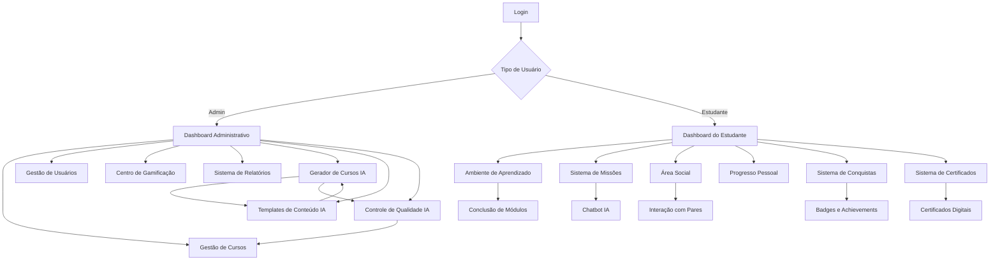

# Documento de Requisitos do Produto - Esquads Academy Platform

## 1. Visão Geral do Produto

A Esquads Academy Platform é uma plataforma de e-learning gamificada abrangente que oferece duas interfaces integradas: um painel administrativo completo para gestão de cursos e usuários, e uma área do estudante interativa com recursos de gamificação avançados. A plataforma resolve o problema da baixa retenção e engajamento em cursos online através de mecânicas de jogos, interação social e personalização do aprendizado.

O produto visa transformar a educação em cibersegurança e outras áreas técnicas, oferecendo uma experiência de aprendizado imersiva que mantém os estudantes motivados e engajados. A plataforma atende educadores, instituições de ensino e profissionais que buscam capacitação técnica de alta qualidade.

## 2. Funcionalidades Principais

### 2.1 Papéis de Usuário

| Papel | Método de Registro | Permissões Principais |
|-------|-------------------|----------------------|
| Administrador | Convite direto do sistema | Acesso total: gestão de usuários, cursos, configurações, relatórios e analytics, auditoria e políticas |
| Estudante | Registro por email ou convite | Acesso a cursos, missões IA, interação social, visualização de progresso, badges e leaderboard |

#### 2.1.1 Detalhamento de Permissões

- Admin:
  - Acessa `\admin\dashboard`; gerencia cursos (criar/editar/publicar), usuários (CRUD), categorias, certificados.
  - Configura gamificação (pontos, badges), visualiza relatórios e analytics, audita conteúdo gerado por IA.
  - Define políticas RLS, integrações externas e parâmetros do sistema.
- Student:
  - Acessa `\student\dashboard`; consome cursos e módulos, executa missões/quiz com suporte de IA.
  - Visualiza progresso, badges e certificados; participa de social e leaderboard.
  - Gerencia seu perfil e preferências.

### 2.2 Módulos de Funcionalidades

Nossa plataforma de e-learning gamificada consiste nas seguintes páginas principais:

1. **Dashboard Administrativo**: analytics em tempo real, métricas de engajamento, visão geral da plataforma, relatórios de uso.
2. **Gestão de Cursos**: editor rico de conteúdo, organização modular, controle de versão, publicação de materiais.
3. **Gestão de Usuários**: administração de papéis, permissões granulares, monitoramento de atividades, controle de acesso.
4. **Centro de Gamificação**: configuração de pontos, criação de badges, definição de regras de conquistas, configuração de leaderboards.
5. **Sistema de Relatórios**: tracking de resultados de aprendizado, estatísticas de uso, exportação de dados, análise de performance.
6. **Geração de Certificados**: templates customizáveis, emissão automática, validação digital, histórico de certificações.
7. **Simulador de Exames**: ambiente de testes baseado em cenários, avaliação de performance, feedback detalhado.
8. **Sistema de Missões**: terminal estruturado de missões, chatbot IA integrado, sistema de dicas progressivas.
9. **Dashboard do Estudante**: progresso personalizado, conquistas, desafios atuais, progressão de habilidades.
10. **Ambiente de Aprendizado**: progressão modular, tracking em tempo real, indicadores de conclusão, conteúdo interativo.
11. **Área Social**: ferramentas de interação entre pares, recursos colaborativos, elementos competitivos.
12. **Sistema de Autenticação**: login seguro, autenticação multifator, recuperação de senha, gestão de sessões.
13. **Gerador de Cursos IA**: criação automatizada de conteúdo didático, elementos visuais, avaliações.
14. **Templates de Conteúdo IA**: configuração de modelos e prompts para geração automática.
15. **Controle de Qualidade IA**: validação e métricas de conteúdo gerado automaticamente.
16. **Sistema de Conquistas**: página dedicada para visualização de badges, achievements e progresso gamificado.
17. **Sistema de Certificados**: gestão completa de certificados digitais com verificação e compartilhamento.

### 2.3 Detalhes das Páginas

| Nome da Página | Nome do Módulo | Descrição da Funcionalidade |
|----------------|----------------|------------------------------|
| Dashboard Administrativo | Analytics em Tempo Real | Exibir métricas de progresso dos estudantes, taxas de engajamento, estatísticas de uso da plataforma com gráficos interativos e atualizações em tempo real |
| Dashboard Administrativo | Visão Geral da Plataforma | Apresentar resumo executivo com KPIs principais, alertas do sistema, notificações importantes e status geral da plataforma |
| Gerador de Cursos IA | Painel de Criação Automatizada | Configurar parâmetros do curso (tópico, dificuldade, público-alvo), iniciar geração automática de conteúdo, acompanhar progresso de criação, revisar conteúdo gerado |
| Templates de Conteúdo IA | Gerenciador de Modelos | Criar e editar templates de IA, configurar prompts personalizados, definir estruturas de curso, gerenciar bibliotecas de conteúdo |
| Controle de Qualidade IA | Dashboard de Validação | Revisar métricas de qualidade automáticas, aprovar/rejeitar conteúdo gerado, ajustar parâmetros de validação, monitorar consistência pedagógica |
| Gestão de Cursos | Editor Rico de Conteúdo | Criar e editar conteúdo com suporte a texto formatado, imagens, vídeos, áudio, documentos PDF, links externos e elementos interativos |
| Gestão de Cursos | Organização Modular | Estruturar cursos em módulos e lições, definir pré-requisitos, sequenciar conteúdo, configurar tempo estimado de conclusão |
| Gestão de Cursos | Controle de Versão | Manter histórico de alterações, permitir rollback de versões, comparar versões diferentes, aprovar publicações |
| Gestão de Usuários | Administração de Papéis | Criar, editar e excluir usuários, atribuir papéis e permissões, gerenciar grupos de usuários, configurar hierarquias |
| Gestão de Usuários | Monitoramento de Atividades | Rastrear login/logout, ações realizadas, tempo de uso, progresso em cursos, tentativas de acesso negado |
| Centro de Gamificação | Configuração de Pontos | Definir valores de pontos por atividade, criar multiplicadores, configurar bônus especiais, estabelecer limites |
| Centro de Gamificação | Criação de Badges | Projetar badges visuais, definir critérios de conquista, configurar raridade, estabelecer badges especiais e sazonais |
| Centro de Gamificação | Configuração de Leaderboards | Criar rankings por diferentes métricas, definir períodos de competição, configurar visibilidade, estabelecer premiações |
| Sistema de Relatórios | Tracking de Aprendizado | Gerar relatórios de progresso individual e em grupo, análise de performance, identificação de dificuldades, recomendações |
| Sistema de Relatórios | Exportação de Dados | Exportar relatórios em PDF, Excel, CSV, configurar relatórios automáticos, agendar envios por email |
| Geração de Certificados | Templates Customizáveis | Criar e editar templates de certificados, inserir logos e assinaturas digitais, configurar campos dinâmicos |
| Geração de Certificados | Emissão Automática | Gerar certificados automaticamente após conclusão de cursos, enviar por email, manter registro histórico |
| Simulador de Exames | Ambiente de Testes | Criar cenários de cibersegurança realistas, simular ataques e defesas, avaliar tomada de decisões |
| Simulador de Exames | Avaliação de Performance | Medir tempo de resposta, precisão das ações, efetividade das soluções, gerar feedback detalhado |
| Sistema de Missões | Terminal de Missões | Apresentar missões estruturadas com início, meio e fim claros, progressão linear, checkpoints de validação |
| Sistema de Missões | Chatbot IA Integrado | Fornecer dicas contextuais, orientação para resolução de problemas, sistema de hints progressivos, suporte 24/7 |
| Dashboard do Estudante | Progresso Personalizado | Exibir cursos concluídos, progresso atual, próximos objetivos, tempo investido, conquistas recentes |
| Dashboard do Estudante | Sistema de Conquistas | Mostrar badges conquistados, pontos acumulados, nível atual, ranking pessoal, metas próximas |
| Ambiente de Aprendizado | Progressão Modular | Navegar por módulos sequenciais, marcar conclusão de lições, acessar materiais complementares, fazer anotações |
| Ambiente de Aprendizado | Tracking em Tempo Real | Monitorar tempo gasto por seção, identificar pontos de dificuldade, salvar progresso automaticamente |
| Área Social | Interação entre Pares | Participar de fóruns de discussão, formar grupos de estudo, compartilhar conquistas, enviar mensagens |
| Área Social | Elementos Competitivos | Participar de desafios em grupo, competições semanais, torneios de conhecimento, rankings colaborativos |
| Sistema de Autenticação | Login Seguro | Autenticar com email/senha, integração com Google/Microsoft, autenticação multifator, gestão de sessões |
| Sistema de Autenticação | Recuperação de Conta | Redefinir senha por email, verificação por SMS, perguntas de segurança, bloqueio por tentativas excessivas |
| Sistema de Conquistas | Visualização de Badges | Exibir badges conquistados e disponíveis, mostrar raridade (common, rare, epic, legendary), indicar progresso para próximas conquistas |
| Sistema de Conquistas | Categorização de Achievements | Organizar conquistas por tipos (achievement, progress, special, milestone), filtrar por status (conquistado/não conquistado), mostrar critérios de obtenção |
| Sistema de Conquistas | Integração Gamificada | Conectar com sistema de pontos, exibir posição no ranking, mostrar estatísticas de progresso, notificações de novas conquistas |
| Sistema de Certificados | Gestão de Certificados | Visualizar certificados obtidos, filtrar por status (todos, verificados, pendentes), exibir informações detalhadas do curso e instrutor |
| Sistema de Certificados | Funcionalidades Avançadas | Download em PDF, compartilhamento em redes sociais, verificação digital via hash, visualização de habilidades desenvolvidas |
| Sistema de Certificados | Estatísticas e Métricas | Mostrar total de certificados, horas de estudo acumuladas, nota média geral, percentual de certificados verificados |

### 2.4 Sistema de Criação de Cursos via IA

#### 2.4.1 Geração Automatizada de Conteúdo Didático
O sistema utiliza inteligência artificial para criar conteúdo educacional completo e estruturado:

**Estruturação Automática:**
- Análise do tópico e criação de estrutura lógica de capítulos e módulos
- Sequenciamento pedagógico otimizado baseado em teorias de aprendizagem
- Definição automática de objetivos de aprendizagem para cada seção
- Criação de materiais de apoio complementares (resumos, glossários, referências)

**Coerência Pedagógica:**
- Validação automática da progressão de dificuldade
- Verificação de consistência terminológica
- Alinhamento com objetivos educacionais definidos
- Adaptação ao nível de conhecimento do público-alvo

#### 2.4.2 Criação de Elementos Visuais
Sistema integrado de geração de assets visuais personalizados:

**Capas e Ilustrações:**
- Geração automática de capas personalizadas para cada curso
- Criação de ilustrações contextuais para conceitos complexos
- Desenvolvimento de diagramas explicativos e infográficos
- Manutenção de consistência visual com a identidade da plataforma

**Templates Adaptativos:**
- Sistema de templates visuais que se adaptam ao conteúdo
- Geração de elementos gráficos baseados no contexto educacional
- Criação automática de slides e apresentações
- Otimização para diferentes dispositivos e resoluções

#### 2.4.3 Sistema de Avaliação Integrado
Geração automática de instrumentos de avaliação alinhados ao conteúdo:

**Quizzes Interativos:**
- Criação automática de questões ao final de cada módulo
- Variação de tipos de questão (múltipla escolha, verdadeiro/falso, dissertativa)
- Ajuste automático de dificuldade baseado no conteúdo
- Feedback personalizado para cada resposta

**Avaliações Finais:**
- Geração de provas finais abrangentes
- Balanceamento automático de tópicos e dificuldades
- Criação de questões práticas e teóricas
- Sistema de correção automatizada com critérios pedagógicos

#### 2.4.4 Controle de Qualidade Automatizado
Sistema robusto de validação e melhoria contínua:

**Verificações Automáticas:**
- Análise de consistência do conteúdo
- Verificação gramatical e ortográfica
- Validação de precisão factual
- Checagem de adequação ao público-alvo

**Métricas de Qualidade:**
- Pontuação automática de coerência pedagógica
- Análise de complexidade e legibilidade
- Avaliação de engajamento potencial
- Recomendações de melhoria automáticas

#### 2.4.5 Fluxo de Produção Automatizado
Pipeline completo desde a concepção até a publicação:

**Processo Integrado:**
- Configuração inicial através de interface intuitiva
- Geração automática de todo o conteúdo do curso
- Revisão e aprovação através de dashboard centralizado
- Publicação automática na plataforma

**Padronização:**
- Aplicação automática de formatação e estilo
- Manutenção de consistência visual e textual
- Integração com sistema de versionamento
- Backup automático de todas as versões

### 2.5 Sistema de Conquistas e Certificados

O Sistema de Conquistas e Certificados é um componente central da gamificação da plataforma, acessível através da barra lateral de navegação do estudante. Este sistema motiva o aprendizado contínuo através de recompensas visuais e reconhecimento de conquistas.

#### 2.5.1 Sistema de Conquistas (Achievements)

**Acesso e Navegação:**
- Página dedicada acessível via `/app/conquistas` na barra lateral
- Ícone Trophy na navegação lateral para identificação visual
- Integração completa com o dashboard do estudante

**Tipos de Badges:**
- **Achievement**: Conquistas por completar objetivos específicos
- **Progress**: Marcos de progresso no aprendizado
- **Special**: Badges especiais para eventos ou conquistas únicas
- **Milestone**: Marcos importantes na jornada educacional

**Sistema de Raridade:**
- **Common (Comum)**: Badges básicos, cor cinza (#6B7280)
- **Rare (Raro)**: Conquistas intermediárias, cor azul-ciano (#06B6D4)
- **Epic (Épico)**: Conquistas avançadas, gradiente roxo-rosa (#8B5CF6 para #EC4899)
- **Legendary (Lendário)**: Conquistas excepcionais, gradiente amarelo-laranja (#F59E0B para #EF4444)

**Interface e Funcionalidades:**
- Cards visuais para cada badge com design responsivo
- Tooltips informativos com descrição, critérios e pontos
- Indicadores visuais de progresso para badges não conquistados
- Ícones específicos por raridade (Crown, Trophy, Star, Award)
- Sistema de notificações para novas conquistas
- Filtros por status (conquistado/não conquistado) e tipo

**Integração com Sistema de Gamificação:**
- Conexão direta com sistema de pontos da plataforma
- Contribuição para ranking e leaderboard
- Desbloqueio de funcionalidades especiais
- Histórico de conquistas com timestamps

#### 2.5.2 Sistema de Certificados

**Acesso e Navegação:**
- Página dedicada acessível via `/app/certificados` na barra lateral
- Ícone Award na navegação lateral para identificação visual
- Interface integrada com perfil do estudante

**Funcionalidades Principais:**
- **Download**: Geração e download de certificados em formato PDF
- **Compartilhamento**: Integração com redes sociais e plataformas profissionais
- **Verificação Digital**: Sistema de hash único para autenticidade
- **Visualização Detalhada**: Informações completas do curso e progresso

**Estatísticas e Métricas:**
- **Total de Certificados**: Contador de certificados obtidos
- **Horas de Estudo**: Somatório de horas investidas em cursos
- **Nota Média**: Média ponderada das avaliações dos cursos
- **Certificados Verificados**: Percentual de certificados com verificação digital

**Informações Detalhadas por Certificado:**
- Nome e descrição do curso
- Informações do instrutor responsável
- Data de conclusão e validade
- Nota obtida e carga horária
- Habilidades e competências desenvolvidas
- Hash de verificação único
- Status de verificação (verificado/pendente)

**Sistema de Filtros:**
- **Todos**: Visualização completa de certificados
- **Verificados**: Apenas certificados com verificação digital
- **Pendentes**: Certificados aguardando verificação

**Recursos Avançados:**
- Histórico completo de certificações
- Integração com LinkedIn e outras plataformas profissionais
- Sistema de badges associados aos certificados
- Validação externa através de QR Code
- Backup automático na nuvem

#### 2.5.3 Integração com Barra Lateral

**Estrutura de Navegação:**
A barra lateral do estudante inclui os seguintes itens principais:
- **Dashboard**: Visão geral e métricas pessoais
- **Cursos**: Acesso aos cursos disponíveis e em andamento
- **Conquistas**: Sistema de badges e achievements (Trophy icon)
- **Missões**: Desafios e atividades práticas
- **Simulados**: Ambiente de testes e avaliações
- **Certificados**: Gestão de certificados digitais (Award icon)
- **Perfil**: Configurações pessoais e preferências

**Design e Usabilidade:**
- Ícones consistentes com a biblioteca Lucide React
- Estados visuais para itens ativos e inativos
- Indicadores de notificação para novas conquistas
- Responsividade para diferentes tamanhos de tela
- Transições suaves entre seções

#### 2.5.4 Fluxo de Interação

**Fluxo de Conquistas:**
1. Estudante completa atividade ou atinge marco
2. Sistema verifica critérios de conquista automaticamente
3. Badge é desbloqueado e notificação é exibida
4. Conquista aparece na página de achievements
5. Pontos são adicionados ao perfil do estudante
6. Atualização do ranking e estatísticas

**Fluxo de Certificados:**
1. Estudante conclui curso com aprovação
2. Certificado é gerado automaticamente
3. Notificação de novo certificado disponível
4. Acesso via página de certificados
5. Opções de download, compartilhamento e verificação
6. Integração com perfil profissional

## 3. Processo Principal

### Fluxo do Administrador
O administrador acessa o dashboard principal para visualizar métricas gerais da plataforma. A partir daí, pode navegar para a gestão de cursos para criar novos conteúdos ou editar existentes, utilizar o centro de gamificação para configurar pontos e badges, acessar a gestão de usuários para administrar permissões, e gerar relatórios detalhados sobre o desempenho da plataforma e dos estudantes.

### Fluxo do Estudante
O estudante acessa seu dashboard personalizado que mostra seu progresso atual, conquistas recentes e próximos objetivos. Pode navegar pelos cursos disponíveis, participar de missões interativas com suporte do chatbot IA, interagir com outros estudantes na área social, e acompanhar sua evolução no sistema de gamificação.

## 4. Design da Interface do Usuário

### 4.1 Estilo de Design

- **Cores Primárias**: #1E40AF (azul profundo), #3B82F6 (azul médio), #60A5FA (azul claro)
- **Cores Secundárias**: #10B981 (verde sucesso), #F59E0B (amarelo atenção), #EF4444 (vermelho erro)
- **Estilo de Botões**: Bordas arredondadas (8px), efeitos de hover suaves, gradientes sutis para ações primárias
- **Tipografia**: Inter como fonte principal (16px base), Roboto Mono para código (14px), hierarquia clara com tamanhos 12px, 14px, 16px, 18px, 24px, 32px
- **Layout**: Design baseado em cards com sombras suaves, navegação superior fixa, sidebar colapsável, grid responsivo
- **Ícones**: Lucide React para consistência, estilo outline, tamanho padrão 20px, cores que seguem a paleta principal

### 4.2 Visão Geral do Design das Páginas

| Nome da Página | Nome do Módulo | Elementos da UI |
|----------------|----------------|-----------------|
| Dashboard Administrativo | Analytics em Tempo Real | Cards com gráficos interativos usando Chart.js, cores #3B82F6 para dados positivos, layout em grid 3x2, animações suaves de carregamento |
| Dashboard Administrativo | Visão Geral da Plataforma | Header com métricas principais em cards compactos, lista de notificações com ícones coloridos, sidebar com navegação rápida |
| Gestão de Cursos | Editor Rico de Conteúdo | Interface tipo Notion com toolbar flutuante, preview em tempo real, drag-and-drop para mídia, modal para configurações avançadas |
| Gestão de Usuários | Administração de Papéis | Tabela responsiva com filtros avançados, modal para edição de usuários, badges coloridos para papéis, ações em dropdown |
| Centro de Gamificação | Configuração de Pontos | Formulários com sliders para valores, preview visual das configurações, cards para diferentes tipos de atividades |
| Sistema de Relatórios | Tracking de Aprendizado | Dashboard com gráficos de progresso, filtros por data/usuário, botões de exportação destacados, tabelas com paginação |
| Dashboard do Estudante | Progresso Personalizado | Cards de progresso com barras animadas, seção de conquistas com badges brilhantes, timeline de atividades recentes |
| Ambiente de Aprendizado | Progressão Modular | Layout de duas colunas com navegação lateral, área de conteúdo principal, barra de progresso no topo, botões de navegação fixos |
| Sistema de Missões | Terminal de Missões | Interface estilo terminal com fundo escuro, texto verde fosforescente, chatbot em overlay lateral, indicadores de progresso |
| Chatbot IA | Interface de Chat | Design moderno de chat com bolhas de mensagem, cores suaves (#E3F2FD), ícones animados, transições suaves, suporte a emojis e elementos gamificados. |
| Gerador de Cursos IA | Wizard de Criação | Interface step-by-step com progress bar, formulários intuitivos, preview em tempo real, cores tecnológicas (#6C5CE7, #A8E6CF), ícones de IA modernos. |
| Templates de Conteúdo IA | Editor Visual | Layout de cards para templates, editor de código com syntax highlighting, preview instantâneo, paleta de cores tech (#2D3748, #4FD1C7, #F093FB). |
| Controle de Qualidade IA | Dashboard Analítico | Métricas visuais com gráficos interativos, indicadores de qualidade coloridos, alertas visuais, layout responsivo com grid system, cores de status (#10B981, #F59E0B, #EF4444). |
| Login/Registro | Formulário Central | Layout limpo e minimalista, campos com bordas arredondadas, botões com gradiente azul (#1976D2 para #42A5F5), validação visual em tempo real. |
| Configurações | Painel de Controle | Interface organizada em abas, switches modernos, sliders personalizados, preview em tempo real das alterações, cores neutras com acentos azuis. |
| Sistema de Conquistas | Grid de Badges | Layout em grid responsivo com cards de badges, cores específicas por raridade (legendary: #F59E0B-#EF4444, epic: #8B5CF6-#EC4899, rare: #06B6D4, common: #6B7280), tooltips informativos, animações de hover suaves. |
| Sistema de Conquistas | Filtros e Navegação | Barra de filtros com chips selecionáveis, indicadores visuais de progresso, ícones Trophy/Crown/Star/Award por raridade, transições animadas entre estados. |
| Sistema de Certificados | Cards de Certificados | Design de cards elegantes com informações estruturadas, badges de status (verificado/pendente), botões de ação (download/share/verify), gradientes sutis para hierarquia visual. |
| Sistema de Certificados | Estatísticas Dashboard | Métricas em cards compactos com ícones coloridos, gráficos de progresso circulares, cores de status (#10B981 para verificado, #F59E0B para pendente), layout responsivo em grid. |

### 4.3 Responsividade

A plataforma segue uma abordagem mobile-first com breakpoints em 640px (sm), 768px (md), 1024px (lg) e 1280px (xl). No mobile, a navegação se transforma em menu hambúrguer, cards se empilham verticalmente, e tabelas se tornam scrolláveis horizontalmente. Otimização para touch com botões de pelo menos 44px de altura, gestos de swipe para navegação, e feedback tátil quando disponível.
