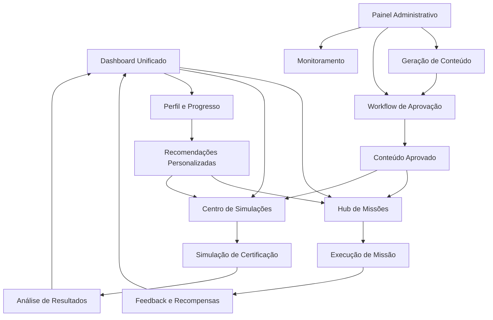

# Documento de Requisitos do Produto - Reestruturação Esquads Unificada

## 1. Visão Geral do Produto

A plataforma Esquads será reestruturada para criar um ecossistema unificado de aprendizado em cibersegurança, combinando missões gamificadas e simulações de certificação em uma experiência coesa e intuitiva.

O sistema resolve problemas críticos de complexidade no gerenciamento de conteúdo, rastreamento ineficiente de progresso e falta de processos estruturados de validação, oferecendo uma solução integrada para preparação profissional em certificações de segurança.

O objetivo é transformar o aprendizado técnico em uma experiência interativa e envolvente que conecta desenvolvimento de habilidades práticas com preparação para certificações profissionais.

## 2. Funcionalidades Principais

### 2.1 Papéis de Usuário

| Papel | Método de Registro | Permissões Principais |
|-------|-------------------|----------------------|
| Estudante Gratuito | Registro por email | Acesso limitado a missões (sistema de vidas), simulações básicas |
| Estudante Premium | Upgrade por pagamento | Acesso ilimitado a missões, todas as simulações, relatórios avançados |
| Mission Architect | Convite administrativo | Validação de conteúdo, aprovação de missões e questões |
| Administrador | Acesso direto do sistema | Controle total, geração de conteúdo, gestão de usuários |

### 2.2 Módulos de Funcionalidades

Nossa plataforma reestruturada consiste nas seguintes páginas principais:

1. **Dashboard Unificado**: centro de controle principal, navegação rápida, progresso visual, sistema de recompensas
2. **Hub de Missões**: categorias de missões, rastreamento de progresso, sistema de vidas, badges e conquistas
3. **Centro de Simulações**: seleção de certificações, configuração de exames, resultados e análises
4. **Painel Administrativo**: geração de conteúdo, workflow de aprovação, monitoramento de usuários
5. **Perfil e Progresso**: estatísticas pessoais, análise de lacunas, recomendações personalizadas

### 2.3 Detalhes das Páginas

| Nome da Página | Nome do Módulo | Descrição da Funcionalidade |
|----------------|----------------|----------------------------|
| Dashboard Unificado | Centro de Navegação | Exibir progresso geral, acesso rápido a missões e simulações, notificações importantes |
| Dashboard Unificado | Sistema de Recompensas | Mostrar XP atual, badges conquistados, ranking de progresso |
| Hub de Missões | Categorias de Missões | Organizar missões por certificação (AWS, Azure, CompTIA), dificuldade e tópicos |
| Hub de Missões | Sistema de Vidas | Controlar tentativas para usuários gratuitos, regeneração temporal |
| Hub de Missões | Rastreamento de Progresso | Visualizar conclusão de missões, pontuação, tempo gasto |
| Centro de Simulações | Seleção de Certificação | Escolher entre AWS Security, Azure Security Engineer, CompTIA Security+ |
| Centro de Simulações | Configuração de Exame | Definir número de questões, dificuldade, tópicos específicos |
| Centro de Simulações | Engine de Questões | Gerar questões por IA com explicações detalhadas, validação rigorosa |
| Centro de Simulações | Análise de Resultados | Calcular pontuação, identificar lacunas, gerar relatórios de maestria |
| Painel Administrativo | Geração de Conteúdo | Criar missões e questões usando IA, definir parâmetros de dificuldade |
| Painel Administrativo | Workflow de Aprovação | Gerenciar status "Pending Review", validação por Mission Architect |
| Painel Administrativo | Monitoramento de Usuários | Acompanhar progresso de estudantes, estatísticas de uso |
| Perfil e Progresso | Estatísticas Pessoais | Exibir XP total, certificações em progresso, tempo de estudo |
| Perfil e Progresso | Análise de Lacunas | Identificar áreas fracas, sugerir missões específicas |
| Perfil e Progresso | Recomendações | Algoritmo personalizado baseado em performance e objetivos |

## 3. Processo Principal

### Fluxo do Estudante:
1. Login no Dashboard Unificado
2. Escolha entre Hub de Missões ou Centro de Simulações
3. No Hub de Missões: seleciona categoria → executa missão → recebe feedback → ganha XP/badges
4. No Centro de Simulações: escolhe certificação → configura exame → realiza simulação → analisa resultados
5. Acessa Perfil para revisar progresso e receber recomendações

### Fluxo do Mission Architect:
1. Acessa Painel Administrativo
2. Revisa conteúdo "Pending Review"
3. Valida qualidade de missões e questões
4. Aprova ou rejeita com feedback
5. Monitora métricas de qualidade

### Fluxo do Administrador:
1. Acessa Painel Administrativo completo
2. Gera novo conteúdo usando IA
3. Configura parâmetros de certificações
4. Monitora performance geral da plataforma
5. Gerencia usuários e permissões

## 4. Design da Interface do Usuário

### 4.1 Estilo de Design

**Cores Principais:**
- Primária: #00FF41 (verde terminal clássico)
- Secundária: #1a1a1a (preto profundo)
- Accent: #FFD700 (dourado para conquistas)
- Background: #0a0a0a (preto terminal)
- Text: #00FF41 e #FFFFFF

**Estilo de Botões:** Retangulares com bordas pixeladas, efeito hover com brilho neon

**Fontes:** 
- Primária: 'Courier New' ou 'Monaco' (monospace)
- Tamanhos: 12px (texto), 16px (botões), 24px (títulos)

**Layout:** Grid-based com cards terminais, navegação superior fixa, sidebar retrátil

**Ícones e Emojis:** Estilo pixel art 8-bit, ícones de terminal (▶, ■, ●), emojis de conquistas (🏆, ⭐, 🎯)

### 4.2 Visão Geral do Design das Páginas

| Nome da Página | Nome do Módulo | Elementos da UI |
|----------------|----------------|-----------------|
| Dashboard Unificado | Centro de Navegação | Layout em grid 2x2, cards com bordas neon, animações de typing effect |
| Dashboard Unificado | Sistema de Recompensas | Barra de XP animada, grid de badges 8-bit, ranking com scroll vertical |
| Hub de Missões | Categorias de Missões | Cards categorizados por cor (AWS=laranja, Azure=azul, CompTIA=verde), filtros dropdown |
| Hub de Missões | Sistema de Vidas | Contador visual com ícones de coração pixelados, timer de regeneração |
| Centro de Simulações | Seleção de Certificação | Cards grandes com logos das certificações, preview de estatísticas |
| Centro de Simulações | Engine de Questões | Interface de quiz com progress bar, botões de múltipla escolha estilizados |
| Painel Administrativo | Workflow de Aprovação | Tabela com status coloridos, botões de ação (aprovar/rejeitar), modal de feedback |
| Perfil e Progresso | Análise de Lacunas | Gráficos radar em estilo terminal, barras de progresso por tópico |

### 4.3 Responsividade

**Desktop-first** com adaptação mobile completa:
- Breakpoints: 1200px (desktop), 768px (tablet), 480px (mobile)
- Navigation: Sidebar colapsável em desktop, bottom navigation em mobile
- Cards: Grid responsivo (4 cols → 2 cols → 1 col)
- Touch optimization: Botões maiores (44px mínimo), gestos de swipe para navegação
- Performance: Lazy loading de conteúdo, animações reduzidas em mobile