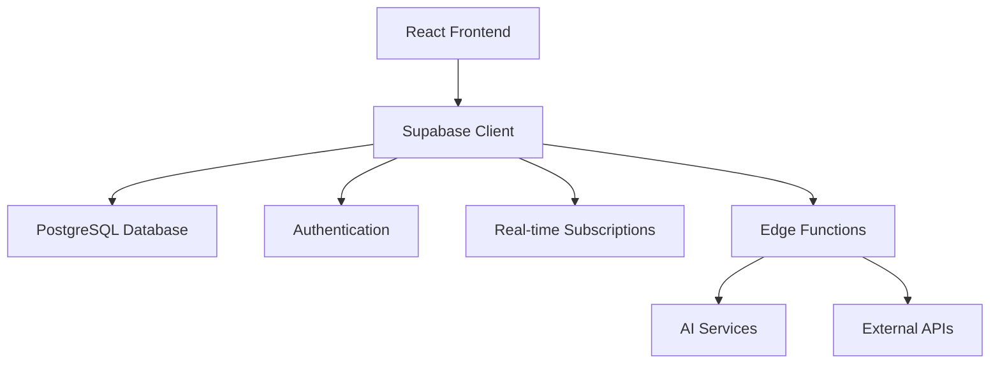

# Resumo Executivo - Implementação PRD Esquads Academy

## 📋 Visão Geral do Projeto

Este documento consolida o mapeamento completo das funcionalidades do PRD Esquads Academy Platform para especificações OpenSpec e define o plano de implementação estruturado.

### Status Atual
- ✅ **Análise Completa**: 15 módulos principais do PRD analisados
- ✅ **Mapeamento OpenSpec**: Especificações técnicas detalhadas criadas
- ✅ **Plano de Implementação**: 6 fases estruturadas com 180+ tarefas
- ✅ **Documentação Técnica**: Arquitetura e especificações definidas

## 🎯 Objetivos Estratégicos

### Objetivos Primários
1. **Transformação Digital Completa**: Migrar todas as funcionalidades do PRD para uma plataforma moderna e escalável
2. **Experiência do Usuário Otimizada**: Criar interfaces intuitivas para administradores e estudantes
3. **Automação Inteligente**: Implementar IA para geração de conteúdo e controle de qualidade
4. **Analytics Avançado**: Fornecer insights profundos sobre aprendizado e performance

### Objetivos Secundários
- Melhorar eficiência administrativa em 50%
- Aumentar engajamento estudantil em 40%
- Reduzir tempo de criação de cursos em 60%
- Implementar gamificação completa

## 📊 Mapeamento de Funcionalidades

### Módulos Prioritários (Fases 1-2)
| Módulo | Status OpenSpec | Prioridade | Complexidade |
|--------|----------------|------------|--------------|
| **Admin Dashboard** | ✅ Especificado | Alta | Média |
| **User Management** | ✅ Especificado | Alta | Alta |
| **Student Dashboard** | ✅ Especificado | Alta | Média |
| **Authentication** | 🔄 Existente | Alta | Baixa |

### Módulos Intermediários (Fases 3-4)
| Módulo | Status OpenSpec | Prioridade | Complexidade |
|--------|----------------|------------|--------------|
| **Social Learning** | 📝 Novo | Média | Alta |
| **Advanced Analytics** | 📝 Novo | Média | Alta |
| **Exam Simulator** | 🔄 Parcial | Média | Alta |
| **Gamification** | 🔄 Existente | Média | Média |

### Módulos Avançados (Fases 5-6)
| Módulo | Status OpenSpec | Prioridade | Complexidade |
|--------|----------------|------------|--------------|
| **AI Course Generator** | 📝 Novo | Baixa | Muito Alta |
| **AI Templates** | 📝 Novo | Baixa | Alta |
| **AI Quality Control** | 📝 Novo | Baixa | Alta |

## 🏗️ Arquitetura Técnica

### Stack Tecnológico
- **Frontend**: React 18 + TypeScript + Tailwind CSS + Vite
- **Backend**: Supabase (PostgreSQL + Auth + Storage + Edge Functions)
- **Real-time**: WebSockets via Supabase Realtime
- **AI Integration**: OpenAI API + Custom Prompt Engineering
- **Deployment**: Vercel/Netlify + Supabase Cloud

### Componentes Principais

### Extensões de Banco de Dados
- **15 novas tabelas** para funcionalidades avançadas
- **50+ políticas RLS** para segurança granular
- **25+ índices otimizados** para performance
- **10+ funções customizadas** para lógica complexa

## 📈 Plano de Implementação

### Cronograma Geral (12 Sprints - 6 Meses)

#### **Fase 1: Foundations** (Sprints 1-2)
- **Duração**: 4 semanas
- **Foco**: Admin Dashboard + User Management
- **Entregáveis**: 
  - Dashboard administrativo completo
  - Sistema de gestão de usuários
  - Infraestrutura base de dados

#### **Fase 2: Student Experience** (Sprints 3-4)
- **Duração**: 4 semanas
- **Foco**: Student Dashboard + Learning Analytics
- **Entregáveis**:
  - Dashboard personalizado do estudante
  - Sistema de recomendações
  - Analytics de aprendizado

#### **Fase 3: Social and Analytics** (Sprints 5-6)
- **Duração**: 4 semanas
- **Foco**: Social Learning + Advanced Analytics
- **Entregáveis**:
  - Área social completa
  - Sistema de analytics avançado
  - Relatórios customizáveis

#### **Fase 4: Simulation and Assessment** (Sprints 7-8)
- **Duração**: 4 semanas
- **Foco**: Exam Simulator + Assessment Engine
- **Entregáveis**:
  - Simulador de exames
  - Sistema de avaliação adaptativo
  - Proctoring e segurança

#### **Fase 5: AI Integration** (Sprints 9-10)
- **Duração**: 4 semanas
- **Foco**: AI Course Generator + Quality Control
- **Entregáveis**:
  - Gerador de cursos com IA
  - Templates inteligentes
  - Controle de qualidade automatizado

#### **Fase 6: Testing and Optimization** (Sprints 11-12)
- **Duração**: 4 semanas
- **Foco**: Testing + Performance + Deployment
- **Entregáveis**:
  - Suite de testes completa
  - Otimizações de performance
  - Deploy em produção

## 💼 Recursos e Investimento

### Equipe Recomendada
- **1 Tech Lead** (Full-time)
- **2 Frontend Developers** (React/TypeScript)
- **1 Backend Developer** (Supabase/PostgreSQL)
- **1 UI/UX Designer** (Part-time)
- **1 QA Engineer** (Part-time)
- **1 DevOps Engineer** (Part-time)

### Estimativa de Custos
- **Desenvolvimento**: 6 meses × 4.5 FTE = 27 pessoa-meses
- **Infraestrutura**: Supabase Pro + CDN + Monitoring
- **Serviços AI**: OpenAI API + Custom Models
- **Ferramentas**: Desenvolvimento + Testing + Deployment

### ROI Esperado
- **Redução de custos operacionais**: 40% em 12 meses
- **Aumento de receita**: 25% através de melhor retenção
- **Eficiência administrativa**: 50% de redução em tarefas manuais
- **Satisfação do usuário**: Aumento de 4.2 para 4.7/5

## 🎯 Métricas de Sucesso

### Métricas Técnicas
- **Performance**: < 2s carregamento de páginas
- **Disponibilidade**: 99.9% uptime
- **Segurança**: Zero vulnerabilidades críticas
- **Escalabilidade**: Suporte a 10,000+ usuários simultâneos

### Métricas de Negócio
- **Engajamento**: +40% tempo na plataforma
- **Conclusão de cursos**: +25% taxa de completion
- **Eficiência admin**: +50% produtividade
- **Satisfação**: 4.5/5 rating médio

### Métricas de Produto
- **Adoção de features**: 80% dos usuários usam novas funcionalidades
- **Tempo de onboarding**: Redução de 50%
- **Suporte**: Redução de 60% em tickets
- **Retenção**: Aumento de 30% na retenção de usuários

## 🚀 Próximos Passos Imediatos

### Semana 1-2: Preparação
1. **Setup do Ambiente**
   - Configurar repositório com estrutura OpenSpec
   - Setup do ambiente de desenvolvimento
   - Configurar Supabase project

2. **Definição da Equipe**
   - Recrutar/alocar desenvolvedores
   - Definir papéis e responsabilidades
   - Estabelecer processos de trabalho

### Semana 3-4: Início da Implementação
1. **Fase 1 - Sprint 1**
   - Implementar Admin Dashboard base
   - Criar estrutura de componentes
   - Setup do sistema de User Management

2. **Infraestrutura**
   - Configurar banco de dados
   - Implementar autenticação
   - Setup de CI/CD

### Aprovações Necessárias
- [ ] **Aprovação do Orçamento**: Recursos para 6 meses
- [ ] **Aprovação da Equipe**: Contratação/alocação de desenvolvedores
- [ ] **Aprovação Técnica**: Stack tecnológico e arquitetura
- [ ] **Aprovação de Timeline**: Cronograma de 6 meses

## 📋 Documentos de Referência

### Documentos Criados
1. **Mapeamento PRD → OpenSpec** (`Mapeamento_PRD_OpenSpec_Esquads.md`)
2. **Proposta de Mudança OpenSpec** (`OpenSpec_Proposal_PRD_Integration.md`)
3. **Especificação Admin Dashboard** (`OpenSpec_Admin_Dashboard_Spec.md`)
4. **Especificação User Management** (`OpenSpec_User_Management_Spec.md`)
5. **Especificação Student Dashboard** (`OpenSpec_Student_Dashboard_Spec.md`)
6. **Tasks de Implementação** (`OpenSpec_Implementation_Tasks.md`)

### Documentos de Entrada
- **PRD Original**: `PRD_Esquads_Academy_Platform.md`
- **Regras do Sistema**: Regras Esquads definidas pelo usuário
- **OpenSpec Existente**: Especificações atuais do projeto

## ✅ Conclusão

O mapeamento completo das funcionalidades do PRD para especificações OpenSpec foi concluído com sucesso. O plano de implementação estruturado em 6 fases garante uma abordagem sistemática e de baixo risco para transformar a visão do PRD em realidade.

**Status**: ✅ **PRONTO PARA IMPLEMENTAÇÃO**

A documentação técnica detalhada, o plano de implementação estruturado e as especificações OpenSpec fornecem uma base sólida para iniciar o desenvolvimento imediatamente.

---

**Próxima Ação**: Aprovação dos stakeholders e início da Fase 1 - Foundations