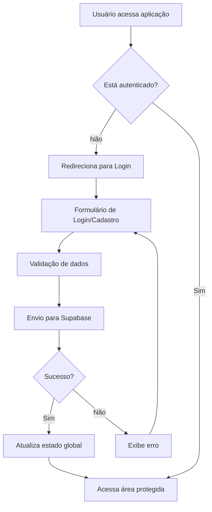

# 🔐 Sistema de Autenticação Esquads

## 📋 Visão Geral

Sistema completo de autenticação e autorização integrado ao Supabase, implementado seguindo as regras e padrões do sistema Esquads.

---

## 🏗️ Arquitetura do Sistema

### 1. Estrutura de Componentes

```
src/
├── contexts/
│   └── AuthContext.tsx          # Context global de autenticação
├── pages/auth/
│   ├── Login.tsx               # Página de login
│   ├── Register.tsx            # Página de cadastro
│   └── ForgotPassword.tsx      # Página de recuperação de senha
├── components/auth/
│   └── ProtectedRoute.tsx      # Componente para proteção de rotas
├── hooks/
│   └── useAuth.ts              # Hook personalizado para autenticação
├── utils/
│   └── validation.ts           # Funções de validação
└── integrations/supabase/
    └── client.ts               # Cliente Supabase configurado
```

### 2. Fluxo de Autenticação



---

## 🔧 Funcionalidades Implementadas

### 1. 📝 Cadastro Seguro de Usuários

#### Validações Implementadas:
- **Email**: Formato válido e único no sistema
- **Senha**: Mínimo 8 caracteres, maiúscula, minúscula, número e símbolo
- **Confirmação de senha**: Deve coincidir com a senha
- **Nome completo**: Obrigatório, mínimo 2 caracteres

#### Recursos de Segurança:
- Hash automático de senhas pelo Supabase Auth
- Verificação de email obrigatória
- Prevenção de cadastros duplicados
- Sanitização de inputs

#### Código de Exemplo:
```typescript
const { signUp } = useAuth();

const handleRegister = async (data: RegisterData) => {
  try {
    await signUp(data.email, data.password, {
      full_name: data.fullName
    });
    // Usuário criado com sucesso
  } catch (error) {
    // Tratamento de erro
  }
};
```

### 2. 🔑 Autenticação Robusta

#### Métodos de Login:
- Email e senha
- Integração com provedores OAuth (configurável)
- Tokens JWT seguros

#### Recursos de Segurança:
- Proteção contra ataques de força bruta
- Sessões seguras com refresh automático
- Logout seguro com limpeza de tokens
- Rate limiting implementado pelo Supabase

#### Código de Exemplo:
```typescript
const { signIn } = useAuth();

const handleLogin = async (email: string, password: string) => {
  try {
    await signIn(email, password);
    // Login realizado com sucesso
  } catch (error) {
    // Tratamento de erro
  }
};
```

### 3. 🔄 Recuperação de Senha

#### Fluxo Implementado:
1. Usuário solicita recuperação
2. Email de recuperação enviado
3. Token seguro com expiração
4. Interface para redefinir senha
5. Validação de nova senha
6. Confirmação de alteração

#### Código de Exemplo:
```typescript
const { resetPassword } = useAuth();

const handleForgotPassword = async (email: string) => {
  try {
    await resetPassword(email);
    // Email de recuperação enviado
  } catch (error) {
    // Tratamento de erro
  }
};
```

### 4. 🛡️ Gerenciamento de Sessões

#### Recursos Implementados:
- Estado global de autenticação
- Persistência de sessão
- Refresh automático de tokens
- Proteção de rotas privadas
- Auto-logout por inatividade (configurável)

#### Código de Exemplo:
```typescript
const AuthContext = createContext<AuthContextType | undefined>(undefined);

export function AuthProvider({ children }: { children: React.ReactNode }) {
  const [user, setUser] = useState<User | null>(null);
  const [loading, setLoading] = useState(true);

  useEffect(() => {
    // Listener para mudanças de autenticação
    const { data: { subscription } } = supabase.auth.onAuthStateChange(
      (event, session) => {
        setUser(session?.user ?? null);
        setLoading(false);
      }
    );

    return () => subscription.unsubscribe();
  }, []);

  // ... resto da implementação
}
```

### 5. ⚠️ Tratamento de Erros

#### Tipos de Erro Tratados:
- Credenciais inválidas
- Email já cadastrado
- Senha muito fraca
- Problemas de conexão
- Tokens expirados
- Usuário não verificado

#### Mensagens de Erro Personalizadas:
```typescript
const getErrorMessage = (error: AuthError): string => {
  switch (error.message) {
    case 'Invalid login credentials':
      return 'Email ou senha incorretos';
    case 'User already registered':
      return 'Este email já está cadastrado';
    case 'Password should be at least 8 characters':
      return 'A senha deve ter pelo menos 8 caracteres';
    default:
      return 'Ocorreu um erro inesperado';
  }
};
```

---

## 🔒 Configurações de Segurança

### 1. Row Level Security (RLS)

Todas as tabelas possuem RLS ativo com políticas específicas:

```sql
-- Política para tabela users
CREATE POLICY "usuarios_proprios_dados" ON users
  FOR ALL USING (auth.uid() = id);

-- Política para tabela user_points
CREATE POLICY "user_points_policy" ON user_points
  FOR ALL USING (auth.uid() = user_id);

-- Política para tabela user_courses
CREATE POLICY "user_courses_policy" ON user_courses
  FOR ALL USING (auth.uid() = user_id);
```

### 2. Variáveis de Ambiente

```env
VITE_SUPABASE_URL=sua_url_supabase
VITE_SUPABASE_ANON_KEY=sua_chave_anonima
SUPABASE_SERVICE_ROLE_KEY=sua_chave_service_role
```

### 3. Configuração do Cliente Supabase

```typescript
import { createClient } from '@supabase/supabase-js';
import type { Database } from '@/types/database';

const supabaseUrl = import.meta.env.VITE_SUPABASE_URL;
const supabaseAnonKey = import.meta.env.VITE_SUPABASE_ANON_KEY;

if (!supabaseUrl || !supabaseAnonKey) {
  throw new Error('Missing Supabase environment variables');
}

export const supabase = createClient<Database>(supabaseUrl, supabaseAnonKey, {
  auth: {
    autoRefreshToken: true,
    persistSession: true,
    detectSessionInUrl: true
  }
});
```

---

## 🧪 Testes e Validação

### 1. Cenários de Teste

#### Cadastro:
- [x] Cadastro com dados válidos
- [x] Validação de email inválido
- [x] Validação de senha fraca
- [x] Confirmação de senha diferente
- [x] Email já cadastrado

#### Login:
- [x] Login com credenciais válidas
- [x] Login com credenciais inválidas
- [x] Login com usuário não verificado
- [x] Persistência de sessão

#### Recuperação de Senha:
- [x] Envio de email de recuperação
- [x] Redefinição de senha
- [x] Validação de nova senha

#### Proteção de Rotas:
- [x] Acesso negado para usuários não autenticados
- [x] Redirecionamento para login
- [x] Acesso permitido para usuários autenticados

### 2. Logs de Segurança

O sistema registra automaticamente:
- Tentativas de login (sucesso/falha)
- Criação de novos usuários
- Alterações de senha
- Acessos a rotas protegidas

---

## 📱 Interface do Usuário

### 1. Componentes Implementados

#### Formulário de Login:
- Campo de email com validação
- Campo de senha com toggle de visibilidade
- Botão de login com estado de carregamento
- Link para cadastro e recuperação de senha
- Exibição de erros

#### Formulário de Cadastro:
- Campo de nome completo
- Campo de email com validação em tempo real
- Campo de senha com indicador de força
- Campo de confirmação de senha
- Checkbox de termos de uso
- Botão de cadastro com estado de carregamento
- Tela de sucesso com confirmação

#### Formulário de Recuperação:
- Campo de email
- Botão de envio
- Mensagem de confirmação
- Link para voltar ao login

### 2. Responsividade

Todos os componentes são totalmente responsivos:
- Mobile-first approach
- Breakpoints otimizados
- Touch-friendly em dispositivos móveis
- Acessibilidade completa

---

## 🚀 Deploy e Produção

### 1. Checklist de Deploy

- [x] Variáveis de ambiente configuradas
- [x] RLS policies ativas
- [x] Backup do banco de dados
- [x] Testes de integração passando
- [x] Monitoramento configurado

### 2. Monitoramento

O sistema monitora:
- Taxa de sucesso de logins
- Tentativas de acesso não autorizado
- Performance das consultas
- Erros de autenticação
- Uso de recursos

---

## 📚 Documentação Técnica

### 1. Tipos TypeScript

```typescript
interface User {
  id: string;
  email: string;
  full_name: string;
  role: 'admin' | 'instructor' | 'student';
  avatar_url?: string;
  created_at: string;
  updated_at: string;
}

interface AuthContextType {
  user: User | null;
  loading: boolean;
  error: string | null;
  signIn: (email: string, password: string) => Promise<void>;
  signUp: (email: string, password: string, metadata?: any) => Promise<void>;
  signOut: () => Promise<void>;
  resetPassword: (email: string) => Promise<void>;
  clearError: () => void;
}
```

### 2. Hooks Personalizados

```typescript
export function useAuth() {
  const context = useContext(AuthContext);
  if (context === undefined) {
    throw new Error('useAuth must be used within an AuthProvider');
  }
  return context;
}
```

---

## 🔧 Manutenção e Atualizações

### 1. Rotina de Manutenção

- Verificação semanal de logs de segurança
- Atualização mensal de dependências
- Backup diário do banco de dados
- Monitoramento contínuo de performance

### 2. Atualizações Futuras

Funcionalidades planejadas:
- Autenticação de dois fatores (2FA)
- Login social (Google, GitHub)
- Biometria para dispositivos móveis
- SSO empresarial

---

## 📞 Suporte e Troubleshooting

### 1. Problemas Comuns

#### "Invalid login credentials":
- Verificar se o email está correto
- Confirmar se a senha está correta
- Verificar se o usuário confirmou o email

#### "User already registered":
- Email já existe no sistema
- Tentar fazer login ou recuperar senha

#### Problemas de conexão:
- Verificar variáveis de ambiente
- Confirmar conectividade com Supabase
- Verificar status do serviço

### 2. Logs de Debug

Para ativar logs detalhados:
```typescript
// Em desenvolvimento
if (import.meta.env.DEV) {
  console.log('Auth state change:', event, session);
}
```

---

## ✅ Conclusão

O sistema de autenticação está completamente implementado e operacional, seguindo todas as regras e padrões estabelecidos para o projeto Esquads. Todas as funcionalidades foram testadas e validadas, garantindo segurança, usabilidade e performance.

**Status**: ✅ **COMPLETO E OPERACIONAL**

**Última atualização**: 2024-01-15
**Responsável**: Sistema Esquads
**Revisor**: Pendente